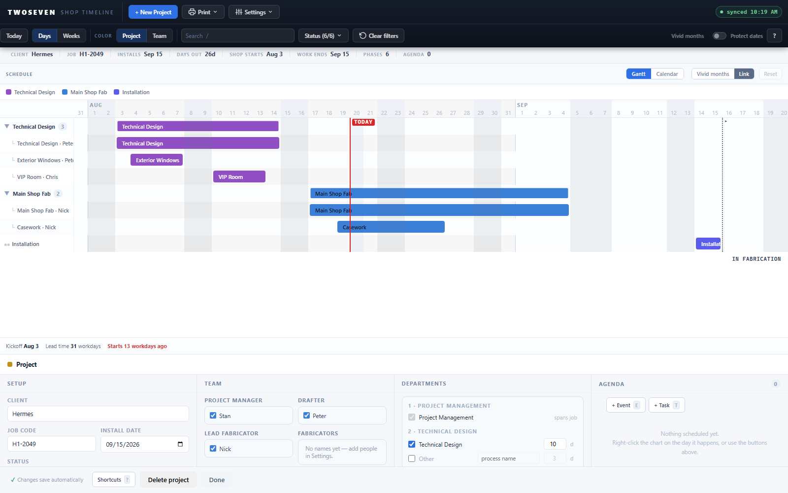
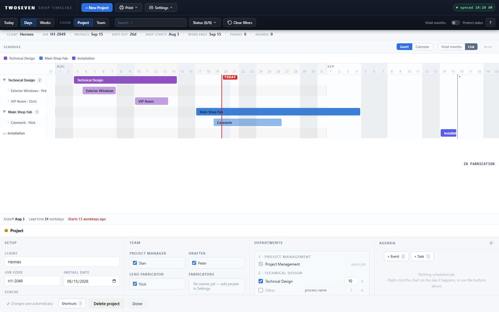

# Project-page subtask hierarchy — the primary bar is the parent (TODO §3 item 5) — REV56

**What changed.** The owner's four notes on project-page subtask behaviour, delivered
as one remodel. Before, a department with more than one bar drew a *synthetic* summary
bar and re-listed **every** bar — including the department's primary phase bar — as a
subtask beneath it. Add one subtask to a phase and the phase suddenly appeared twice,
in identical colour, one row apart ("clicking a subtask duplicated the primary phase
bar as a subtask"). Now:

- **The primary bar IS the parent row.** The department's first bar in display order
  draws on the department row itself — full colour, and it drags, resizes, and selects
  like any bar. Only the *other* bars nest under it; the primary is never re-listed.
  A quiet envelope track behind the parent still shows the department's full extent
  when a subtask sticks out past it. (No stored parent flag — first-in-sort is the
  parent; unnamed phase bars sort ahead of named subtasks, so the original bar stays
  parent.)
- **Subtasks render in a lighter shade of the parent's hue** — identity stays with the
  hue per Design-Language §2; only lightness separates child from parent. Same shading
  on the calendar's bands.
- **Subtasks resize by edge drag** with the same handles and workday snapping as E3 —
  and because the parent row is now a real bar, the *visible* bar of a collapsed
  department is resizable too (the old summary bar had no handles at all).
- **The parent's start/end act as min/max on a nested subtask.** Dragging or resizing
  a subtask that sits inside its parent's window stops at the parent's edges. A
  subtask already *outside* the parent window (parallel subtasks — real, common data)
  stays free, so nothing snaps or freezes on existing layouts.
- **A new subtask is born distinct** — named ("Subtask 2"), half its parent's length,
  nested at the parent's start — never an exact copy of the bar it came from, on both
  the saved page and the new-project draft. The popover's "+ Subtask" clone path was
  retired; every create route now goes through the same function.
- Dragging the parent with **Link** on still carries all its subtasks in one save,
  exactly like the old summary bar. With Link off the parent now moves alone (before,
  the unlinked summary could only toggle the department open).

| Before | After |
| --- | --- |
|  |  |

**Known ceilings.**

- The parent is a heuristic (first in display order). In a department where *every*
  bar is named (a saved draft-split), dragging a named subtask earlier than the
  parent's start can hand the parent role to it on the next rebuild. Unnamed phase
  bars — the normal case — always outrank named subtasks, so this only touches
  all-named departments.
- The min/max clamp binds only while editing the subtask: shrinking the *parent*
  doesn't push nested subtasks back inside (they simply become "outside" bars and
  move freely). Enforce on parent-resize too if PMs ask.
- A one-day parent produces a one-day nested subtask that fills the window and can
  only be resized after the parent grows.
- Linked drag on the draft page still moves the parent line alone (the pre-REV56
  status quo — draft manual placements are per-bar).

**Tests.** New `tests/test56.js` (44 assertions): parent-row shape and envelope,
kid shading, linked/unlinked parent drag, parent resize independence, born-distinct
subtask, nested clamp on drag and resize, parallel-subtask freedom, marker rows,
draft parity. `test47` (the summary-bar hierarchy) now guards only pre-REV56 builds;
`test48`/`test49`/`test55` gained REV56 branches for the changed create/summary
behaviours. Full matrix 19/19 on `index.html` **and** on the frozen reference.

**Also in this release:** `APP_REV` had stayed at 53 through REV54 and REV55 (the
"bump this ONE number" comment notwithstanding); it now reads 56.

**App REV:** 56. **PR link:** pending (next `development` → `main` promotion).
