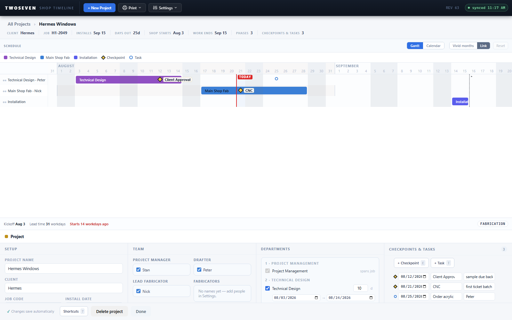

# One checkpoint language — the project page adopts the Home modal's editor

**Date:** 2026-08-21 · **App REV:** 64 · **Branch:** development

## What changed

The Home timeline's phase modal has always talked about **"Checkpoints (approvals /
releases / holds)"** — dated markers with a name picked from a standard list (Client
Approval, Shop Drawings, the departments) and a notes field. But that language and that
editor existed **only** in the modal. The project page's Agenda was a read-only list
where the basic "+ Event" / "+ Task" buttons were the only controls, and renaming was the
only inline edit.

Now the project page speaks the same language:

- **The Agenda column (bottom-right of the project page dock) is now "Checkpoints &
  Tasks"**, and every row is the same editor the Home modal uses: date | name | notes,
  editable in place, plus a delete. Task rows take the same shape with the assignees
  ("who") in the third slot.
- **The name field suggests the standard checkpoint targets** (Client Approval, Shop
  Drawings, each department) via a native datalist — pick one or type anything, so
  free-named events made anywhere still edit fine.
- **"+ Event" is now "+ Checkpoint"** everywhere on the project page: the buttons, the
  right-click menus on the gantt and calendar, the chart legend, the orphan row, and the
  toasts. Same data, one name.
- **Notes finally round-trip:** the agenda can now edit an event's notes; previously
  notes were only reachable through the Home modal.
- Clicking a diamond on the chart still jumps to its row — the cursor now lands directly
  in the always-present name field instead of spawning a temporary editor.

Same-day follow-ups from first use:

- **Tasks get their own gantt row.** Task circles no longer ride the row of whatever
  phase they point at — they all share one "Tasks" row at the bottom of the project
  chart (named tasks show a label chip, like checkpoints always did). The extra
  "Checkpoints" row now only catches checkpoints pointing at a department the job
  doesn't use.
- **Every panel row carries a phase selector**, so a checkpoint or task added from the
  buttons (not by right-clicking a phase row) can be pointed at its phase afterward.
  Rows are two lines now: date | name | delete, then phase | notes (or who).
- **Deleting is obvious and everywhere:** the row's × is always visible (it used to
  appear only on hover), and right-clicking a diamond or circle on the chart deletes it
  after a confirm.

No schema change: checkpoints are the same events they always were (standalone rows in
`ShopTimeline_Events`, or legacy `ticketNodes` on a host phase where that list is
missing), and tasks are the same `ShopTimeline_Tasks2` rows. The colleague app is
unaffected.

Also deleted two dead functions (`renderDraftEvents`, `renderDraftTodos`) left over from
the old create-page side editors — their host elements no longer existed.

## Why it mattered

"Checkpoints, approvals, releases, holds" appeared in exactly one place (the Home phase
modal) and nowhere on the project page, so the two surfaces looked like two different
features editing different things. They were always the same data; now they look like it,
and the project page finally edits dates and notes without a modal.

## Tests

`test46`, `test50`, `test57` updated to accept both the new editor and the REV50
reference's click-to-rename agenda (feature-detected via the `ag-dl` datalist). Full
suite green on `index.html` and `reference/Timeline_50.html`.
