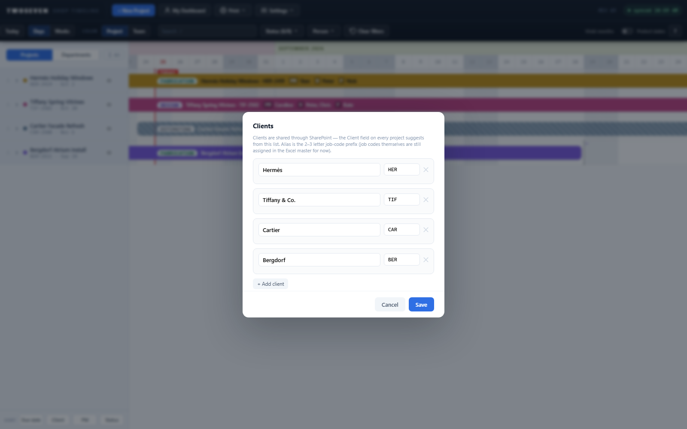

# Client list — N3 lands (REV69)

**Date:** 2026-08-25 · **REV:** 69 · **PR:** [#15](https://github.com/221twoseven/Project-Scheduler/pull/15)

The client roster the owner imported from the Excel master (2026-08-21) is now wired
into the app. Closes §3a N3.

## What changed

- **`ShopTimeline_Clients` loads at boot** — columns `Title` (client name) and
  `field_2` (job-code alias), confirmed by the owner from List settings. Rows sync by
  SharePoint item id (the imported list has no appId column). Absent list degrades to
  browser-local: quiet console line at load, one warning toast on save — the same
  contract as Staff.
- **The project Client field is now a type-ahead** fed by the list, on both the draft
  and saved pages. Deliberate deviation from N3's "dropdown" wording: a native
  `datalist` instead — free text keeps working, so projects whose client predates the
  list (or a one-off client) never break, and the existing field bindings are
  untouched. "Add new…" lives in the manager below rather than inside the field.
- **Settings → Clients** — the manager, mirroring People & Availability: one row per
  client (name + alias), add/remove, aliases uppercased on save, duplicate names
  rejected, an inline note when the browser is offline from the list.
- Job codes themselves are **still assigned in the Excel master** — the modal's hint
  says so. The list is the scheduler's source for who clients *are*; the divergence
  rule from the TODO stands until the deliberate cutover.

## Evidence

- 

## Tests

`tests/test69.js` (15 assertions): field mapping + item-id keying, datalist on BOTH
pages (the REV49 lesson), manager round-trip with the POST body asserted
(`Title`/`field_2`), trim/uppercase, duplicate rejection, offline degrade.
`tests/harness.js` gained a `clientsList` gate (additive, same pattern as events).

## Ceilings / follow-ups

- The type-ahead doesn't *enforce* the list — free text is a feature today (legacy
  data, one-off clients); revisit only if stray spellings become a real problem.
- Client color: consciously dropped (Design-Language §2.2, 2026-08-21).
- Job-code auto-assignment from Alias + next number stays with the SharePoint-as-
  database north star (TODO §5).
