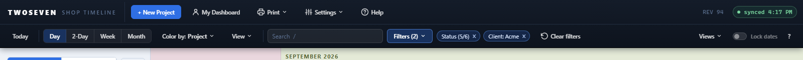
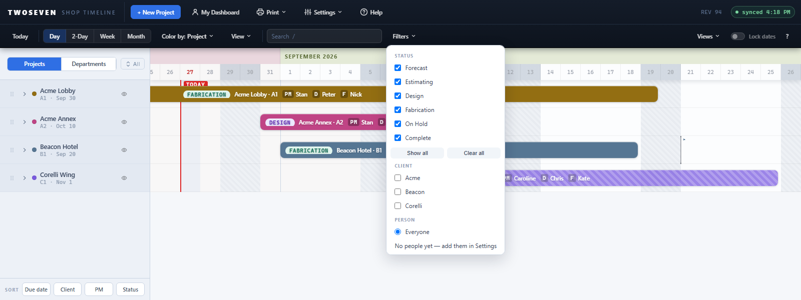

# Native toolbar direction — Phase 3 (REV94)

**Date:** 2026-08-27 · **REV:** 94 · **Initiative:** Native software toolbar
direction · **Branch:** development (pending promotion to main)

## What changed

Phase 3 of `docs/Archive/Toolbar-Native-Direction.md` — **consolidate the filters**, and
add a new **Client** filter.

- **One `Filters ▾` menu.** The separate Status and Person buttons are gone;
  status, client and person now share a single dropdown with three sections
  (built into `#status-menu` / `#client-menu` / `#person-menu` inside one
  `#filters-menu`). Status and client are multi-select checkboxes; person is a
  single-select radio, as before.
- **New Client filter.** Narrows the board to the selected client(s), rows
  removed like status/person (`clientHit(p)` folded into `visTasks()` and
  `buildRows()`). The picker lists only clients that actually have a project on
  the board (`boardClients()`), not the whole Clients master. It persists in the
  UI prefs and restores on load, and rides along in saved Views.
- **Active-filter chips + count.** Each active constraint shows as a removable
  chip beside the button (`Status (5/6) ×`, `Client: Acme ×`, `Person: Robert ×`),
  and the button carries a count (`Filters (2)`).
- **Contextual Clear.** "Clear filters" is hidden until a filter, search, or
  spotlight is active — it no longer sits on the row permanently.

## Why it mattered

Status and Person were two equal-weight buttons that each spent a slot on the
row and named an internal axis. One `Filters ▾` with chips is the familiar
pattern: the button says how many filters are on, the chips say which, and each
chip clears itself. Client was the missing axis — the shop thinks in clients, and
now the board can be narrowed to one.

## Evidence

## Tests

- New `tests/test-client-filter.js` (13/13): `boardClients()` lists only clients
  with projects; selecting a client narrows the board; the chip, count, and Clear
  behave; the pick persists and restores. Registered in `tests/run.js`.
- `test88.js` (22/22): new reading order and a Phase 3 section — Status/Person
  buttons gone, one Filters button, three menu sections, Clear hidden until active.
- `test65.js` (person filter) updated to drive through `Filters ▾` and assert the
  `Person: …` chip; `test-c3-status.js` and `test-goto.js` point their
  "one overlay at a time" checks at `#filters-menu`. `test66` (Teams picker,
  which calls `buildPersonMenu()`) unchanged and green.

## Design language

`Design-Language.md` §2.6 updated: the filter cluster is `search · Filters ▾ ·
chips · Clear`; status/client/person share one menu; chips + count + contextual
Clear; the client picker is board-scoped.

## Known ceilings / follow-ups

- **Phase 4** (application-bar cleanup) is the last planned step: split Settings
  (People/Clients → a Resources menu), read Timeline ⇄ Dashboard as the two views,
  fold the `?` legend into a Help menu.
- Init calls `buildStatusMenu()` (status is `ST`-independent); the client/person
  sections build lazily on open, after `ST` is populated — `boardClients()` also
  guards `ST` so an early call can't throw.
