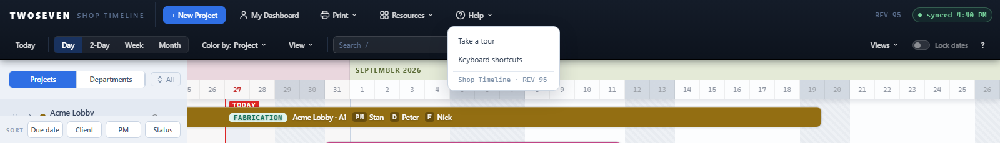
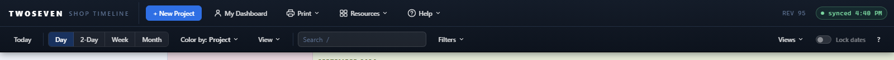
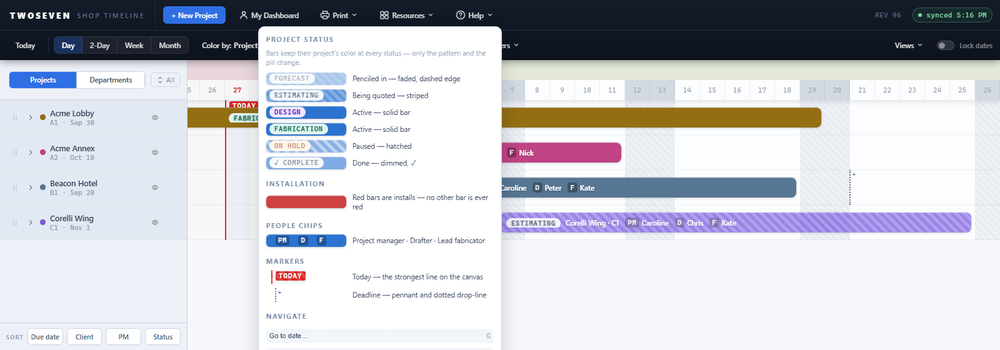

# Native toolbar direction — Phase 4 (REV95)

**Date:** 2026-08-27 · **REV:** 95–97 · **Initiative:** Native software toolbar
direction · **Branch:** development (pending promotion to main) · **Final phase**

## What changed

Phase 4 of `docs/Archive/Toolbar-Native-Direction.md` — **application-bar cleanup**, the
last planned step.

- **Resources ▾ replaces Settings.** The old Settings menu held People &
  Availability and Clients — those are shared-data editors, not preferences, so
  the button now reads **Resources** and holds exactly those two. (Nothing else
  lived in Settings after density moved to `View ▾` in Phase 2, so the label was
  the only thing left to fix.)
- **Help is a menu.** The single Help button became **Help ▾** — *Take a tour*
  (the old click behaviour, still route-aware: project pages get their shared
  tour in place), *Keyboard shortcuts* (opens the shortcut sheet), *Legend* (the
  colour/marker swatch popover, folded in from the timeline toolbar's `?` in
  REV96), and an **About** line carrying the version (`Shop Timeline · REV N`,
  which used to sit in the Settings menu).
- The `id`s `mi-people` / `mi-clients` are unchanged, so their editors and the
  suites that drive them keep working; only the container moved.

## Scope decisions (deliberately light)

- **Timeline ⇄ Dashboard stays as-is.** The locked Fork-2 decision was *light*
  navigation — Dashboard already carries an `.active` state and reads as the
  second view, and its enter/exit is tied to the Projects/Departments lens. A
  separate "Timeline" nav button would duplicate that and fight the lens model,
  so it was not added.
- **The `?` legend folded into Help ▾ (REV96).** It was first kept inline, then
  folded into Help at the owner's request: the **Legend** item opens the same
  swatch popover (now anchored under Help), and the standalone `?` button left
  the timeline toolbar. The `?` *key* still opens the keyboard-shortcut sheet.

Also refreshed the first-run tour's search step, which still said "Status and
Person" — it now reads "Filters narrows the view by status, client or person".

## Why it mattered

Settings was the last taxonomy leak in the app bar — a preferences label over two
data editors. Help was a single-action button with no home for the version or the
keyboard shortcuts. The bar now separates cleanly: global **actions** (New
Project), **navigation** (My Dashboard), **commands** (Print), **resources**
(People, Clients), **help/utilities** (Help), and **status** (REV, sync).

## Evidence

## Tests

- `test88.js` (25/25): new Phase 4 section — Settings gone, Resources holds
  People/Clients, Help is a menu with a tour and shortcuts.
- `test74.js` (coach tour) and `test86.js` (project-page tour) now click the
  **Take a tour** item instead of the Help button; behaviour assertions
  unchanged, both green.
- `test66` / `test69` / `test70` (which click `mi-people` / `mi-clients`) pass
  unchanged — the ids moved menus but kept their names.
- REV97 follow-up: removing `#btn-legend` orphaned the first-run tour's 6th step
  (it targeted that button); it now points at `#btn-help`. `test74` caught it —
  full suite 49/49.

## Native direction — complete

Phases 1–4 are shipped to `development`. The shell now separates navigation,
commands, view state, filters, resources, and status instead of a wall of
equal-weight pills. Remaining optional idea from the strategy: `‹ Today ›`
prev/next stepping (Phase 5) — not built; the go-to-date popover + scroll cover it.
