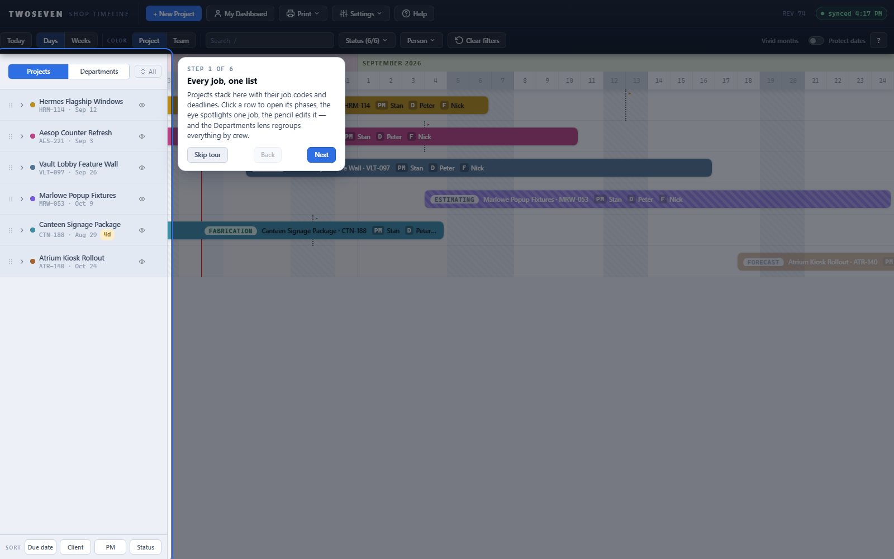
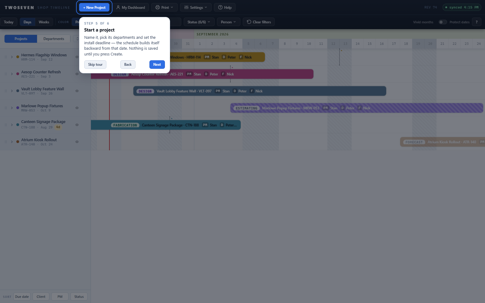

# Coach marks + Help button (N14)

**Date:** 2026-08-25 · **REV:** 74 · **Branch:** development · PR link: pending

## What changed

A **Help** button now sits in the toolbar's top row. Clicking it starts a six-step
guided tour: a spotlight cutout highlights one surface at a time (the project list, the
timeline, search and filters, My Dashboard, New Project, and the ? legend) with a short
plain-language card beside it. **First-time users get the tour automatically, once** —
after sign-in, on a browser that has never seen it — and Help replays it any time.

- Skip tour / Back / Next buttons; the last step's button reads **Done**.
- Keyboard: **Enter/→** next, **←** back, **Escape** ends. The tour owns the keyboard
  while it's up; the app underneath is blocked by the scrim either way.
- Steps whose target isn't on the page are dropped, so a partial view (or an older
  build) gets a shorter tour instead of a broken one.
- Opened from the project page, Help routes home first — the tour's targets live on
  the home view.
- The seen-flag (`shopTimelineCoachSeen`, this browser only) is set the moment the
  tour opens, even if it's abandoned — it never nags twice. No SharePoint, schema, or
  auth involvement.

## Why

Owner decision 2026-08-25: coach marks are a given across the board — a help button at
the top triggers them for first-time users. This pulls N14 forward from Phase 4;
its original gate (hallway test round 2 showing testers stuck) was waived when the
round was skipped for lack of team availability under the viable-product push.

## Evidence

| First step — the project list | New Project step |
|---|---|
|  |  |

## Tests

`tests/test74.js` (17 assertions): auto-open on a fresh browser, the seen flag, button
and keyboard stepping in agreement, keyboard ownership while up, Done/Escape/Skip all
ending it, Help replaying it, missing targets shortening the tour, and no nag on a
second boot. The jsdom harness seeds the seen-flag for every other suite so the
first-run tour can't interfere with their keyboard events (`coachFirstRun` opts out).

## Ceilings

- The tour is **pointer-opened only** (no keyboard shortcut opens it) — a deliberate
  two-path exception like REV61's: `?` on the project page already means the shortcuts
  sheet, and the home `?` button is the legend, so a third `?` meaning was worse than
  the missing path. Revisit alongside Phase 4's shortcuts sheet.
- Six fixed steps on the home view; the project page has no tour of its own. Add one
  only if new users still get lost there.
- The spotlight tracks its target on window resize; the background poll pauses while
  the tour is up (same courtesy every overlay gets), so nothing redraws under the scrim.
