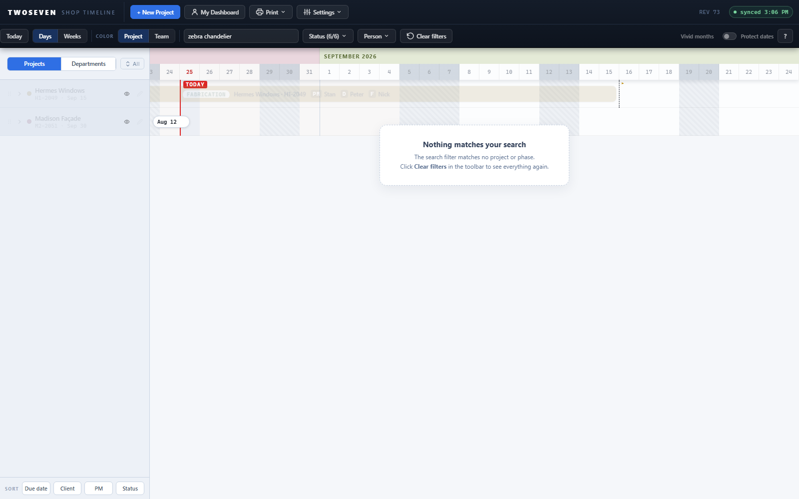

# Deferred polish pass — narrow-bar handles, draft-move undo, search empty state (T3/T6/T7)

**Date:** 2026-08-25 · **App REV:** 73 · **Branch:** development · **PR:** [#15](https://github.com/221twoseven/Project-Scheduler/pull/15)

## What changed

With the §3 feature queue empty and hallway test round 2 next, the unconditional
items in TODO §7 (ceilings carried from Phases 1–2) shipped as one small batch so
testers meet the finished behavior:

- **Resize handles widen on narrow bars (T3).** Edge grab zones were a fixed 9px
  (main timeline) / 8px (project page). Per Design-Language §6 they now grow to
  12px on bars narrower than 60px, capped at the bar's outer thirds so a move zone
  always survives in the middle. One shared `edgeZone()` helper drives the main
  timeline's hit test and visible handles and the project page's handle elements
  (draft and saved — both go through the same `barFor`).
- **Draft-page moves get an undo toast (T3).** Dragging a bar on the new-project
  draft silently pinned the placement; resizes already toasted. A move now shows
  the same "Moved <phase> N days later/earlier" toast with Undo, which restores
  the previous manual placement (or removes it).
- **The empty-state card learned search and spotlight (T7).** Search and spotlight
  dim rather than hide, but a zero-match search (or a search ∩ spotlight
  combination with no overlap) left a fully dimmed canvas with no explanation.
  A new card branch says why and points at Clear filters. `applyFilter()` now
  re-renders the card, so it tracks every keystroke without a full render.

  
- **Two-chip rows are now tested (T6).** No code change — the case (a row whose
  bars sit off both viewport edges at once) was implemented but never asserted.
  `test-b1.js` now drives a department lane straddling the viewport and checks
  both chips, their dates, and the click-to-centre.

## Why it mattered

None of these were bugs, but each was a small "the app went quiet on me" moment:
a resize grab that missed on a short phase, a draft move that vanished without
acknowledgment, a search typo that blanked the screen with no way out shown.

## Deliberately not done (their own conditions unmet)

- Native `title` tooltips — reconsider only if touch use materializes (T8).
- Toast dock offset on drag-resize — only if someone notices (U7).
- Persistent error banner — only if the ~5s auto-dismiss still proves fleeting (carried from T7).
- The 📌 unicode glyph on Pin dates — swap when that modal is next touched (U6).

## Tests

Extended, not new files: `test-e3-resize.js` (+10: edge-zone formula, handle/bar
width consistency, draft-move toast + undo — draft and saved), `test-b1.js`
(+6: the two-chip lane), `test65.js` (+4: search/spotlight empty-state card).
