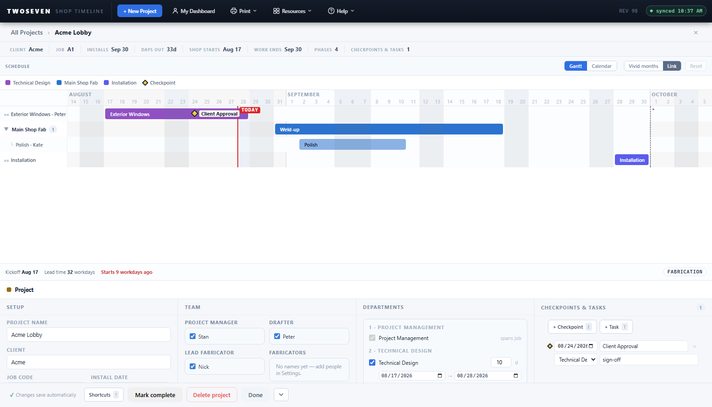

# Collapsible edit dock on the project page (REV99)

**Date:** 2026-08-28 · **REV:** 99 · **Branch:** development (pending promotion to
main) · **PR:** _pending_

## What changed

The project edit page's bottom dock (the Setup / Team / Departments / Agenda form, or a
phase's fields when one is selected) can now be **collapsed** to give the Gantt or Calendar
the whole window.

- A **chevron toggle** sits at the footer's far **bottom-right**. Clicking it hides the
  form fields and the resize grip; the slim footer bar — with the toggle and the
  Done/Delete/Shortcuts actions — stays put, so nothing is stranded. The chart's `flex:1`
  reclaims the freed space. Clicking again expands it.
- The chevron points **down** to collapse and flips **up** to expand; its `title` and
  `aria-expanded` track the state.
- **State persists per user across sessions** — stored in `localStorage`
  (`shopTimelineDockCollapsed`, next to the existing `shopTimelineDockH`), read at load and
  applied when the project page renders, so it survives a refresh or a new login.
- Works on **both** the Gantt and Calendar views (the dock is shared), and on saved
  projects and new-project drafts.

## How it was built

Mirrors the existing dock-height persistence exactly: a `DOCK_COLLAPSED` global loaded from
`localStorage` (like `DOCK_H`), a `setDockCollapsed()` twin of `setDockH()`, and a `collapsed`
class on `#pp-dock` that hides `#pp-insp` + `#dock-resize` via CSS. `renderProjectPage`
applies the persisted state just before its `npvRebuild()`, so the chart paints into the
collapsed layout from the first frame. Editing while collapsed still happens in the
edit-in-place popover (REV98).

## Tests

- New suite **`tests/test92.js`** (registered in `run.js`): the dock starts expanded with a
  footer toggle; clicking collapses it (form hidden, footer/toggle stay, `localStorage`
  written, `aria-expanded` flips) and clicking again expands it; a **fresh boot with the
  flag pre-seeded renders collapsed from the start** (the cross-session persistence case).
- `npm test` and `npm run test:ref` both green (the reference build skips — no toggle).

## Docs

`docs/Design-Language.md` §7.5 updated with the collapse toggle (owner request 2026-08-28).

## Evidence

- 
- 
