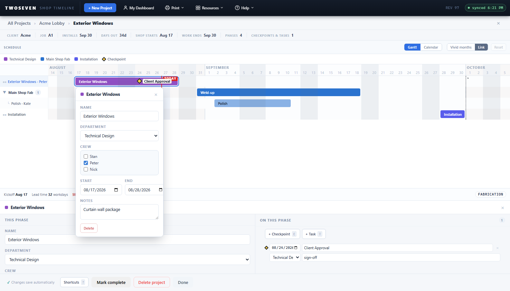
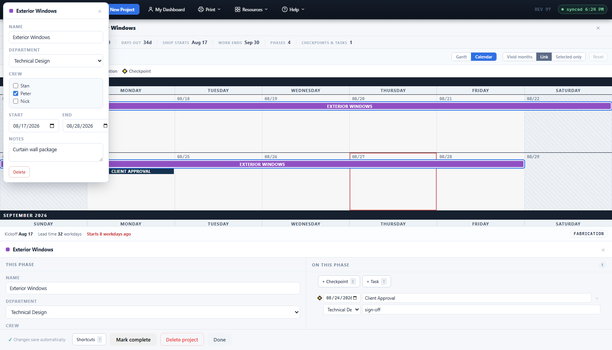
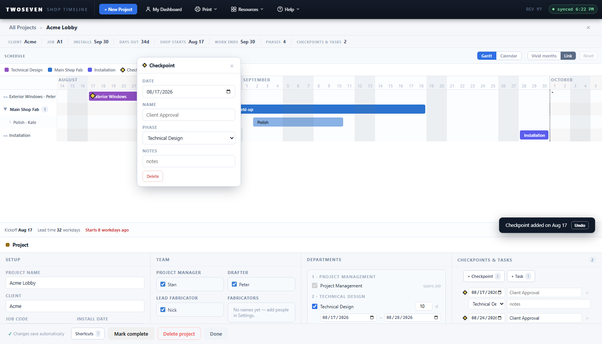

# Edit-in-place popover on the project chart (REV98)

**Date:** 2026-08-27 · **REV:** 98 · **Branch:** development (pending promotion to
main) · **PR:** _pending_

## What changed

Editing a phase, subtask, checkpoint, or task on the project page used to mean one of
two clumsy paths: left-click to select and then hunt down to the bottom-dock form, or
right-click a small "add" menu whose **Name** field silently got overwritten by the next
menu press. Both are replaced by **one small edit-in-place popover** that opens right where
you're working, on both the Gantt and the Calendar.

- **Left-click any item → the popover opens on it**, anchored to the bar/band/marker. It
  shows the same fields as the bottom inspector (Name, Department, Crew, Start, End, Days,
  Notes for a phase; Date/Name/Phase/Notes for a checkpoint; Due/Title/Phase/Who for a
  task) and a Delete. The bottom dock form is **unchanged** and stays in sync — the popover
  and the dock share one commit path, so an edit made in either place reads back in both.
- **Double-click a phase/subtask title** (the Gantt gutter name, or a calendar phase band)
  **renames it in place**, like renaming a folder in Explorer — Enter or click-away commits,
  Esc cancels.
- **Right-click → New subtask / checkpoint / task** now creates the item immediately (the
  Undo toast is preserved) and **opens the popover on it** with the name pre-selected —
  "create, then edit". The broken inline **Name** field is gone from the right-click menu.
- The popover dismisses on Esc (one layer, before it clears the selection), an outside
  click, or a scroll, and layers above the top toolbar so a tall popover clamped near the
  top of the window keeps its own header and close button visible.

All of the above works identically on the **Gantt** and **Calendar** views.

## Why it mattered

The old menu's Name field didn't work, and the only real editor was a form at the far
bottom of the screen — a long eye-trip from the bar you clicked. The design language
already anticipated this: §6 called for a "portable version of the inspector" and §7.5
named it explicitly. This is that editor, now present on the **saved** project page too,
not just drafts.

## How it was built (notably lazy)

- The retired REV3.5 popover left its commit helpers behind (`ppPopName`, `ppPopDate`,
  `ppPopDelete`) — they were exactly what the new popover needed, so no new persistence
  code was written.
- The bottom inspector's field-commit and crew-commit logic was **extracted** into
  `ppCommitPhaseField` / `ppCommitCrew` and shared with the popover, which is what gives
  the two surfaces automatic data parity (one code path, not two that can drift).
- The popover reuses the inspector's own CSS field classes (`.ins-f`, `.ins-row3`,
  `.crew-list`, `.ins-btn`), so the two editors are visually identical by construction.

## Design-doc changes

`docs/Design-Language.md` §6 updated in the same change (CLAUDE.md rule — never diverge
silently): the N11 split is refined with the edit-popover amendment, the retired inline
name field is noted, checkpoint/task click now opens the popover (not the agenda row), and
the project-page double-click — reserved by the 2026-08-27 ruling — is now bound to inline
rename (owner request, same day).

## Tests

- New suite **`tests/test91.js`** (registered in `run.js`): left-click opens the popover on
  both views, edits write through and the dock reflects them (parity, both directions),
  right-click → New opens the popover on the fresh item, double-click renames in place, and
  Esc/outside-click dismiss it.
- Updated suites that asserted the retired behaviour: `test48/49/50/53/57` (the `.mn` inline
  name field is gone; the sniff that gated the new-vs-reference branch is re-pointed from
  `/\.npv-menu \.mn/` to `/npvEditPop/`), and `test72` (a calendar marker click now opens the
  popover instead of focusing the agenda row).
- `npm test` and `npm run test:ref` both green (50/50 suites; the reference build correctly
  skips/branches to the legacy behaviour).

## Known ceilings / follow-ups

- Duplicate and Pin stay **inspector-only** — the popover carries the data fields plus
  Delete to keep it compact. Add them to the popover if shop use asks for it.
- A background poll that lands while the popover is open is deferred until it closes (same
  as an open menu), so a very long edit session won't see a teammate's change until
  dismissed — acceptable, and the dock still shows it on the next interaction.

## Evidence

- 
- 
- 
