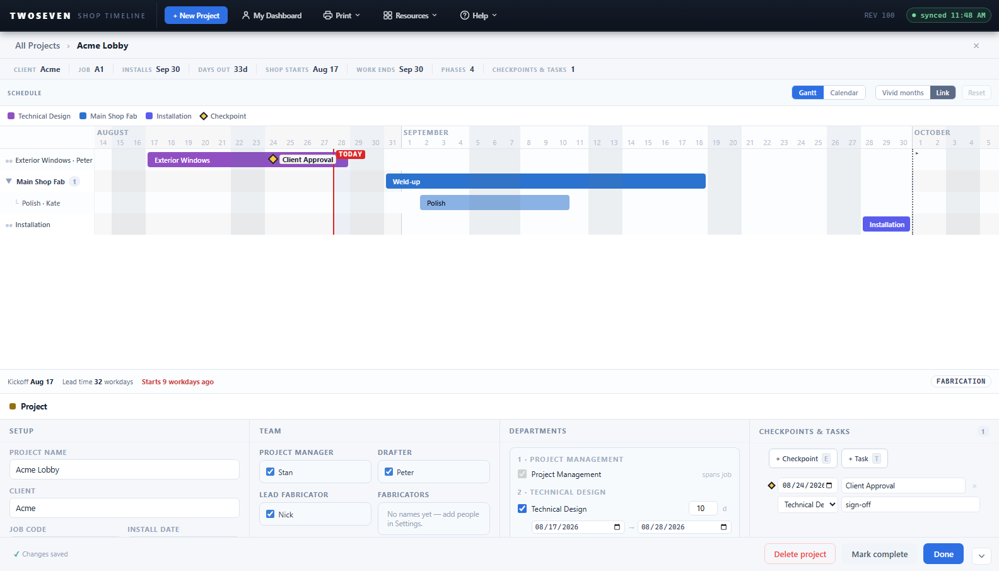
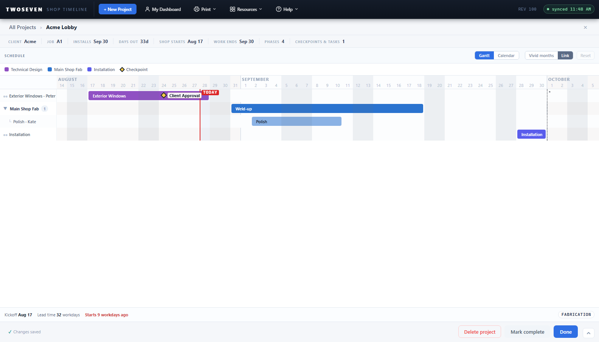

# Project-page footer as a standard action bar (REV100)

**Date:** 2026-08-28 · **REV:** 100 · **Branch:** development (pending promotion to
main) · **PR:** _pending_ · **Source:** owner UX handoff

## What changed

The project-page footer was a flat left-aligned row —
`✓ Changes save automatically | Shortcuts | Mark complete | Delete project | Done` —
that mixed passive status, project actions, help, and a panel control with no hierarchy.
It's now a conventional action bar with each control class visually separated:

- **Left — passive status.** `✓ Changes save automatically` → **`✓ Changes saved`**, muted
  text that reads as state, not a button.
- **Right — project actions, weakest→strongest.** **Delete project** (subdued destructive —
  transparent, red only on hover, always confirms) · **Mark complete** (neutral secondary
  workflow step) · **Done** (the **primary/accent** control). Done outranks Mark complete:
  it's the exit from editing and the most frequent action, whereas completing a project is
  a rarer state transition. New-project drafts keep Cancel (neutral) + Create project
  (primary) in the same right cluster.
- **Removed — Shortcuts.** Keyboard help is application-level, not a project action, so the
  footer button is gone. It's reachable via **Help ▾ → Keyboard shortcuts** (now route-aware
  — the project page opens its own `pp-ks` sheet instead of the timeline's `tl-ks`) and the
  **`?`** overlay, both unchanged.
- **Separated — the dock collapse toggle.** It acts on the interface container, not the
  project, so it's no longer a footer button competing for the button row's spacing. It sits
  in its own fixed bordered area at the **dock's bottom-right corner**, present in both the
  expanded and collapsed states.

Governing principle from the handoff: the footer contains actions on the *current project*;
controls acting on the *application shell* stay visually separate.

## How it was built

- The existing button tokens already fit: `.btn-del` was exactly the subdued-destructive
  treatment, `.btn-primary` the accent, `.btn-ghost` the neutral secondary, `.pg-auto` the
  passive status text — so the change is mostly reclassification, not new CSS.
- Project actions are wrapped in a `.foot-actions` group (`margin-left:auto` right-aligns it;
  `margin-right` reserves the corner) so status and actions never share spacing.
- The toggle moved out of `.dash-foot` to a direct child of `#pp-dock`, absolutely positioned
  at the corner (`#pp-dock` is already `position:relative`).
- `Help ▾ → Keyboard shortcuts` became route-aware, mirroring the existing route-aware
  `Take a tour` item.

## Tests

- `test92.js` updated: the toggle now asserts it sits in its own dock corner **outside** the
  footer button row (`closest('#pp-dock') && !closest('.dash-foot')`).
- `test49` (footer present) and `test87` (Mark complete) unaffected — ids unchanged.
- `npm test` and `npm run test:ref` green.

## Known ceilings / follow-ups

- A disabled **Mark complete** (project already complete) uses a generic `.btn:disabled`
  dim; fine, revisit only if the completed state needs a distinct treatment.

## Evidence

- 
- 
