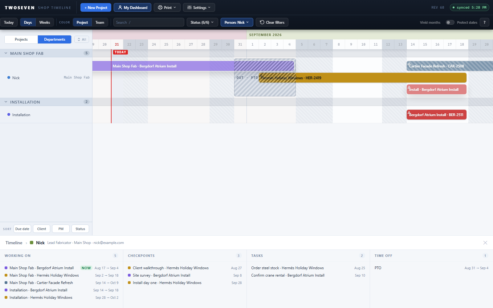

# Dashboard button + breadcrumb — item 4 complete (REV68)

**Date:** 2026-08-21 · **REV:** 68 · **PR:** [#15](https://github.com/221twoseven/Project-Scheduler/pull/15)

Final slice of the person-filter / dashboard track (TODO §3 item 4). REV65 built the
filter, REV66 the identity, REV67 the panel — this adds the one-click way in and the
labeled way back. **§3 item 4 is done.**

## What changed

- **"My Dashboard" button** in the top toolbar: one click sets the Departments lens,
  the person filter to "me", and the panel — the whole dashboard composition. It stays
  lit while the dashboard is showing.
- **Who is "me":** `meName()` (login email → `Staff.email`, then display name). If
  unresolved, the button asks once — a small "Who are you?" menu of the roster — and
  **remembers the pick on this device** (`shopTimelineMe`), completing the identity
  chain's last link. A remembered name that has left the roster is ignored, and a
  resolved identity always beats the remembered pick.
- **Breadcrumb:** the panel header is now an N1-style trail — **Timeline › name** —
  and clicking *Timeline* (or the ✕) unwinds to the home view: the unfiltered Gantt,
  in whichever lens you were using before entering. Entering from the Departments
  lens exits back to it; entering from Projects restores Projects.

## Evidence

- 

## Tests

`tests/test68.js` (14 assertions): the ask-once flow (menu, remember, enter), direct
entry on the second click, identity-beats-remembered, breadcrumb unwind restoring the
prior lens from both exits, stale remembered names rejected.

## Ceilings / follow-ups

- The shared shop terminal signs in as one account — its identity resolves to that
  account's Staff row (or the remembered pick). Fine for a wall display; a personal
  dashboard there means one click into the ask menu.
- The remembered pick is per browser, not per Windows profile.
- Harness note (not an app issue): frozen-clock captures (virtual-time headless
  Chrome) freeze CSS transitions mid-swap; the screenshot generator now disables
  transitions. Chased as a "cascade bug" for a while — it wasn't one.
