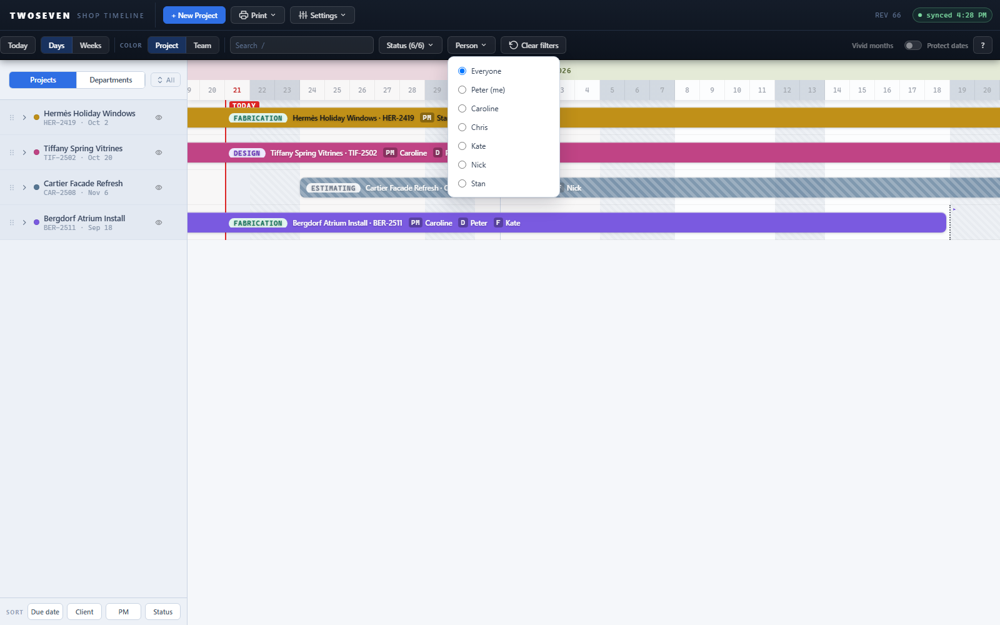
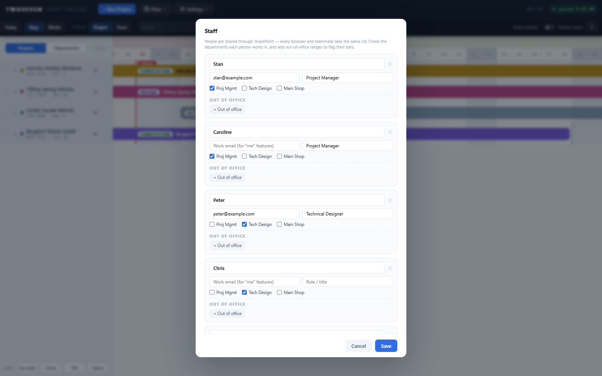

# Identity chain — the app knows who "me" is (REV66)

**Date:** 2026-08-21 · **REV:** 66 · **PR:** [#15](https://github.com/221twoseven/Project-Scheduler/pull/15)

Second slice of the person-filter / dashboard track (TODO §3 item 4), building on
REV65's person filter.

## What changed

- **Staff carries email and role.** `ShopTimeline_Staff`'s new `email`/`role` columns
  (added by the owner 2026-08-21) now round-trip through the app: People &
  Availability gets an **Email** and a **Role / title** field per person, saved with
  the rest of the roster. The app also *preserves* values entered directly in the
  SharePoint list — before this, a roster save from the app would have dropped them.
- **`meName()` — the identity chain.** Signed-in email vs `Staff.email`
  (case/whitespace-insensitive) first; display name second; null when unresolved.
  The remembered-person-picker fallback is deliberately deferred to the dashboard
  button slice, which is where an explicit "who are you?" ask naturally lives.
- **"Me" floats to the top** of the Person filter menu, labeled `Name (me)`, right
  after Everyone.
- **Sticky lens:** the Projects/Departments choice now persists per browser and
  restores on the next visit — joining the person pick (REV65), status filter, color
  mode and collapsed sections. This is the "whichever was most recent" home view the
  dashboard breadcrumb will return to.

## Evidence

- 
- 

## Tests

`tests/test66.js` (13 assertions): field-mapper round-trip, all three chain outcomes,
menu pinning without duplication, editor fields + trim-on-save, lens persistence
round-trip with button state.

## Ceilings / follow-ups

- Emails for existing staff must be **backfilled by hand** (in the modal or the List)
  until 5b's Teams-membership picker fills them automatically.
- Identity does not yet *default* the person filter to "me" — deliberate: the shared
  shop terminal signs in as one account, and auto-filtering every load would hide the
  shop schedule. The dashboard button (next slice) is the explicit "show me mine" act.
- Next slices: the person panel under the Department view, then the dashboard button +
  breadcrumb (with the remembered-picker fallback).
