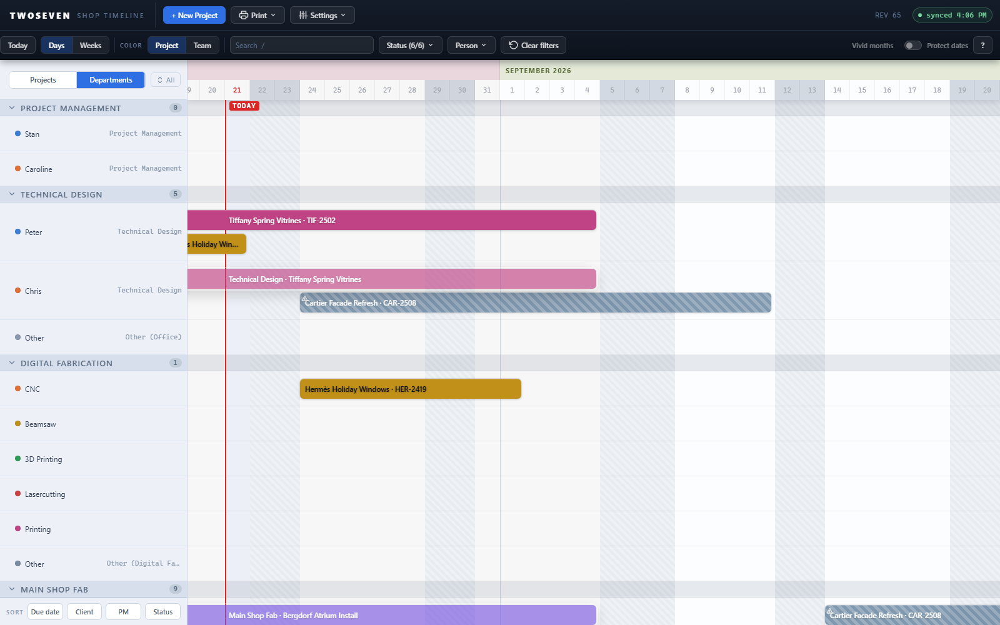
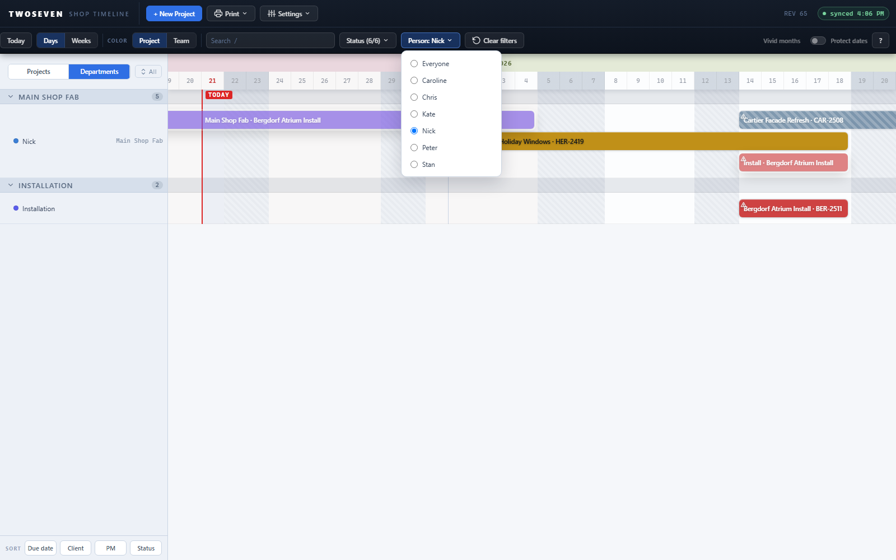
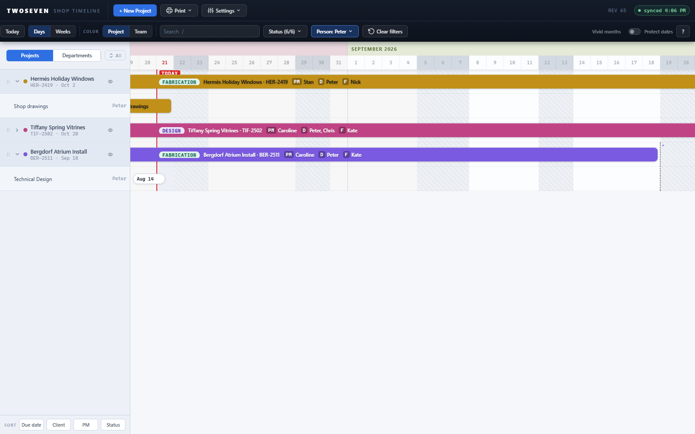

# Person filter — "whose plate is this?" (REV65)

**Date:** 2026-08-21 · **REV:** 65 · **PR:** [#15](https://github.com/221twoseven/Project-Scheduler/pull/15)

The first slice of the person-filter / dashboard track (TODO §3 item 4). A **Person**
dropdown now sits in the toolbar beside the Status filter and limits the whole home
Gantt to one person's work, in both lenses.

## What changed

- **Person menu** in the toolbar: Everyone (default) plus every name from People &
  Availability, rebuilt on every open so roster edits show up immediately. The button
  reads `Person: Nick` and lights up while a pick is active.
- **Project lens:** only projects the person is on survive — explicit crew membership
  or implicit ownership via the project team on an unowned umbrella (the same
  `barCrew` rule the overbooking checker uses). Expanded projects show only the
  person's bars.
- **Departments lens:** only the person's own lanes survive; department/process lanes
  keep only their bars; departments with none of their work drop entirely. The result
  reads as "my plate" — this is the Gantt half of the future dashboard view.
- **Rows are removed, not dimmed** — unlike search (which dims to keep layout stable),
  the person filter collapses the view, because its job is focus, not lookup.
- **Clear filters** (toolbar) and the in-canvas **Reset the view** both clear the pick;
  the pick **persists** in UI prefs and restores on the next visit — the first piece of
  the per-user sticky views planned for the identity slice.
- **Empty state:** picking a person with nothing scheduled explains itself and points
  at Clear filters.

## Evidence

- 
- 
- 

## Tests

`tests/test65.js` (14 assertions): menu contents, badge, both lenses' row filtering,
implicit-umbrella involvement, both reset paths, persistence round-trip, empty-state
card. Skips on builds without `btn-person` (the frozen reference).

## Ceilings / follow-ups

- The Meeting Sheet and print views deliberately ignore the person filter — they are
  whole-shop documents. Revisit only if someone asks for a personal print.
- The filter matches **names**, not identities — same-name people collide (existing
  app-wide convention; the roster is small).
- Next slices (TODO §3 item 4): identity chain (`Staff.email` → float "me" to the top,
  default the pick), the person panel under the Department view, then the dashboard
  button + breadcrumb.
