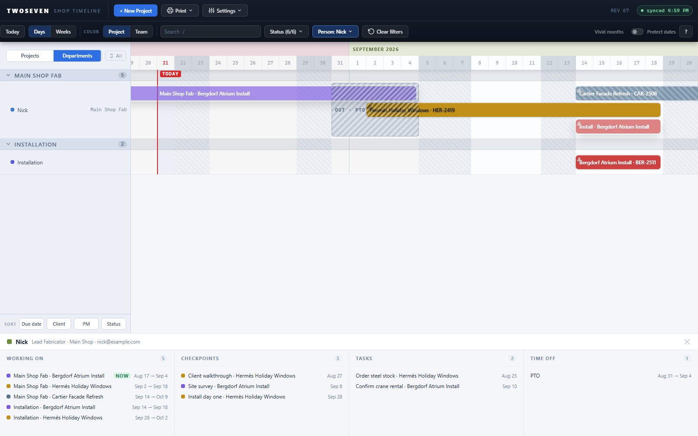

# Person panel — the dashboard takes shape (REV67)

**Date:** 2026-08-21 · **REV:** 67 · **PR:** [#15](https://github.com/221twoseven/Project-Scheduler/pull/15)

Third slice of the person-filter / dashboard track (TODO §3 item 4). With REV65's
filter and REV66's identity, this is the owner's dashboard composition working:
**Departments lens + person filter + this panel = the dashboard view.** All that's
left is the button and breadcrumb that name it.

## What changed

- **A bottom panel (`#me-dock`) docks under the Departments lens** whenever the person
  filter is on — the same title-block idea as the project page's bottom inspector,
  reusing its column styles. It clears with the filter (its ✕ does that too) and never
  appears in the project lens or on project pages.
- **Header:** the person's name with their role, department(s) and email, synced live
  from People & Availability.
- **Four read-only columns**, capped at 8 rows each (+N more): **Working on** — their
  bars, soonest first, a NOW tag on anything spanning today; **Checkpoints** — upcoming
  events on their projects; **Tasks** — their open to-dos with due dates; **Time off** —
  current and future ranges. Editing stays where it lives (People & Availability, the
  Home modal, the charts).
- Toasts now dock above this panel the same way they avoid the project-page inspector
  (extends the D3 rule).

## Evidence

- 

## Tests

`tests/test67.js` (14 assertions): visibility rules (lens + person + project page),
header contents, all four columns' include/exclude logic (NOW tag, past checkpoints,
completed and other-people's tasks), and the ✕-clears-filter path.

## Ceilings / follow-ups

- Panel height is fixed at 236px — no drag-resize until someone asks (the project-page
  dock's resizer pattern is ready to borrow).
- Checkpoints come from `ShopTimeline_Events` only; legacy per-phase ticket nodes are
  not folded in.
- Rows are not clickable (no jump-to-bar); worth adding if testers reach for it.
- Next slice: the dashboard **button + breadcrumb** ("me" via the identity chain, with
  the remembered-picker ask when unresolved) — then §3 item 4 is done.
