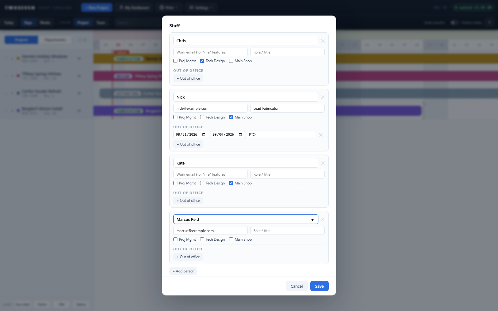

# People & Availability picks from Microsoft Teams (REV70)

**Date:** 2026-08-25 · **REV:** 70 · **PR:** [#15](https://github.com/221twoseven/Project-Scheduler/pull/15)

TODO §3 item 5b — the app's first Teams integration, and the last §3 build item.
With this, **§3's feature work is complete.**

## What changed

- **The staff editor's Name field suggests from the company Team** in Microsoft
  Teams (group `e434fc35-f2be-4dde-a258-2c23d94b5f9e`, chosen by the owner). Typing
  or picking an exact member **fills their work email automatically** — the email
  that drives every "me" feature — and never overwrites one already present.
- **Opening the editor backfills** emails for existing people whose name exactly
  matches exactly ONE member; ambiguous names are left alone, and every fill is
  visible in the form before Save. This was the promised one-click backfill for the
  pre-Teams roster — it now happens on open, zero clicks.
- **The Team is a menu, not a sync.** Only people explicitly saved join
  `ShopTimeline_Staff`; leaving the Team removes nobody from the schedule (departed
  people persist on historical projects by design).
- **Auth is isolated:** `TeamMember.Read.All` (admin-consented 2026-08-25) rides its
  own silent token request. Missing consent, or any Graph failure, degrades to the
  old free-text field with a console line — sign-in and everything else are
  untouchable by this feature. Membership pages via `@odata.nextLink`.

## Evidence

- 

## Tests

`tests/test70.js` (11 assertions): member mapping/sorting/lowercasing, datalist
wiring, backfill (single-match yes, ambiguous no, existing email untouched),
live fill on typing, save round-trip, and no auto-import of the Team.
`tests/harness.js` gained a `teamMembers` gate (403 by default — the realistic
no-consent degrade).

## Ceilings / follow-ups

- Members are fetched once per session (first editor open); a mid-session Team
  change needs a reload to appear.
- Matching is by exact display name (case-insensitive) — nicknames ("Nick" vs
  "Nick Barnes") don't auto-match; pick from the suggestions to link them.
- The group id is one constant (`TEAM_GROUP_ID`) — repointing to a purpose-built
  Team later is a one-line change.
