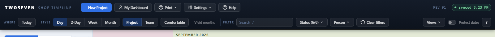
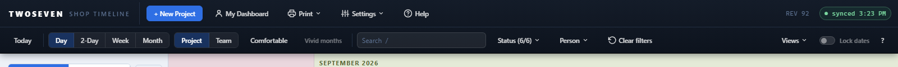

# Native toolbar direction — Phase 1 (REV92)

**Date:** 2026-08-27 · **REV:** 92 · **Initiative:** Native software toolbar
direction · **Branch:** development (pending promotion to main)

## What changed

The owner's handoff: make the shell feel like established desktop/web software,
not a bespoke dashboard. The strategy is `docs/Archive/Toolbar-Native-Direction.md`
(five phases). This is **Phase 1 — de-taxonomize + reserve visual weight**, and
it reverses the eyebrow-label approach shipped hours earlier (REV88, Option A).

- **Removed the `Where` / `Style` / `Filter` eyebrow labels.** The two cluster
  separators now carry the grouping — the UI no longer teaches users the app's
  internal taxonomy. The now-dead `.t-mini` CSS (base rule + `max-width:1400px`
  rule) went with them.
- **Protect dates → Lock dates.** The toolbar toggle label and both
  resize-blocked messages.
- **Visual-weight pass.** A rule scoped to `.tb-row` makes standalone toolbar
  buttons sit flat (transparent at rest, background on hover). **+ New Project**
  is the one accent; the segmented scale/color groups keep their frame; an
  active view/nav state stays lit. Overlay and sidebar `.t-btn` are untouched
  (the scope and `#t-tint`'s own ID rules see to that).

## Why it mattered

Two leaks made the shell feel custom: the row-2 controls were all equal-weight
pills with their buckets labelled out loud, and only one action (New Project)
deserved prominence. Flat buttons + a single accent + separator-carried grouping
is the familiar pattern; the eyebrows were the opposite instinct.

## Evidence

## Tests

`test88.js` §2 was flipped from "eyebrows present" to assert the de-taxonomised
state: no `.t-mini` labels remain, the separators stay, and the lock toggle
reads "Lock dates" (13/13). The behaviour guards (`test-b3-zoom`, `test-b5`,
`test-c1-color`, `test-c3-status`, `test-goto`, `test-v4-views`, `test-quiet`,
`test-e3-resize`, `test72`) pass unchanged — chrome moved, no behaviour changed.

## Design language

`Design-Language.md` §2.6 rewritten to the native (no-eyebrow) model: grouping
by question kept, but carried by separators + spacing, not printed labels; New
Project the one accent, standalone buttons flat, segmented groups framed.

## Known ceilings / follow-ups

- Density and Vivid are still visible flat buttons — they move into a `View ▾`
  menu in **Phase 2**, alongside `Color by: Project ▾`.
- Comments in `index.html` still say "Protect dates" in prose (internal, not
  user-facing); left as-is to keep the diff to user-visible strings.
