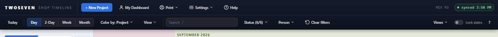
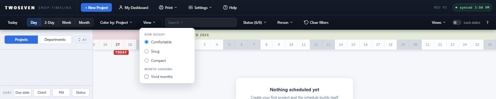

# Native toolbar direction — Phase 2 (REV93)

**Date:** 2026-08-27 · **REV:** 93 · **Initiative:** Native software toolbar
direction · **Branch:** development (pending promotion to main)

## What changed

Phase 2 of `docs/Archive/Toolbar-Native-Direction.md` — **move the low-frequency view
controls off the row into menus**, so only the most-touched controls stand as
buttons.

- **View ▾ menu.** Density (Comfortable / Snug / Compact) and Vivid months left
  the row and now live in a single `View ▾` dropdown, grouped under **Row height**
  and **Month shading** section labels. Behaviour is unchanged — the same
  `applyDensity` / `TINT` state, persistence, and render path; only the control
  moved.
- **Color by: Project ▾ dropdown.** The Project / Team segmented toggle became a
  labelled dropdown that shows the current lens and offers the two options. The
  button label follows the choice (`Color by: Team`).
- **Scale stays visible.** Day / 2-Day / Week / Month remain a segmented control
  — the most-touched control, with D/W/+/− keys (decision locked in the strategy
  doc). It is now the only framed group on the row.
- **Settings → Density alias retired.** Its release gate had already fired; the
  item is gone from the Settings menu.

Net: the timeline row drops from ~11 standing controls to a tighter set —
`Today · [Day 2-Day Week Month] · Color by ▾ · View ▾ | Search · Status · Person
· Clear | Views ▾ · Lock dates · ?`.

## Why it mattered

Density, Vivid, and the colour toggle were all standing buttons of equal weight
for controls a user touches rarely. Menus for the low-frequency and single-choice
options — segmented control only for the frequent, mutually-exclusive scale — is
the familiar desktop pattern and keeps the row legible.

## Evidence

## Tests

- `test88.js` rewritten to the Phase 2 end state (18/18): new reading order, old
  controls gone, `View ▾` lists the three densities + Vivid months, `Color by ▾`
  offers Project/Team, and picking from each drives `DENSITY` / `COLOR_MODE` with
  the dropdown label following.
- `test-b5.js` (density) and `test-quiet.js` (Vivid) updated to drive the controls
  through the `View ▾` menu instead of the retired toolbar buttons — behaviour
  assertions unchanged, both green (29/29, 27/27).
- Full guard set green: `test-b3-zoom`, `test-c1-color`, `test-c3-status`,
  `test-goto`, `test-v4-views` (saved views restore through `applyViewState`),
  `test-e3-resize`, `test72`, `test46`.

## Design language

`Design-Language.md` §2.6 updated: the view cluster is now scale (segmented) ·
`Color by ▾` · `View ▾`; single-choice / low-frequency controls belong in menus.

## Known ceilings / follow-ups

- **Phase 3** consolidates Status + Person into a single `Filters ▾` with a count
  and removable chips (Clear appears only when a filter is active).
- The `.sm-sec` menu section label uses `--fs-micro` (the sanctioned decorative
  eyebrow token) so it clears the §3 "nothing informational below 11px" guard.
