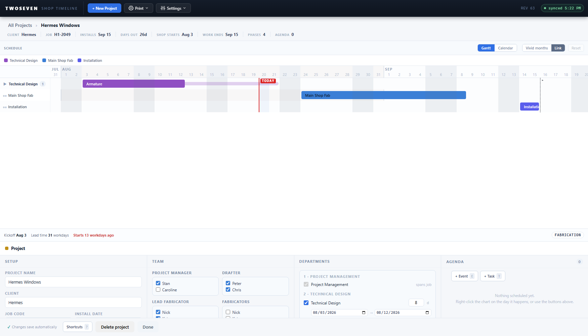

# Breadcrumb trail on the project page (REV63)

**Date:** 2026-08-20 · **App REV:** 63 · **Branch:** development

## What changed

The project page's top row was three unrelated controls pretending to be a line: a blue
"← Timeline" button, a colored dot, an editable title input, and a floating "‹ Phase"
tail. It's now one breadcrumb trail with one visual logic:

**All Projects › [Project Name] › [Phase]**

- Ancestor segments are muted links; the deepest segment is dark — that's where you are.
- Clicking a link unwinds to it (the same one layer Escape peels). The phase segment
  appears only while a bar is selected.
- The green/colored dot is gone.
- **The project name is edited in the Setup section now** — first field, above Client —
  with the same commit behavior as every other project field. The trail is navigation,
  nothing else.

## Evidence

## Notes

- `#pp-name` kept its id (now in Setup), so drafts, autosave stash/restore, and the
  create-validation focus path are unchanged; `#pp-back` and `#pp-bc` kept theirs, so
  the N1 breadcrumb tests still pass as written.
- Dead CSS removed: both legacy `.pg-back` blocks, `.pg-dot`, `.pg-name`, `.pg-crumb`.
- Full run: 24/24 suites on `index.html`, reference untouched.
