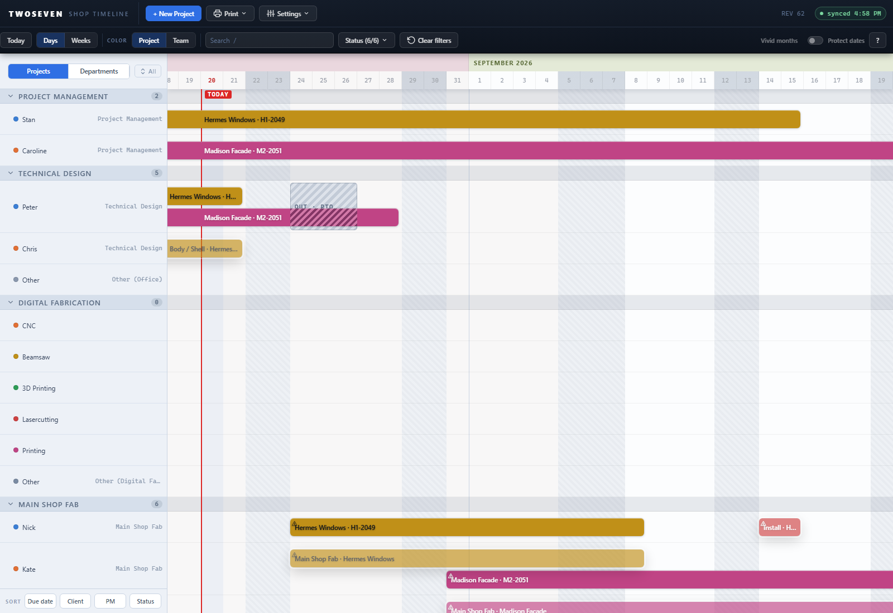
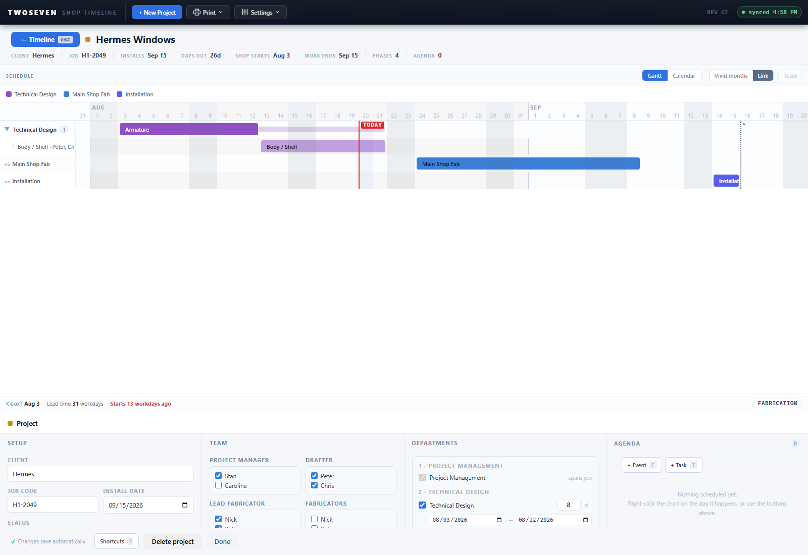

# Work priority over people priority — crews on subtasks (REV63)

**Date:** 2026-08-20 · **App REV:** 63 · **Branch:** development

## What changed

The schedule used to be people-first: picking three drafters on a project drew three
parallel Technical Design bars, one per person, and every phase editor then only let you
assign **one** person per bar. That fought how the shop actually works — a fluid pool of
labor moving together through pieces of work ("Armature", then "Body / Shell", same
people on both).

Now the model is work-first:

- **One bar per department.** The scheduler no longer fans out one bar per person. A
  department's umbrella bar carries **no owner** — ownership is implicit through the
  team picked in the project settings (who shows up in each person's lane, overbooking,
  and out-of-office checks automatically).
- **Subtasks are the unit of work.** Splitting a department gives one row per subtask,
  and each subtask carries a **crew of any size** — a checkbox picker culled to the
  people checked on the project's Team section (install still picks from the full
  staff). Empty crew = covered by the project team.
- **Agenda tasks (to-dos) take multiple people** too — the data model always stored a
  list; the editors just capped it at one.
- **Overbooking is per person across crews:** the same name on overlapping bars from
  different projects flags every bar it rides on, whether the name is explicit or
  implicit via the team.
- On the dashboard's department lens, a crew bar shows in **every member's lane** (the
  first member holds the real draggable bar; the others get ghost references, the same
  pattern installs already used).

## Storage / colleague-app compatibility

Crews save as **plain comma-joined names** ("Peter, Chris") in the existing `assignee`
text column — the same convention project roles already use. No SharePoint schema
change. The colleague app shows the comma list as literal text; its person-lane grouping
treats a multi-name crew as one label (known, accepted trade-off — single-name bars are
unaffected). Install crews keep their existing JSON-array format.

## Evidence

- 
- 

## Tests

- `tests/test62.js` rewritten for the new model (draft lifecycle: one unowned bar,
  comma crews, subtask splits, one-bar deletes).
- `tests/test63.js` new (saved side: scheduler, `barCrew` implicit-team fallback,
  crew-aware overbooking).
- `tests/test61.js` updated (crew checkboxes on both left-click editors, pool culled to
  the project team, comma-list persistence).
- Full run: **24/24 suites** on `index.html`, **24/24** on the frozen REV50 reference.

## Known ceilings / follow-ups

- The draft "Lines" panel and the agenda-task table edit crews as comma-text inputs
  (narrow grid columns); the checkbox picker lives in the bar popover / inspector.
- A multi-crew bar's color in team-color mode follows the first crew member.
- The colleague-app lane quirk above.
