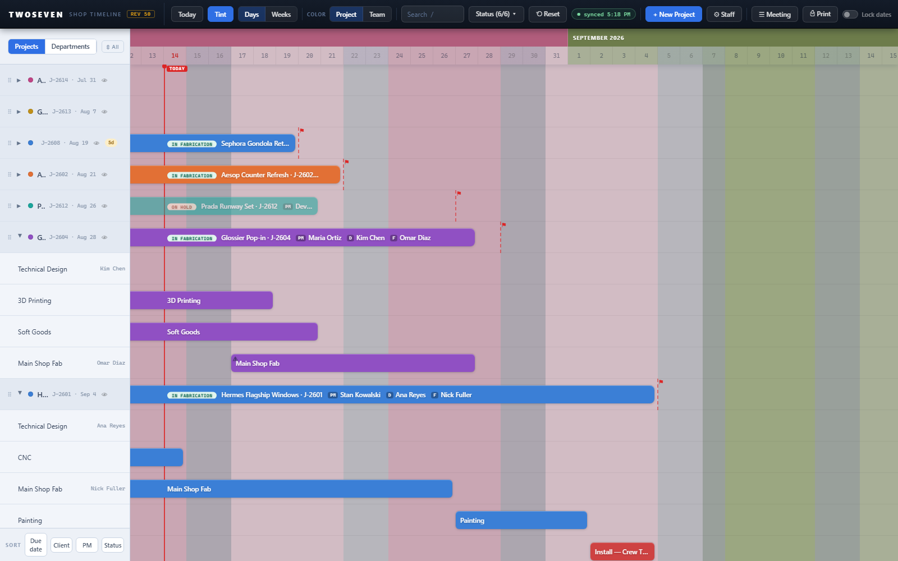
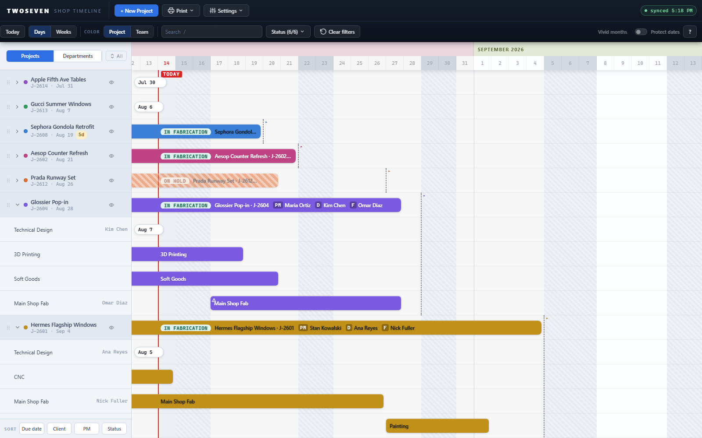
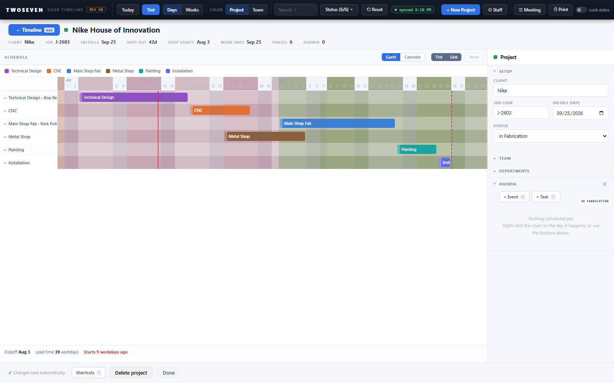
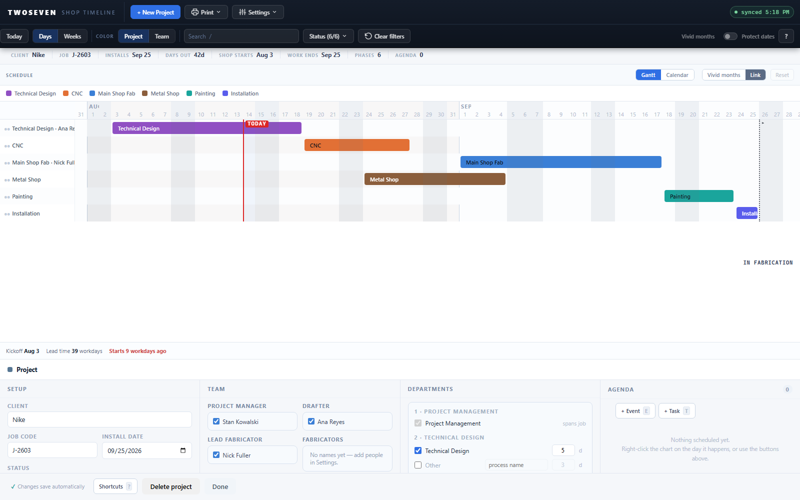
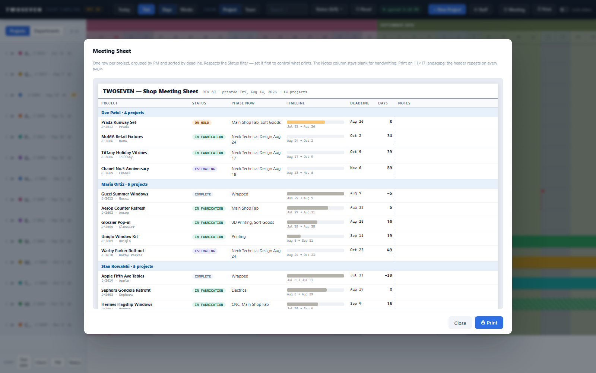
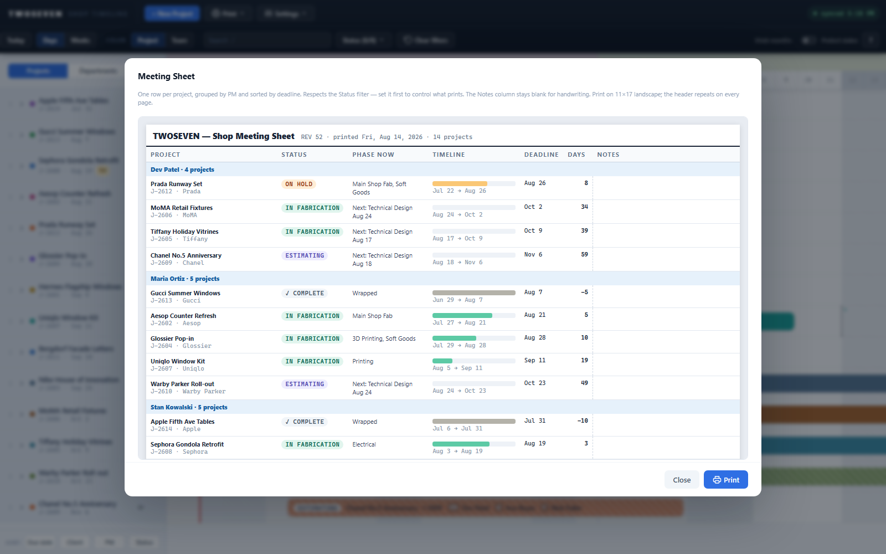
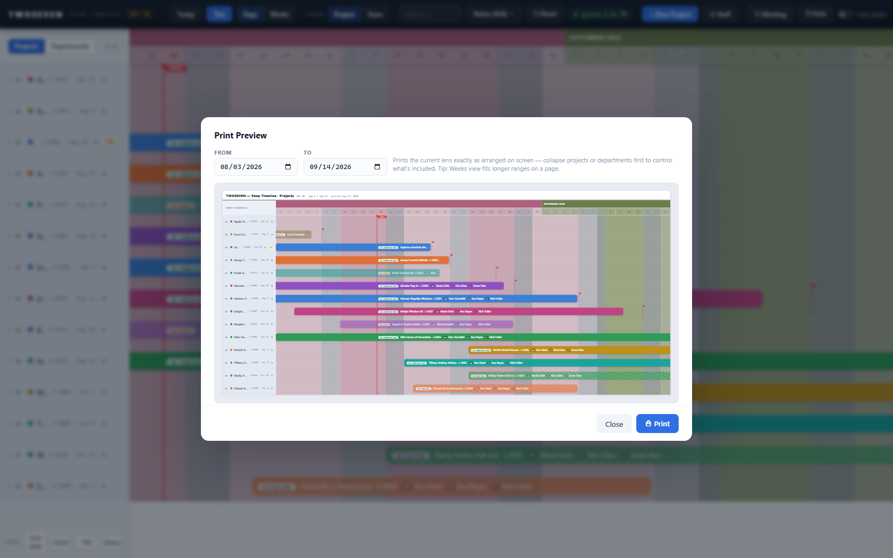
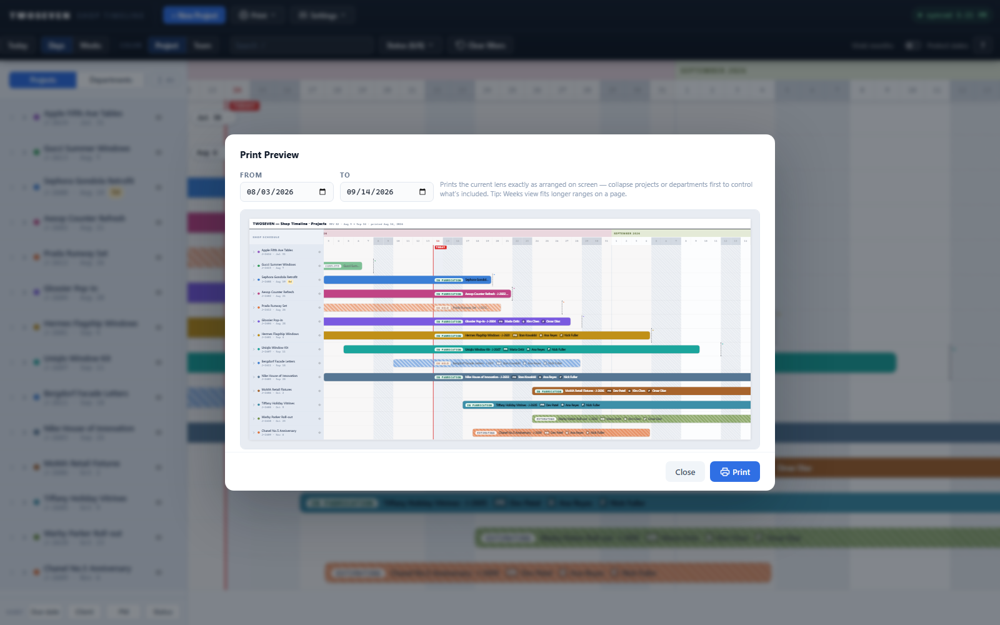

# Phase 2 closed — the visual system pass (U8)

**Date:** 2026-08-14 · **Branch:** development · **App REV:** 52 · **Brief:** `docs/Phase-2-Task-Briefs.md` U8

Phase 2 rebuilt how the Timeline *looks and reads*: one type scale, one quiet
canvas, one honest color system, one icon language. Phase 1 fixed what things
*do*; Phase 2 fixed what they *say at a glance*. This record closes the phase.

## Every finding shipped (finding → what changed → record)

| Finding | What changed | Milestone record |
|---|---|---|
| **C5** — informational text below legibility | Type & layout tokens; nothing informational under 11px | [C5 record](2026-08-13-c5-type-scale.md) |
| **E1** — project inspector squeezed into a right rail | Inspector docks to the bottom; the schedule gets the full width | [E1 record](2026-08-13-e1-bottom-dock.md) |
| **C2** — month-tint background louder than the data | Quiet canvas by default; "Vivid months" is the opt-in | [C2 record](2026-08-14-quiet-canvas.md) |
| **B4** — today/deadline markers lost against the background | Markers re-tuned on the quiet canvas | [B4 record](2026-08-14-b4-today-deadline-markers.md) |
| **C3** — color meant four things at once, no legend | Status = pattern + pill on the project's own hue; ? legend | [C3 record](2026-08-14-c3-status-legend.md) |
| **C6 / C7** — mixed icon styles, uneven toolbar | One SVG icon set; two-tier toolbar rhythm; dark chrome kept | [C6/C7 record](2026-08-14-u6-svg-icons-toolbar-rhythm.md) |
| **D3** — toasts stacked over the sort bar | Toasts dock bottom-right, cap at 3, collapse repeats | [D3 record](2026-08-14-u7-toast-docking.md) |
| **D2** — status legible only through hue | Codified as a regression test — see below | this record |

## What U8 itself shipped

**Print now speaks the same design language as the screen.**
- The meeting-sheet CSS carried its own hand-typed sizes and colors; it now
  uses the shared tokens (`--fs-title`, `--fs-fine`, `--txt`), and the print
  stylesheet's month-header override inherits `--side` instead of repeating
  the hex. Printed output can no longer drift from on-screen styling without
  a test failing (`test-quiet.js` pins the print block).
- **Bug fixed:** the meeting sheet's mini timeline bars still used the
  *pre-migration* status names, so most projects printed with a gray fallback
  bar. The fills now map to the six real statuses — In Fabrication prints
  green, In Design violet, Forecast pale blue.
- The meeting-sheet header — **TWOSEVEN — title · REV · printed date · project
  count** — is confirmed as the template any future report copies.

**Color-blind safety is now a test, not a hope (D2).**
New suite `tests/test-cb.js` (37 assertions, runs in `npm test` against both
builds) re-computes the whole color system under a deuteranopia simulation
(Machado et al. 2009 matrix — the most common color-vision deficiency) and
asserts:
1. all 12 project colors keep a readable label after simulation (worst case
   4.2:1, guard at 4.0:1);
2. every status pill's own text still passes 4.5:1 after simulation;
3. the premise is real: simulated status hues *do* collapse into
   near-identical pastels — which is why…
4. …every status must stay tellable without hue: forecast (faint + dashed),
   estimating (74% opacity), on-hold (hatch), complete (dim + ✓), plus a
   distinct pill word per status. Delete any of those treatments and the
   build fails.

## Evidence — before (REV50) vs after (Phase 2), identical seed data

In `screenshots/`:

| View | Before | After |
|---|---|---|
| Dense timeline |  |  |
| Project page |  |  |
| Meeting sheet |  |  |
| Print preview |  |  |

The pairs were captured from the same build process with the same 14-project
seed; the only variable is the app version.

## Verification

- All **15 suites pass** on `index.html` and on the frozen REV50 reference
  (`npm test` / `npm run test:ref`).
- The new CB suite is part of `npm test`, so D2 is a permanent regression
  guard, not a one-off audit.

## Known ceiling / follow-up

- **Hallway test round 2** (the five tasks from the strategy doc §6) needs
  real people — schedule it before promoting `development` to `main`; compare
  assist counts to round 1.
- In-Design and In-Fabrication bars are both full-strength on purpose (both
  are "active work"); the pill word is what separates them. If shop feedback
  wants a bar-level cue, that's a Phase 3 decision.
- Phase 3 scope per the brief: B3 zoom / B5 compact density if PMs still
  report navigation pain, B6 saved views if they don't.
- PR link: _pending — changes are on `development`, not yet promoted._
