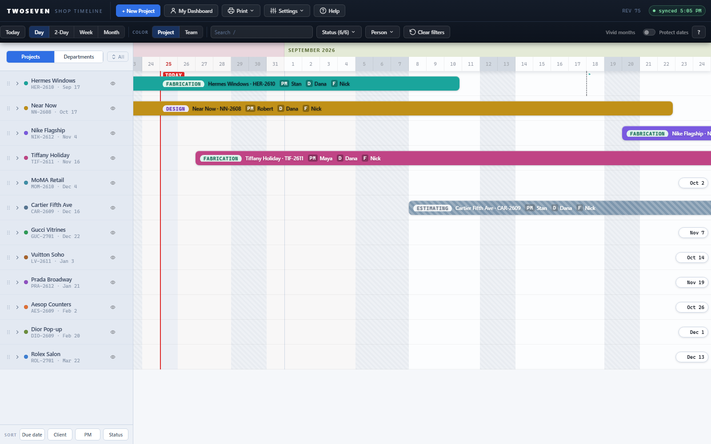
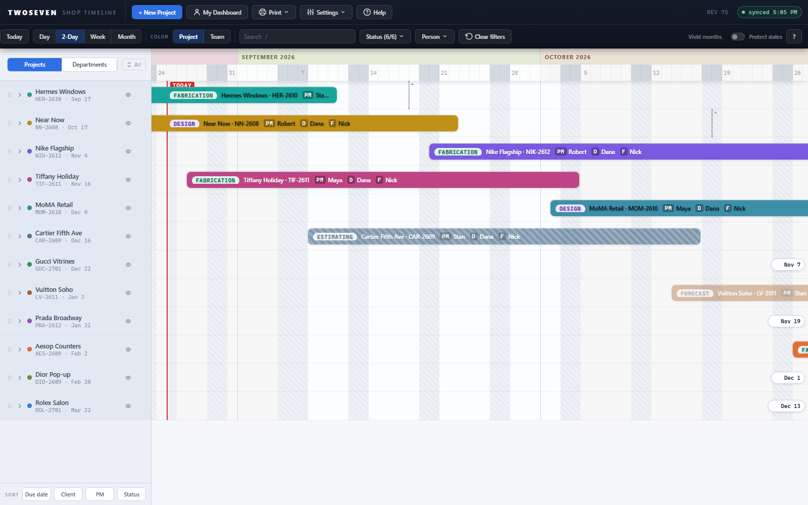
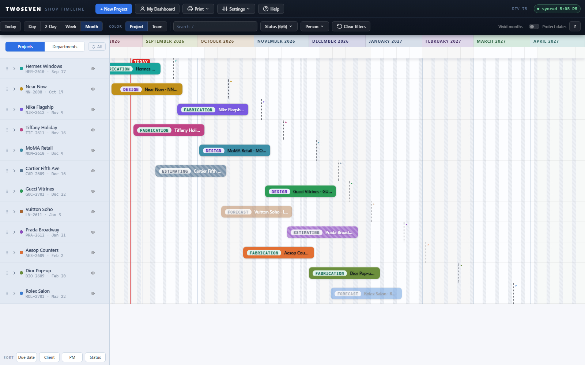

# Four zoom steps (finding B3, zoom half) — REV75

**Date:** 2026-08-25 · **App REV:** 75 · **Finding:** B3 (UX audit, "two zoom levels,
no in-between, no overview") · **Design Language:** §7

## What changed

The Days/Weeks toggle became a four-step zoom: **Day 40 / 2-Day 20 / Week 14 /
Month 5 px per day**. Day and Week keep the exact old scales, so those two steps
render pixel-identical to REV74 and every existing test still means what it meant.
The two new steps fill the gap the audit named: 2-Day for "a few weeks at once
without losing day resolution," Month for the season overview — a 6-month season
now fits one screen with every project identifiable by its color and label.

- **Control:** the toolbar toggle is now a four-button segmented group
  (Day · 2-Day · Week · Month), same `tog-grp` rhythm as the Color and lens toggles.
- **Keyboard:** `D` and `W` still jump straight to Day/Week; `+` and `−` step the
  zoom in and out.
- **Persistence:** the chosen step is saved in the UI prefs (`UI_KEY`) and restored
  on the next visit.
- **Axis header:** Month step shows month names only; 2-Day numbers Mondays only;
  Day and Week are unchanged.
- **Bar anatomy (§7):** as a bar narrows its label sheds pieces in order — PM/D/F
  chips first, then the job code, then everything but the status pill; below ~34px
  the bar renders bare, a colored identity tick (never under 4px). Weekends and
  holidays compress but never disappear, at every step.
- **Edge indicators (B1)** are geometry-driven, so they keep pointing at off-screen
  bars correctly at all four steps.

The Design-Language §7 zoom line carried illustrative values (34/20/9/3) from before
implementation; it now records the shipped scales — doc and code updated in the same
PR per the never-silently-diverge rule.

## Evidence

| Step | Screenshot |
|---|---|
| Day (unchanged control) |  |
| 2-Day (new) |  |
| Month (new) |  |

## Tests

New suite `tests/test-b3-zoom.js` (32 assertions): scale constants, keyboard
walking, Month/2-Day headers, weekend compression, six-months-on-one-screen,
§7 anatomy thresholds, UI_KEY persistence, and edge indicators at Month.
Full `npm test` run green before merge.

## Known ceilings / follow-ups

- The B3 **jump-to-date** half (`G` / click the month header) is not in this PR.
- Anatomy thresholds are px constants (`BAR_W_CHIPS/CODE/PILL/TICK` in
  `index.html`); they apply at every step, so a very short project (< ~2 weeks)
  at Week zoom now shows pill-only instead of clipped text — intended per §7.
