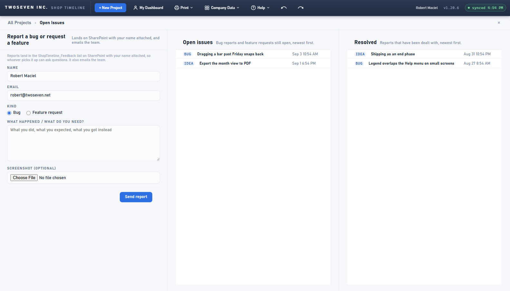

# 2026-09-04 — Resolved column on the Open Issues page

**Date:** 2026-09-04 · **Version:** 1.20.7 · **Branch:** development → main

Owner ask: the Report a bug or idea page (#/issues) gets a third column for resolved
reports. Since v1.20.1 a resolved report simply vanished from the public list and lived
only on the developer page; now the team can see what has already been dealt with.

## What changed

- `renderIssues()` lays out three columns — report form | open issues | resolved — each
  with its own heading, the `fb-3col` class narrowing the form column so all three fit.
- `fbPaintList()` paints both lists from the single feedback fetch (open ≠ resolved by the
  `status` column); empty states: "No open issues…" / "Nothing resolved yet."
- No SharePoint change — the `status` column already existed.

Guarded by `test-v160` ("the resolved column renders as a third pane").
