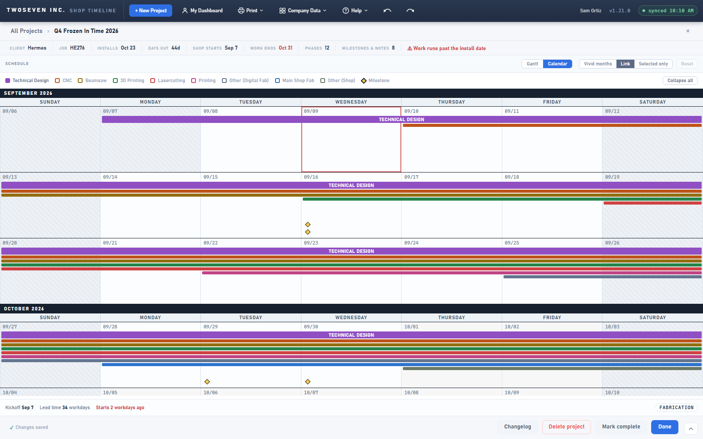

# 2026-09-09 — Calendar detail levels

**Date:** 2026-09-09 · **Version:** 1.21.0 · **Branch:** development (/preview/ only for now)

Owner ask: with a fully stacked job (nine phases, ten milestones and notes) the project
calendar was unreadable — one titled row per phase per week, plus a row per marker, so a
week ran to twenty rows. The fix is a three-step detail level per phase, the same idea as
the expand/collapse elsewhere in the app, with the legend chips as the controls.

## What changed

- **Level 0 is the default:** every phase paints as a slim colour strip with no text, and
  milestones/notes as bare diamonds and circles. Markers on different days share one row.
- **The legend chips are buttons** (calendar mode only). Click a phase chip to step it to a
  titled bar, click again for its subtasks, again to go back to a strip. The swatch shows
  the level — hollow, filled, filled with a caret. Click **Milestone** or **Note** to show
  the marker text. **Collapse all** resets every phase and turns marker text off.
- Clicking a strip still selects it and opens its phase to subtasks, as before; the selected
  phase always reads at full size.
- Under the hood the per-phase expand set became a map of department → level; the band's
  label stays in the DOM under the strip (tooltips and tests still see it) and CSS hides it.

Known ceiling: a level-0 strip is a ~9px click target, below the app's 24px rule — one
click expands it to a full-size band, which is the escape. Recorded as a §9 exception in
`docs/Design-Language.md`.

**v1.21.1, same day (owner ask):** the project-page tour gained a step on the calendar
legend ("Read the calendar at any depth"), right after the Gantt/Calendar toggle step. The
step switches the chart to Calendar before it is spotlit, so the chips it points at are the
live buttons. The earlier "The schedule" step's calendar sentence was reworded to match.
Copy recorded in `docs/Copy-Coach-and-Helpers.md` (rows 10, 12).

Guarded by `test-v1210`.
