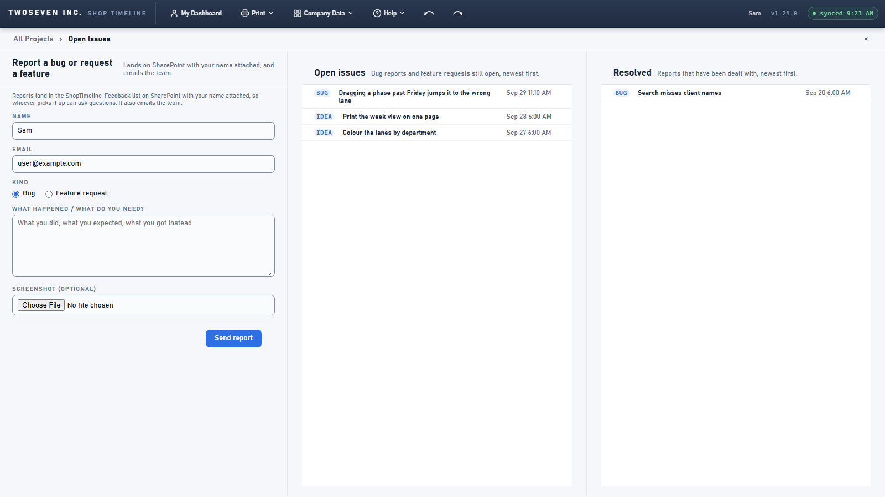
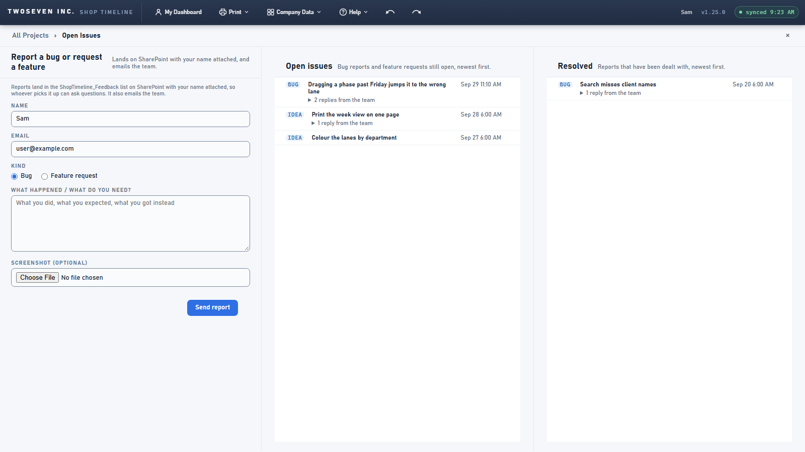
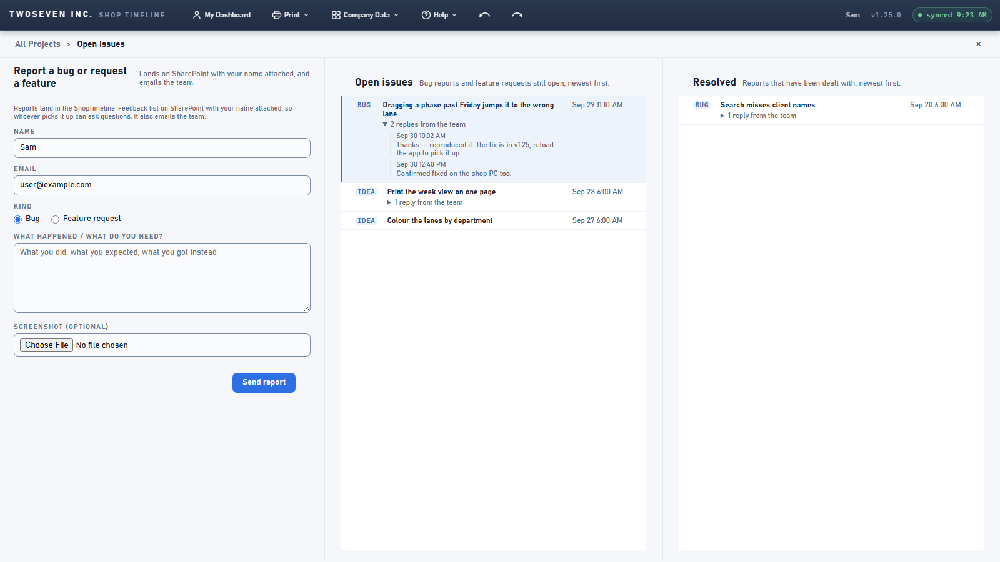

# 2026-09-30 — Team replies on reports (v1.25.0)

**Date:** 2026-09-30 · **App version:** v1.25.0 · **Where:** `index.html` + the private
tracker `221twoseven/Project-Scheduler-issues` (`poll.mjs`, commit e770dfe) · **PR:** see
the `feat/issue-comments` pull request

## What changed

The team can now answer a report, and the person who filed it hears back. The owner asked
for this on 2026-09-30 and asked to build it right away rather than queue it in the TODO.

1. **You reply on GitHub.** A comment on the ticket that starts with `/reply` is meant for
   the reporter. Any other comment (debugging notes, stack traces, Claude's notes) stays
   on GitHub.
2. **The poller copies replies to the list.** It copies each `/reply` comment, without the
   prefix, into the report's new `comments` column. It rewrites that column every run, so
   editing or deleting a reply on GitHub updates the app too. Comments trigger the job,
   so a reply shows up in about a minute.
3. **The app shows replies.** On Help ▸ Open Issues, a report with replies shows a
   "1 reply from the team" toggle that opens to show them. The developer reports page
   shows the replies too. A link to `#/issues/<id>` opens the page with that report
   highlighted and its replies already open.
4. **The reporter gets an email.** A new reply also sets `lastComment`. A Power Automate
   flow on the list emails that reply to the reporter, with the link from step 3. The
   poller can't send email: it only has access to SharePoint, and giving it tenant-wide
   Mail.Send was ruled out. The flow's steps are in the tracker's README.
5. **The reply goes to whoever actually sent the report.** From v1.25.0, each new report
   records the sender's sign-in in `reporterUpn`. The email box on the form can be
   edited, so it isn't trusted. Reports filed earlier fall back to the form's email.

**Schema** (⚠ additive, owner-applied 2026-09-30) on `ShopTimeline_Feedback`:
- `comments`: multiple lines of text
- `lastComment`: multiple lines of text
- `reporterUpn`: single line of text

## Known ceilings

- **Replies are public inside the shop.** The Open Issues page is visible to everyone,
  and so is the list on SharePoint. Write `/reply` comments for the whole shop.
- **Only people with a GitHub account on the tracker can reply.**
- **One repeated reply isn't mailed.** If two `/reply` comments in a row have the same
  text, `lastComment` doesn't change, so the second one isn't emailed.
- **The email link only works on the new version.** Until v1.25.0 reaches `main`, a
  `#/issues/<id>` link opens the timeline instead of the report.

## Rollback

- Stop the email: turn off the Power Automate flow.
- Stop the syncing: revert the tracker commit. The rest of the poller keeps working.
- The app side is additive. A build without it ignores the three columns.

## Screenshots

Before (no replies) → after (replies folded under each report) → after, opened from the
email link (`#/issues/5`: the report highlighted, its replies expanded):

