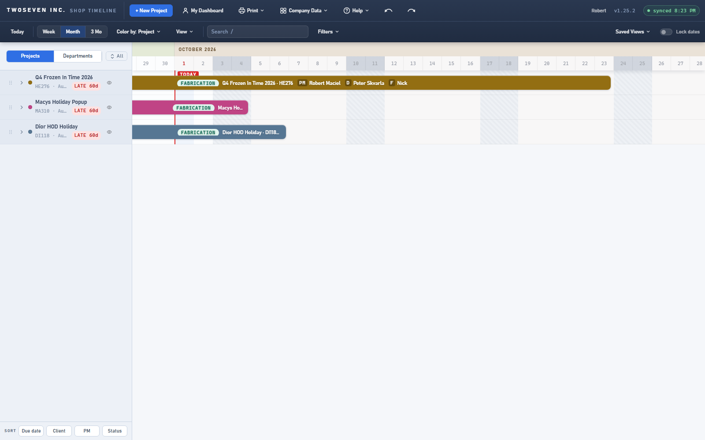
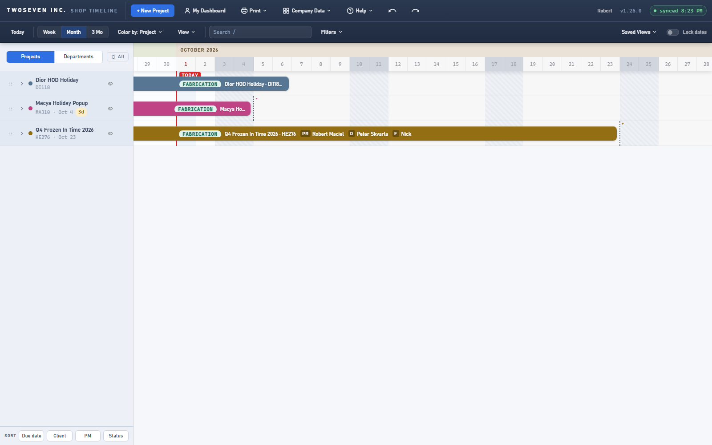
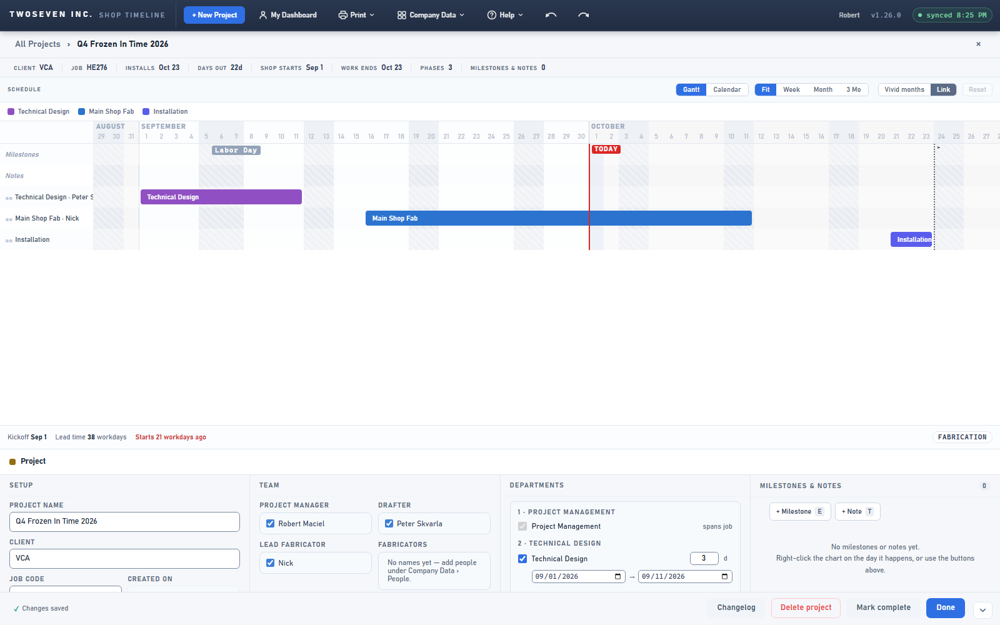

# 2026-10-01 — One due-date rule: the install block decides (v1.26.0)

**Date:** 2026-10-01 · **App version:** v1.26.0 · **Where:** `index.html` · **PR:** #78 ·
**Tracker:** `221twoseven/Project-Scheduler-issues#15` and `#20`

## What changed

PMs enter an install date when they create a project, then reschedule the real
Installation under Departments. Everything the shop sees kept reading the first date:
the dashboard's LATE tag, the project header's "Installs" and "Days out", the dotted date
line on the chart, the PM late prompt and the Meeting Sheet. One project had Shipping
scheduled and Installation unticked, and its header still said "INSTALLS Oct 9".

1. **One rule.** A project's due date is the end of its Installation block (the latest
   end if there are several), else the end of its Shipping block, else none. The helper
   is `dueOf`, and every surface above reads it, so they can never disagree again. The
   header and the chart's date-line say "Installs" or "Ships" to match.
2. **The Setup date is retired from view.** On a saved project the editable Install date
   is gone; a read-only **Created on** shows when the project was first saved. The stored
   value stays in the list (it is still the anchor the automatic layout was built from) but
   nothing reads it for lateness.
3. **New projects ask once.** The New Project form's date is now labelled **Target install
   / ship date**. It lays the schedule out backward and becomes the Installation block
   (or the Shipping block when Installation is unticked); after Create, the dates live in
   Departments.
4. **Neither block, no date.** A project with neither Installation nor Shipping shows no
   install date anywhere and is never marked late. The Meeting Sheet prints TBD for it.
5. **Due date sort** follows the same rule; projects without a due date sort last.

## Known ceilings

- **The automatic layout still plans backward from the Setup date** at creation and when
  a department is added to a project that has no later phase to anchor to. That is the
  date's one remaining job; it matches the target the PM gave.
- **Old projects keep their stored Setup date** in the list. Nothing shows it, and a
  project that gains an Installation block later picks up the new rule automatically.
- **"Work runs past the install date"** now means a block ends after the Installation
  (or Shipping) end, which can only be another on-site block; it is rare by design.

## Rollback

Revert the PR. No schema change, no data migration: the `deadline` column is untouched,
and `createdAt` was already being written at creation.

## Screenshots

Three projects, each with a Setup install date 60 days in the past. One has its
Installation block three weeks out, one has only Shipping in three days, one has neither.
Before: all three carry a LATE tag and the old date. After: the first shows the install
date with no tag, the second a soon chip counting to its shipping date, the third no date
and no tag.

The project header before and after on the first project: "Installs" moves from the old
Setup date to the Installation block's end, and "Overdue by" becomes "Days out".

