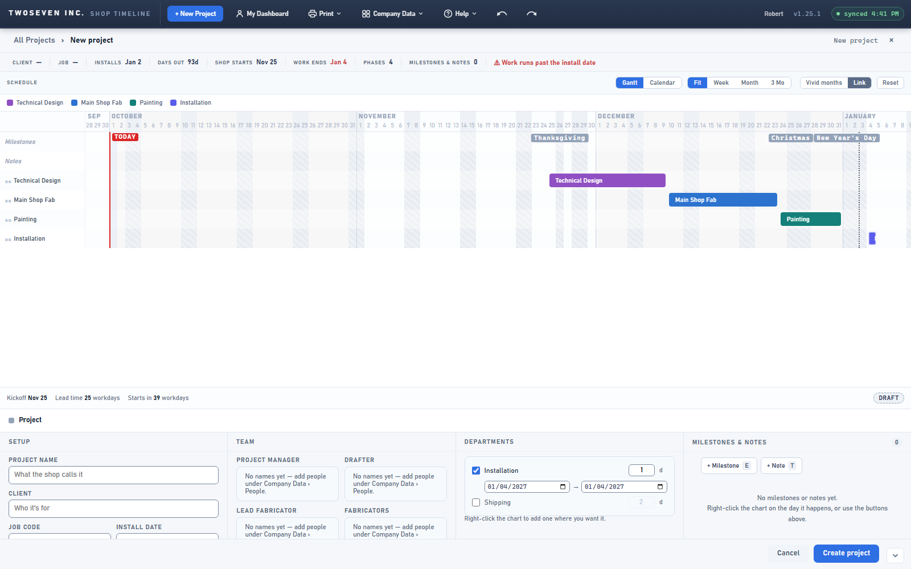
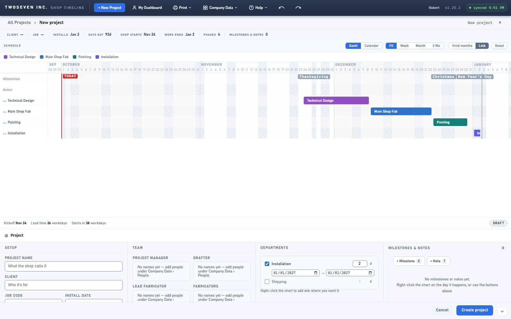

# 2026-10-01 — Installation dates stay as typed (v1.25.2)

**Date:** 2026-10-01 · **App version:** v1.25.2 · **Where:** `index.html` · **PR:** #77 ·
**Tracker:** `221twoseven/Project-Scheduler-issues#26`

## What changed

A PM typed Installation dates of Jan 1 → Jan 2, 2027 on a new project and watched the
start jump to Jan 4, after the end. The app was pushing every typed department date
forward to the next workday, and Jan 1 is a holiday with a weekend right behind it.
Installs happen on weekends and holidays, so that rule was wrong for on-site work, and
it was silent everywhere.

1. **Installation and Shipping keep the dates you type.** Weekends and holidays included.
   Their day count ("d") is calendar days, and typing a number of days ends the block
   that many calendar days after its start.
2. **Shop departments still land on a workday, but the app now says so.** A start typed
   on a weekend or holiday moves forward to the next workday; an end moves back to the
   workday before, the way a resize does. A short note appears under the date pair, for
   example "Mon, Sep 7 is Labor Day, so the start moved to Tue, Sep 8."
3. **The start can never end up after the end.** If an edit would cause that, the other
   date moves to match, and the note says that too.
4. **One rule, every typed-date path.** The Departments rows in project setup and the
   Start/End fields in the phase panel share the same `typedDates` function, on the New
   Project draft and on saved projects alike. The date fields show where the date landed,
   not what was typed.

What did not change: dragging and resizing bars on the chart snap exactly as before, and
the automatic layout of a new project still plans shop work on workdays.

## Known ceilings

- **Dragging an Installation bar still snaps to workdays.** The report was about typed
  dates and the spec covered those; a dragged install bar that should sit on a Saturday
  is a separate change if anyone asks.
- **The phase panel's note only shows after the panel repaints**, which it does right
  after each date edit. The retired draft popover carries the same note but is not
  repainted on edit.

## Rollback

Revert the PR. The change is behaviour only: no schema, no new columns, no stored values
change shape.

## Screenshots

New Project, Setup install date Jan 2, 2027, Installation typed Jan 1 → Jan 2. Before:
both dates jumped to Mon, Jan 4 (one day, and the header warned "work runs past the
install date"). After: Jan 1 → Jan 2, two days, exactly as typed.

