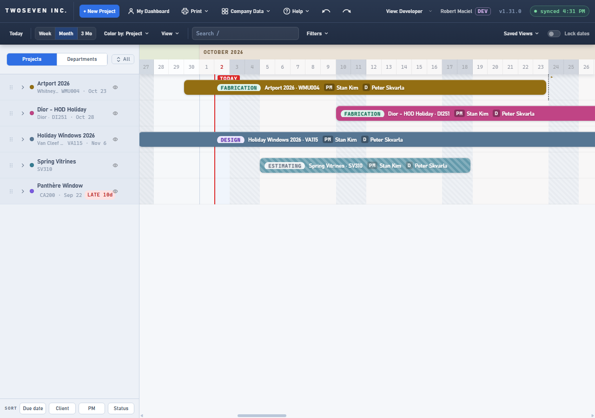
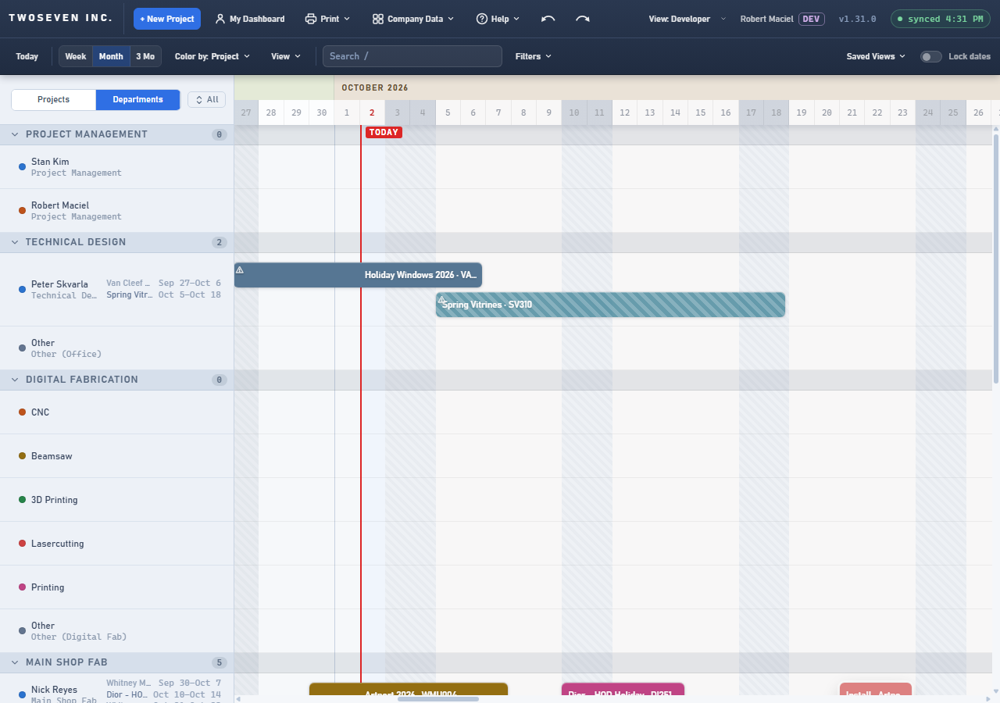

# 2026-10-02 — The client shows on the dashboard (v1.31.0)

**Date:** 2026-10-02 · **App version:** v1.31.0 · **Where:** `index.html`, `tests/test-contrast.js` ·
**PR:** #86 · **Tracker:** `221twoseven/Project-Scheduler-issues#24`

## What changed

Project setup has had separate Client and Project name fields for a long time, but the
dashboard showed only the name, so PMs typed the client into the name ("Dior - HOD
Holiday") to tell jobs apart.

1. **Projects view.** Each project's second line now reads **client · cost code · date**
   ("Whitney Museum · WMU004 · Oct 23"). When the row is too narrow the client is the part
   that gets cut; the code and the date stay whole, and the full client is on hover.
2. **Departments view.** Each project line under a person starts with the client in a
   lighter grey ("Whitney Museum · Artport 2026"), and hovering the line shows the whole
   text. When the name already starts with the client ("Dior - HOD Holiday") nothing is
   added in front of it.
3. **Nothing stored changes.** The project name is shown as typed. Editing the Client in
   Setup, on a saved project or on the New Project draft, repaints the dashboard the way
   every other field does. Print inherits both views.

Bar labels on the chart are unchanged (the owner's default on Q1).

## Known ceilings

- At the default 300px sidebar the Projects line has roughly 150px for client · code ·
  date, so a long client reads as a stub ("Van Cleef & Ar…"), and beside a LATE chip it
  can collapse to nothing. By spec the client gives way first; the owner asked to review
  the layout on the tracker and may want a minimum width.
- The Projects view shows the client even when the name starts with it ("Dior - HOD
  Holiday" over "Dior · DI251 · Oct 27"): plan 1 as written. One token moves the
  not-doubled rule there too if the review wants it.
- SORT ▸ Client already heads each group with the client; the second line now repeats it
  under every row of the group.
- Tracker #33 (not approved) asks the Departments line to show the cost code instead of
  the name. It was built here as approved on #24; #33's spec names the seams it would
  change (`clientLead`, the lane line text and hover tip).

## Rollback

Revert the PR. No data or column changes.

## Screenshots

Projects view, then Departments view, default sidebar width. Before: name over
"code · date"; lane lines read the project name. After: the client leads the second line
and the lane lines; the Dior project is not doubled; the long client is cut first.

