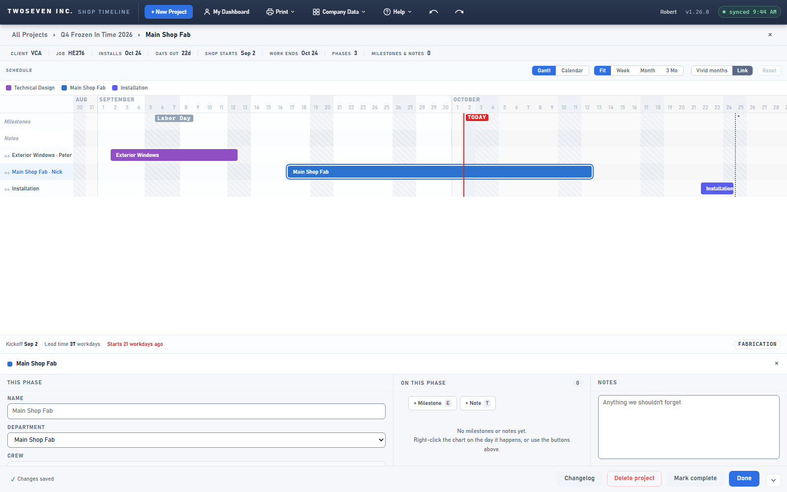
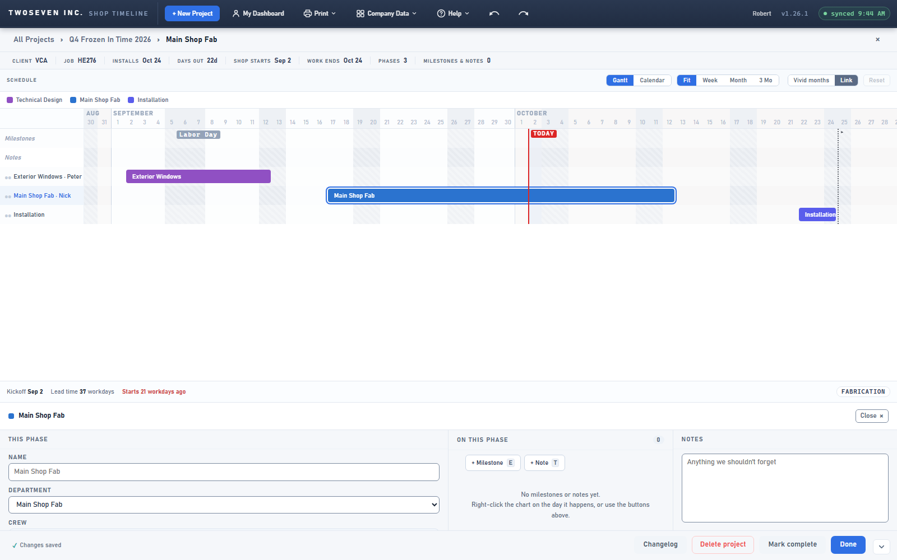

# 2026-10-02 — Blank chart space closes the phase panel; a labelled Close (v1.26.1)

**Date:** 2026-10-02 · **App version:** v1.26.1 · **Where:** `index.html` · **PR:** #79 ·
**Tracker:** `221twoseven/Project-Scheduler-issues#25`

## What changed

On the project page, clicking the empty space between rows closed the phase panel, but
clicking the empty space below the last row did nothing, because the click listener sat
on the box that holds the rows and that box ends with the last row.

1. **Any blank chart space deselects.** The press listener moved up to the chart's scroll
   box, which fills the visible chart area, so the space below the last row and the empty
   right side behave like the space between rows. Bars, row titles, the date axis (it
   pans) and the add menu still do not deselect, and a press on the horizontal scrollbar
   is a scroll, not a click.
2. **What you were typing is kept.** When a press on the chart is about to close the
   panel, a field that still holds an uncommitted value is committed first (`npvBlur`),
   so a half-typed name is never lost. Browsers already do this on blur; the app now does
   it itself, so it also holds in the test harness.
3. **The close control reads "Close ×".** The bare × in the panel header (and in the edit
   popover) is now a small labelled button, 24px tall, with "Esc" in its tooltip. It acts on
   the press: type a name and press Close, and the name is saved and the panel closes in one
   go (before, the first click only saved and a second one closed).
4. **A press that dismisses the add menu still keeps the selection.** The document-level
   handler that closes open layers now treats the whole scroll box as the chart, so the
   rule from N11 holds below the last row too.

The Calendar view keeps its own rule from v1.0.3: blank space never deselects there.

## Known ceilings

- The dashboard chart is unchanged; the report and the spec were about the project page.

## Rollback

Revert the PR. Behaviour and styling only; nothing stored changes.

## Screenshots

Project page with a phase selected. Before: a bare × in the panel header. After: "Close ×".

