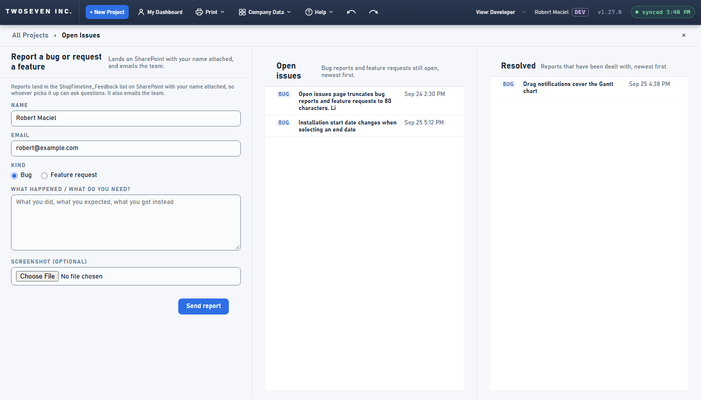
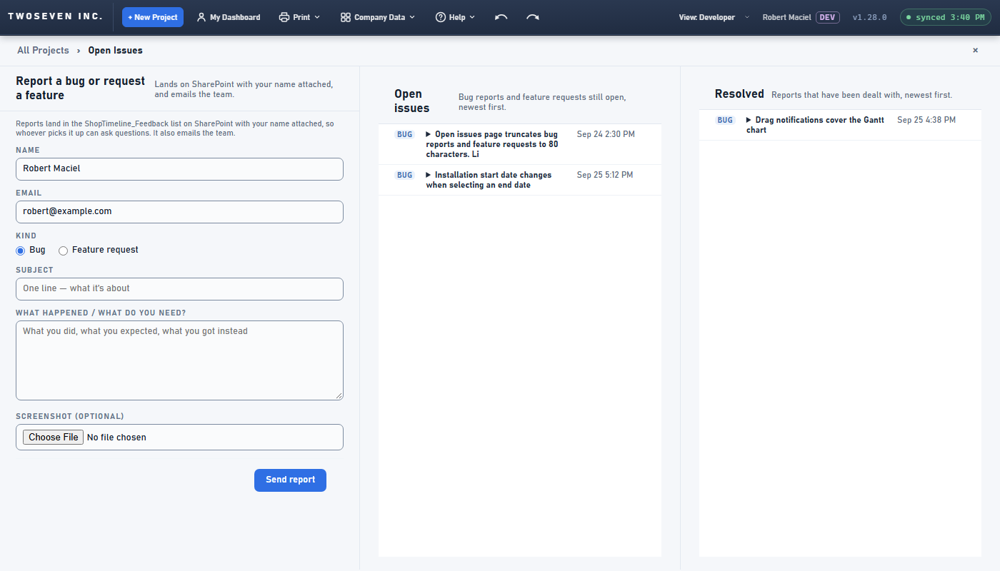
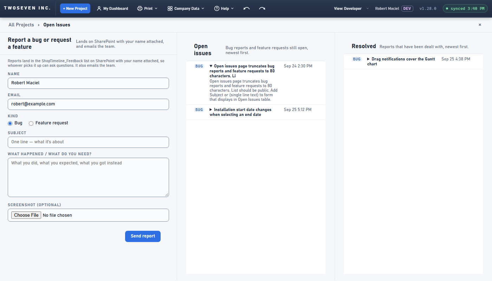

# 2026-10-02 — Report form gets a Subject; Open Issues shows the full text (v1.28.0)

**Date:** 2026-10-02 · **App version:** v1.28.0 · **Where:** `index.html`, `docs/TODO.md` ·
**PR:** #83 · **Tracker:** `221twoseven/Project-Scheduler-issues#10`

## What changed

A report's title was the first 80 characters of its description, and Open Issues showed
only that title, so every report read as a sentence cut off mid-word.

1. **A Subject on the form.** The report form asks for a required one-line Subject (up to
   120 characters) above the description. It is stored as the row's Title, so the team
   email and the tracker's GitHub issue are titled with it too. No new list column.
2. **The full text on Open Issues.** The subject is now the heading of a fold; clicking it
   unfolds the whole description underneath, the way the developer comments already do.
   Every signed-in person sees it (the owner's default for "public"); the page is not
   opened to anonymous visitors. The link in a reply email opens the report with both its
   text and its replies unfolded.
3. **Old reports keep their titles** and now unfold their full text as well.

TODO item 39 is ticked. The developer page was not touched, so the §7.4 ledger entry about
its Mark resolved / Reopen buttons now waits for the next change to `renderReports`.

## Known ceilings

- Names stay off Open Issues (they live on the developer page and in the email).
- The Subject is required; a report cannot be filed without one. The description is
  still required as well.

## Rollback

Revert the PR. Rows filed with a subject keep a sensible Title under the old code (it
reads them as plain titles); no column changes.

## Screenshots

Open Issues with the report that filed this request. Before: the title cut at 80
characters, nothing else. After: the form shows the Subject field; the report's title has
a fold marker; after a click its full text shows underneath.

