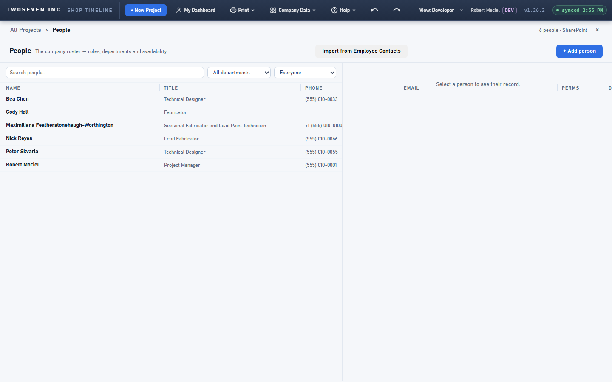
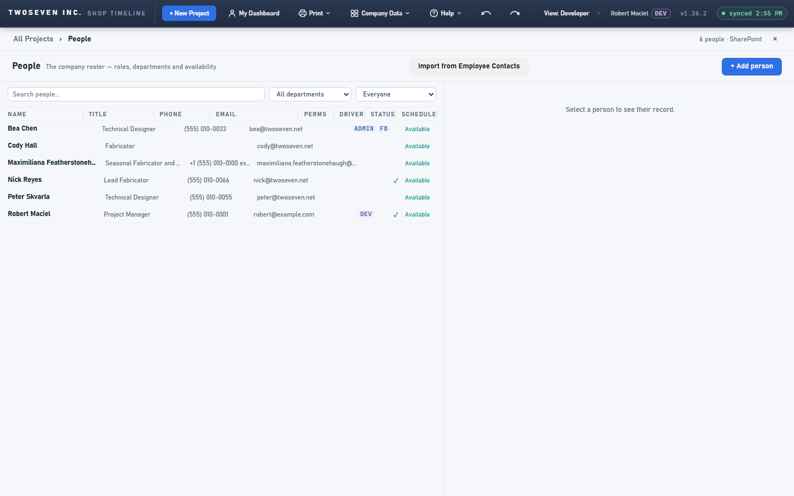
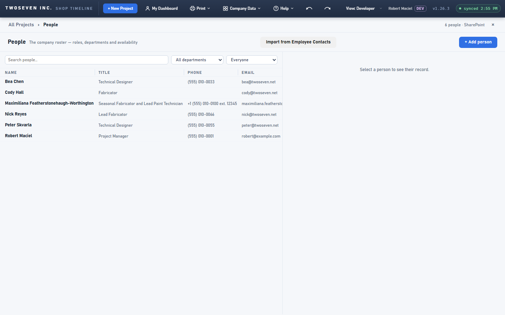

# 2026-10-02 — People page columns: fixed widths, clipped header (v1.26.3)

**Date:** 2026-10-02 · **App version:** v1.26.3 · **Where:** `index.html` · **PR:** #81 ·
**Tracker:** `221twoseven/Project-Scheduler-issues#13` and `#27`

## What changed

The People list is a grid, not a table. Its eight columns shared the pane by proportion,
so widening one squeezed the others, long values spilled into their neighbours, and the
header row, which sat outside the scrolling area, ran under the record panel when the
columns were wider than the pane.

1. **Every column is a fixed width.** Dragging a column edge moves that column only; the
   ones to its right slide over unchanged. The table is as wide as its columns, so leftover
   space stays empty on the right, and a table wider than the pane scrolls sideways inside
   it.
2. **Columns fit their text, capped.** A column nobody has resized fits its widest value
   (up to 280px) on every paint. Double-click a column edge to fit it and keep that width.
3. **Nothing spills.** Every cell cuts off with … at its own column edge, and hovering a
   cut-off value shows it in full. Permission chips keep their own tooltips.
4. **The header scrolls with the rows.** It now lives inside the list's scroll area and
   sticks to the top, so the one horizontal scrollbar moves header and rows together and
   the header can never run under the record panel. The list pane clips its contents; the
   divider between list and panel is the existing one.
5. **Reset widths.** Right-click the header row for a small menu with Reset widths, which
   clears every remembered width and lets the columns fit their content again.

A data refresh keeps the sideways scroll position as well as the vertical one.

## Known ceilings

- Column widths are remembered per browser, like the dock heights; nothing is stored in
  SharePoint.
- A column nobody has resized refits on every paint, so a new long name can widen it
  between refreshes. Resized columns never move until Reset.
- Reset widths lives in the right-click menu only; the grip tooltip names the double-click.
- The Clients page keeps its proportional columns; nothing there changed.

## Rollback

Revert the PR. Styling and page code only; the remembered widths key is unchanged.

## Screenshots

Widths pre-set wider than the pane. Before: the header runs under the record panel and
the rows have a scrollbar the header ignores. After: header and rows stop at the pane
edge and scroll together.

No remembered widths. Before: proportional columns, long values cut at arbitrary shares.
After: each column at its fitted width (the long email at the 280px cap with …). With this
roster the fitted table is wider than the pane, so it scrolls sideways; a shorter roster
leaves empty space on the right instead. Drag a column edge, or widen the pane, to taste.

