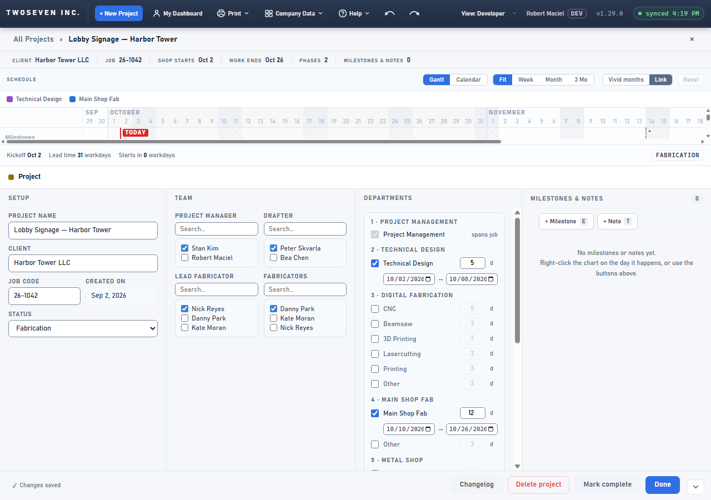
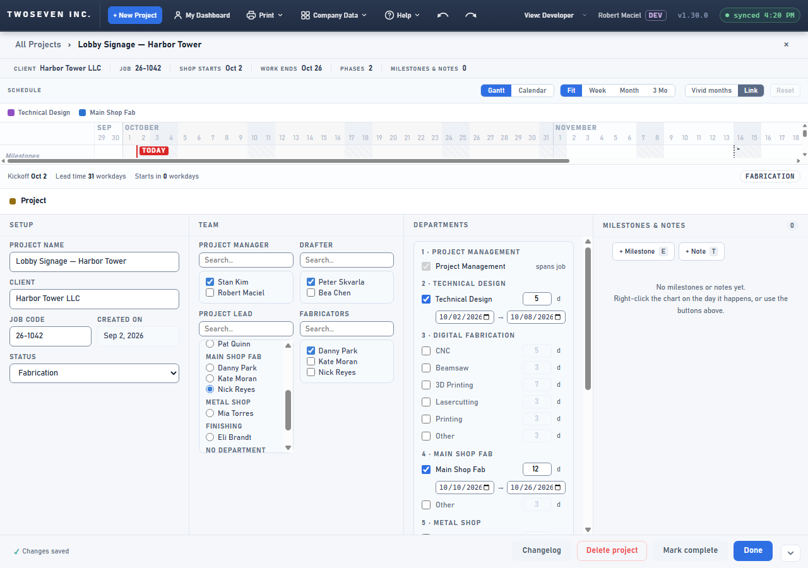
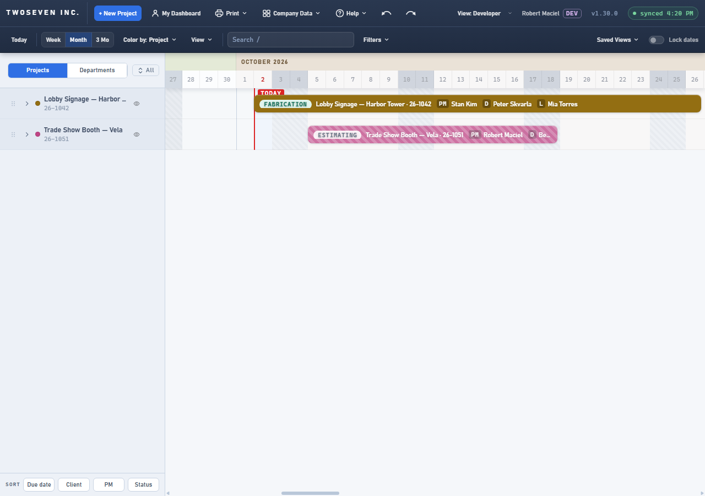
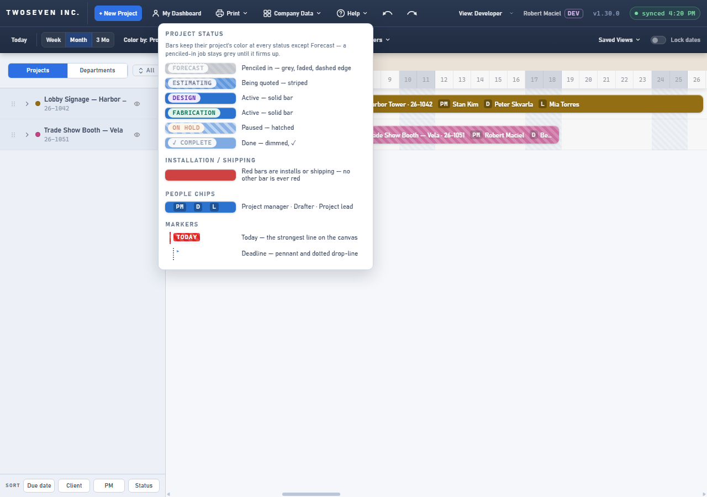

# 2026-10-02 — A project lead from any department (v1.30.0)

**Date:** 2026-10-02 · **App version:** v1.30.0 · **Where:** `index.html`, `design/Design-Language.md`,
`docs/TODO.md` · **PR:** #85 · **Tracker:** `221twoseven/Project-Scheduler-issues#18`

## What changed

The Team section's third role was "Lead fabricator", a multi-select list of the Main Shop
Fab roster. Jobs are increasingly led by someone in Metal, Print or the office, and that
person could not be named.

1. **Project lead.** The role is renamed everywhere it shows: the Team label, the chip on
   the chart bar (now **L**, was F), the bar tooltip and Help ▸ Legend.
2. **Anyone on the People roster.** The list offers every person, grouped by department
   in the app's department order (a person files under their first department; people
   with no usable department sit under "No department"), alphabetical inside each group.
   The #19 Search box works on it; "None" and the chosen person stay visible while
   filtering and an emptied department header folds away.
3. **One lead, or none.** The list is single choice with a "None" row. Blank is a valid,
   savable state.
4. **Existing projects keep their lead.** The value still lives in the `leadFab` column,
   so nothing in SharePoint changed. A project that already has two leads shows them as
   one combined row until someone picks another person; an unrelated Team change leaves
   the pair alone.

TODO item 1 / decision D10 (flexible roles) is untouched: this is still one fixed role
with a new name and a wider pool.

## Known ceilings

- **An unassigned Main Shop Fab umbrella bar is still implicitly owned by the lead**
  (`roleField('fab') → leadFab`). With a Metal or Print lead that bar now shows under
  their person filter and My Dashboard, counts toward their overbooking warnings, files
  under the "—" lane in the department lens and takes a hash colour there. If the owner
  wants the umbrella to belong only to a fab lead, that is a one-line follow-up in
  `barCrew`.
- **Install / Shipping crew default** still seeds PM + lead when a bar has no crew, so a
  non-fab lead lands on new install crews by default.
- A person with several departments appears under their first one only.
- No status filter: the list is the roster as the People page holds it (the sibling
  pickers do the same). Hiding Off Payroll / Terminated people is a separate decision.
- The Meeting Sheet never showed the lead, so it is unchanged.
- The People page's "Lead Fabricator" HR titles are job titles, not this role; untouched.

## Rollback

Revert the PR. Values in `leadFab` are unchanged in shape (comma-joined roster names);
the old code reads them as before.

## Screenshots

Saved project, Team section. Before (v1.29.0): LEAD FABRICATOR as a checkbox list of the
fab roster. After: PROJECT LEAD as a single-choice list grouped by department, Nick
checked under Main Shop Fab; then with Mia (Metal Shop) as the lead. Then the chart with
the **L** chip on the bar, and Help ▸ Legend reading PM · D · L.

