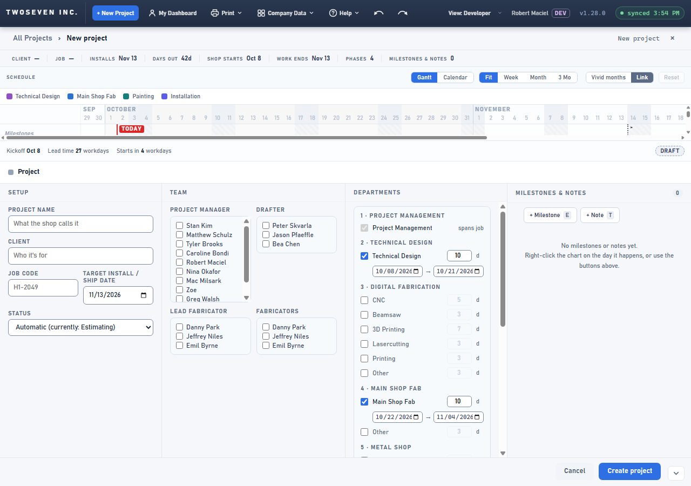
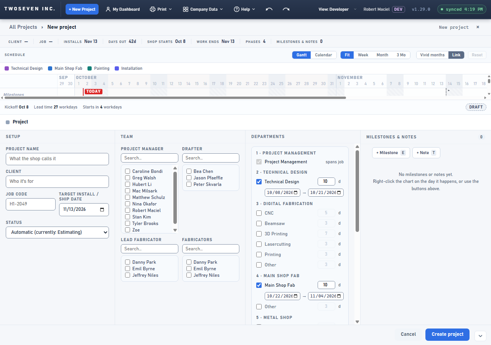
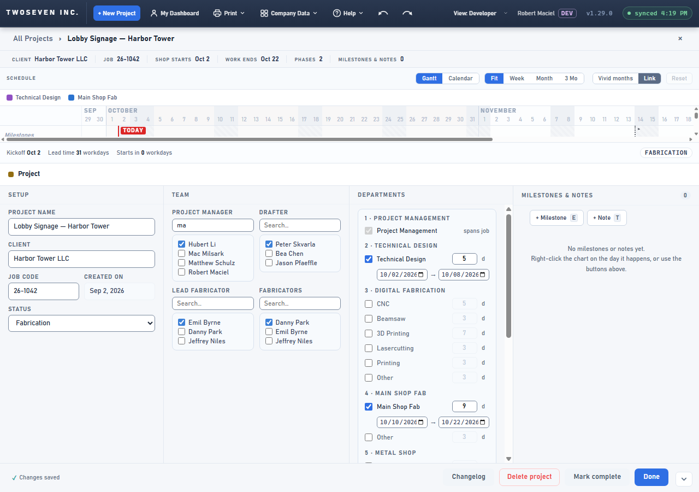

# 2026-10-02 — Team lists alphabetical, with a Search box (v1.29.0)

**Date:** 2026-10-02 · **App version:** v1.29.0 · **Where:** `index.html`, `design/Style-Guide.md` ·
**PR:** #84 · **Tracker:** `221twoseven/Project-Scheduler-issues#19`

## What changed

The four Team lists in project setup (Project manager, Drafter, Lead fabricator,
Fabricators) listed people in the order they were added to the People roster, with no
way to narrow them. With a growing roster, finding a name meant reading the whole box.

1. **Alphabetical.** Each list is sorted by the name as it is shown, so a nickname sorts
   where it reads. On a saved project the people already checked sit at the top.
2. **A Search box above each list.** Typing narrows the names as you type, matching any
   part of the shown or stored name ("chen" finds a person shown by their nickname).
   Checked names stay visible while filtering, and a tick made while filtering is saved
   like any other; the typed text survives the tick.
3. **Taller lists.** About nine names show before the scrollbar (was eight).

Both the New Project draft and a saved project's page share the one list builder, so the
Project lead list that tracker #18 will add inherits the search for free.

## Known ceilings

- The typed filter is not remembered across a full repaint of the setup panel (a
  colleague's save arriving on the 90-second poll, a Setup text or date field change,
  or a failed Create validation). The box comes back empty; the ticks are kept.
- The Crew pickers on phases (dock, popover, task modal) are not Team lists and are
  unchanged.
- Viewers without the project-setup grant see neither the checkboxes nor the search box,
  as before.

## Rollback

Revert the PR. No data or column changes.

## Screenshots

New Project draft, Team section. Before: roster order, eight names and a sliced ninth.
After: alphabetical, a Search box above each list, nine names. The third shot is a saved
project with "ma" typed into the Project manager search: the checked PM stays at the top
with the three matches.

