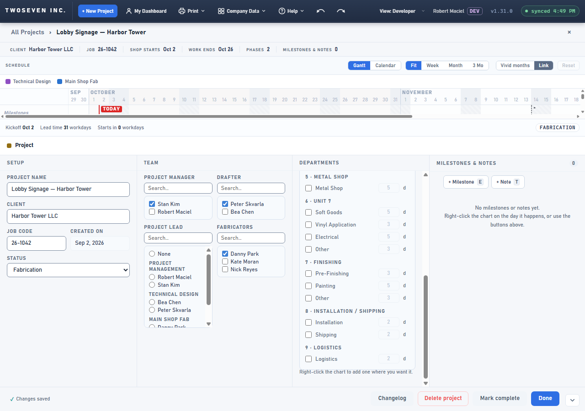
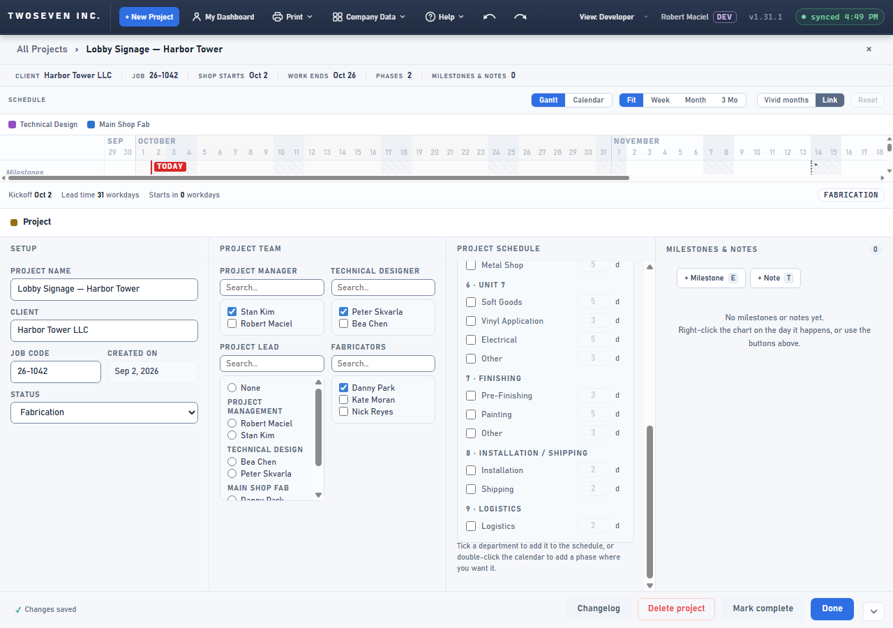
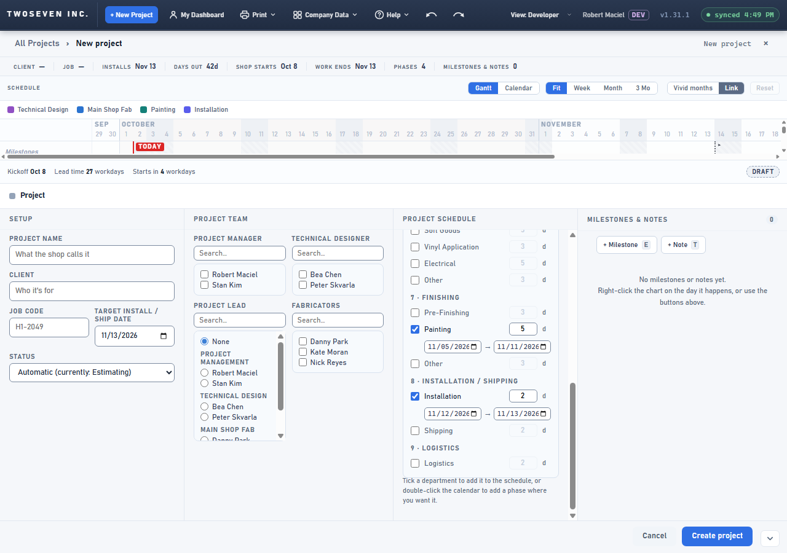
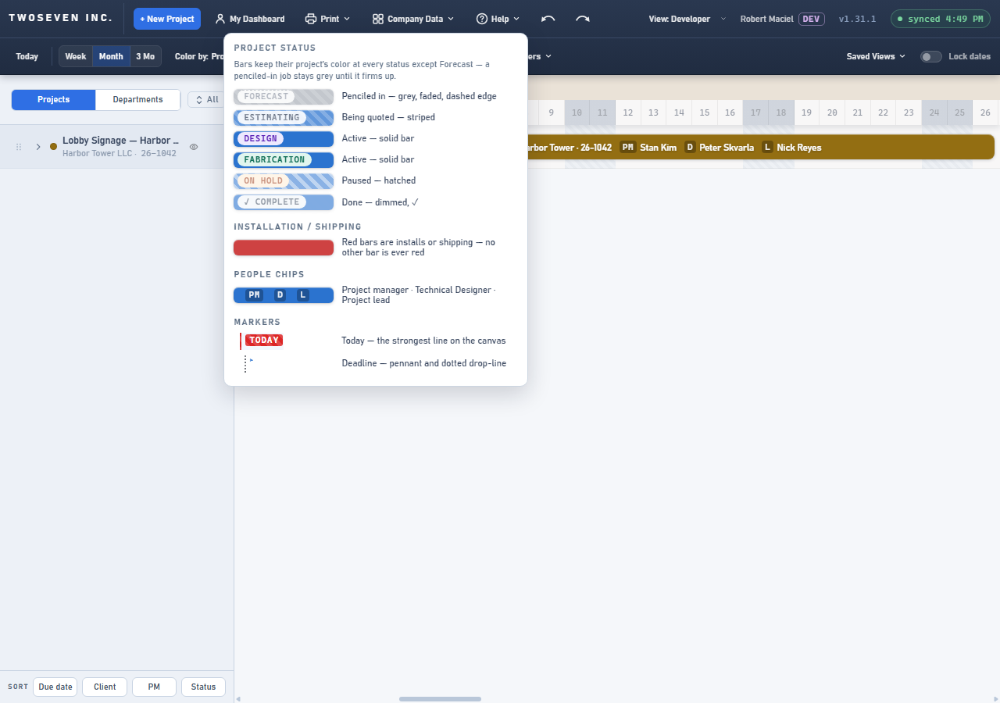

# 2026-10-02 — Technical Designer, Project Team, Project Schedule (v1.31.1)

**Date:** 2026-10-02 · **App version:** v1.31.1 · **Where:** `index.html`, `design/Design-Language.md`,
`docs/Copy-Coach-and-Helpers.md`, `docs/TODO.md` · **PR:** #87 · **Tracker:**
`221twoseven/Project-Scheduler-issues#17` and `#22`

## What changed

Three wording changes on the project page, plus one stale hint fixed in passing. No
behaviour, data or column changes.

1. **Drafter → Technical Designer** (#17): the Team label and the Help ▸ Legend text. The
   stored column `drafter` and every stored value stay as they are; existing assignments
   still show. The chart chip stays **D**.
2. **Team → Project Team** (#22): the section assigns people to the project.
3. **Departments → Project Schedule** (#22): the section schedules work across departments,
   Shipping and Installation included. The dashboard's Projects / Departments lens switch
   keeps its name (owner default on Q1).
4. **The hint under Project Schedule** said "Right-click the chart to add one where you want
   it." Right-click has offered milestones and notes only since v1.2.1; the hint now names the
   two doors that exist: "Tick a department to add it to the schedule, or double-click the
   calendar to add a phase where you want it."
5. The editor tour step and the copy inventory say the new names.

TODO item 1 (terminology pass) has its Drafter half done; the Job code → Cost code half
waits on tracker #21.

## Known ceilings (recorded in TODO §7.4)

- **Two "Drafter" echoes remain.** Changelog rows (admin/PM) still read the stored key
  `drafter:` — the text is written into the Changelog list at save time, so a label map
  would split old and new rows; the read-side word map planned with #21 covers it. The **D**
  chip (bar, tooltip, legend) still abbreviates the old word; "TD" would widen every
  sidebar row — the owner is asked in the PR.
- A person whose HR title on the People page is typed "Drafter" still reads so there: list
  data, not an app label.

## Rollback

Revert the PR. Nothing stored changes.

## Screenshots

Saved project with nothing selected, the dock showing the project sections. Before: SETUP ·
TEAM (… DRAFTER …) · DEPARTMENTS with the right-click hint. After: PROJECT TEAM, TECHNICAL
DESIGNER, PROJECT SCHEDULE with the new hint, Peter still ticked. Then the New Project draft
with the same three strings, and Help ▸ Legend.

