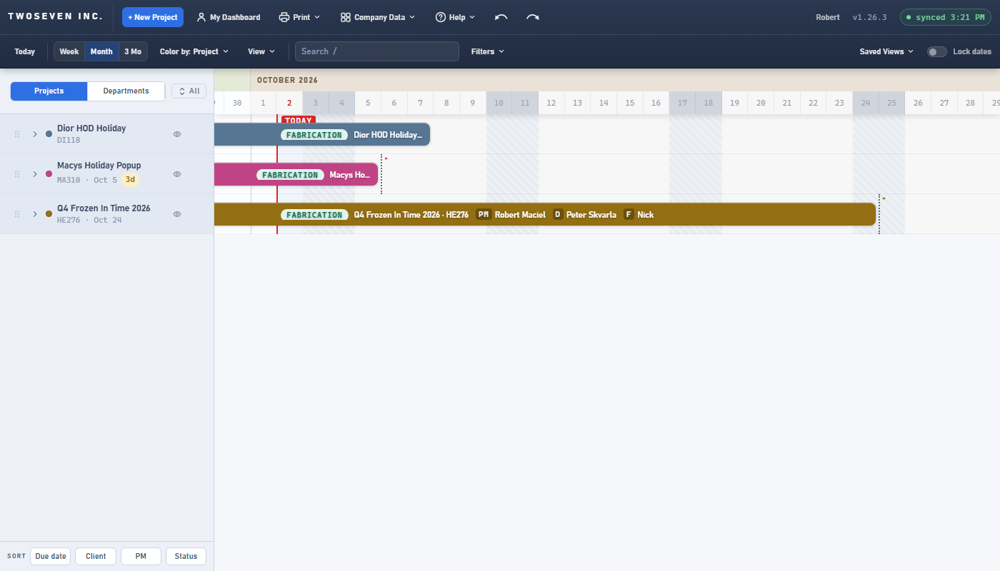
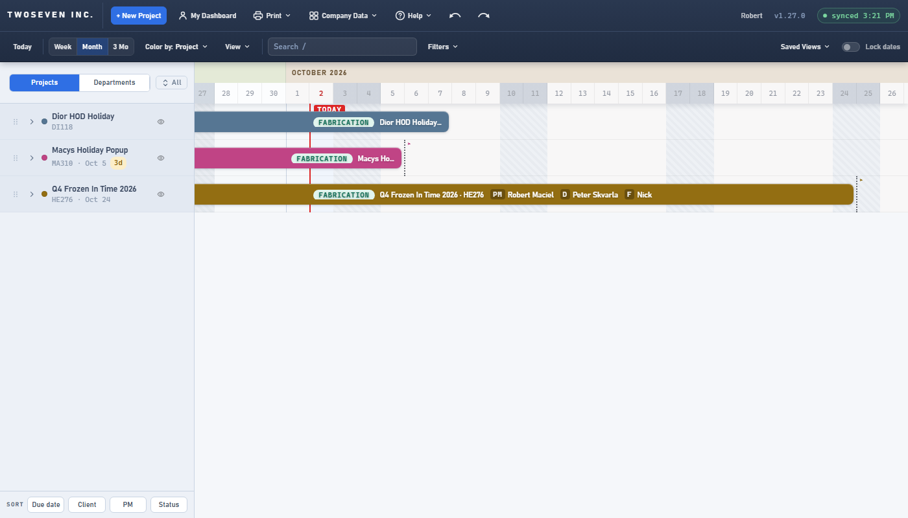
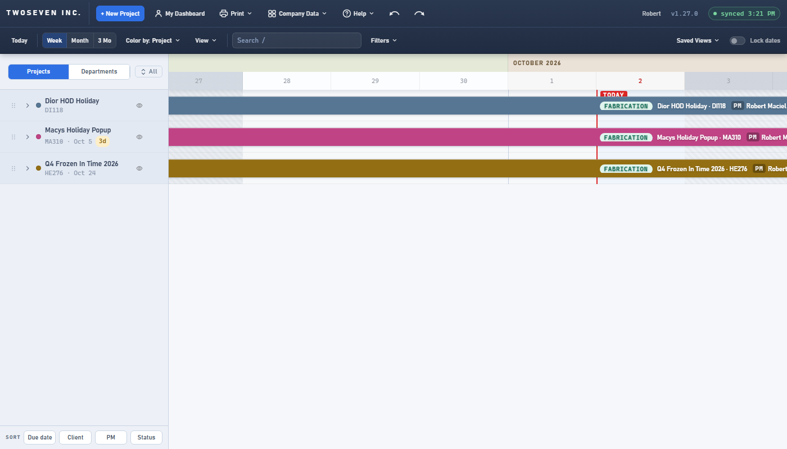
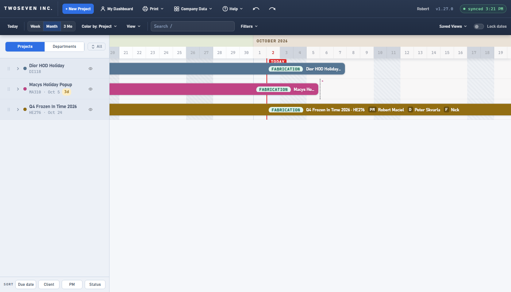

# 2026-10-02 — Today shows this week from Monday; past days washed grey (v1.27.0)

**Date:** 2026-10-02 · **App version:** v1.27.0 · **Where:** `index.html`,
`design/Design-Language.md`, `design/Style-Guide.md`, `docs/TODO.md` · **PR:** #82 ·
**Tracker:** `221twoseven/Project-Scheduler-issues#2`

## What changed

The Today button (and `T`) centred today's column; the first load parked today a column and
a half in from the left. A PM asked for the current week to start at the left edge instead,
and the owner's approval added a light grey wash over the days that have passed.

1. **Today puts Monday at the left edge.** Today, `T` and the Go to date popover's Today
   pick all scroll so Monday of the current week is the first column, in every zoom (Week,
   Month, 3 Mo and a drag-set fit). A Sunday belongs to the week that began the Monday
   before. The other jumps (G, a month-name click, +1 and +3 months, Next install, the
   edge chips) still centre their date.
2. **The default view agrees.** First load and every routed arrival at the timeline (Done,
   the breadcrumb, Back, the empty-state Sign in) land on the same alignment, instantly.
3. **Past days wear a wash.** A light grey, transparent layer covers every day column before
   today, under the rows and bars, so bar text keeps its contrast and the weekend hatch
   still reads through it (`.past-col`, `rgba(148,163,184,.06)`).

Tooltips and the keyboard sheet now say "This week from Monday". Design-Language §2.4 and
§7, Style-Guide §2 and §5.5, and TODO item 33 plus its §7.5 ceiling were updated.

## Known ceilings

- At a drag-set fit beyond roughly 250 days on screen the canvas ends before Monday can
  reach the left edge, so the browser clamps the scroll; the three zoom buttons stop at
  91 days, where it is exact.
- The wash is one value. `.06` sits between the workday and weekend greys so past
  workdays still read lighter than past weekends; a stronger wash would have to be a
  darker grey, not a higher alpha.
- The wash shows in Vivid months too; hiding it there is one stylesheet rule if asked.

## Rollback

Revert the PR. Behaviour, strings and one background layer; nothing stored changes.

## Screenshots

Month zoom on first load. Before: today near the left, no past wash. After: Monday of the
current week at the left edge, the days before today under the grey wash.

After, Week zoom (Monday to Sunday fill the width) and after, scrolled one week back (the
previous week's weekend reads through the wash).

