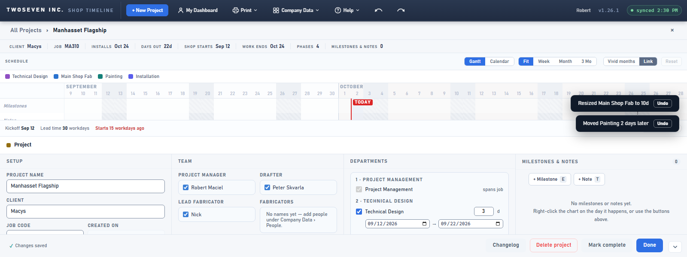
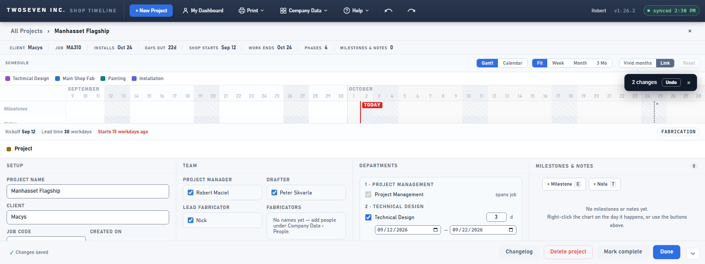
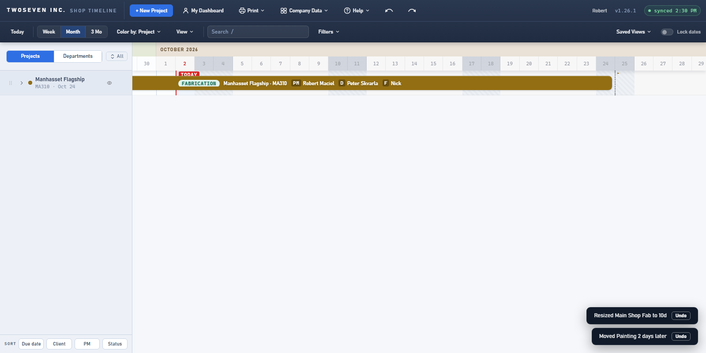
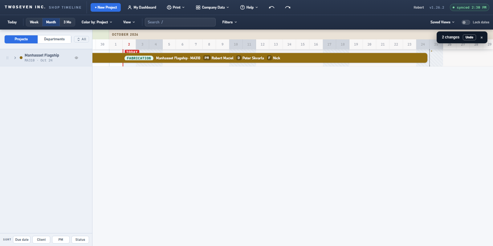

# 2026-10-02 — Undo notifications stay off the chart (v1.26.2)

**Date:** 2026-10-02 · **App version:** v1.26.2 · **Where:** `index.html`,
`design/Design-Language.md`, `design/Style-Guide.md` · **PR:** #80 ·
**Tracker:** `221twoseven/Project-Scheduler-issues#23`

## What changed

After a few drags on the project page the Undo notifications stacked bottom-right, over the
Installation bar, with no way to close them, and a bar under one could not be dragged.

1. **Placement.** On the project page the stack sits in the blank strip between the last
   row and the detail panel. When that strip is too small for it, the stack moves to the
   top right of the legend / date band, never onto the toolbar row (it holds buttons) and
   never over bars. On the dashboard it sits at the top right of the date header. Company
   Data pages keep the bottom-right corner. The place is chosen when a notification
   arrives, so a stack never jumps while one fades (`toastPlace`). On the band and the
   header the stack would hang down into the rows, so only one notification shows there
   at a time; older ones wait hidden and fade on their own timers.
2. **A × on every notification**, 24px tall, next to Undo.
3. **The fade pauses only on the controls.** It still fades after 5 seconds; hovering Undo
   or × pauses it and leaving resumes the time that was left. Before, every pass of the
   pointer restarted the 5 seconds, which is why they lingered.
4. **Quick edits share one notification.** Several undoable edits within the window
   collapse into "N changes · Undo", and Undo reverses the latest one (the rest stay on
   Ctrl+Z). A plain notification in between ends the run; identical plain messages still
   collapse into a ×N badge as before.
5. **Drags pass through.** A notification's body no longer takes the pointer; only Undo, ×
   and Details do, so a drag or resize that starts under one reaches the bar.

Design-Language §6 (Feedback) and Style-Guide §7.8 describe the new rules.

## Known ceilings

- The notification's text is no longer selectable and hovering it does not pause the fade;
  that is the price of letting drags through. Only the controls pause it.
- The stack is placed when a notification arrives; dragging the panel taller while one is
  showing does not move it (TODO §7 entry stands).
- In the legend-band position the newest notification is at the bottom of the stack, the
  reverse of the corner. Harmless; noted in the Style Guide.

## Rollback

Revert the PR. Behaviour and styling only.

## Screenshots

Project page, short window, two edits in a row. Before: two notifications over the bars,
no ×. After: one "2 changes · Undo ×" at the top right of the legend band, the bars clear.

Dashboard, same two edits. Before: bottom-right. After: the top right of the date header.

