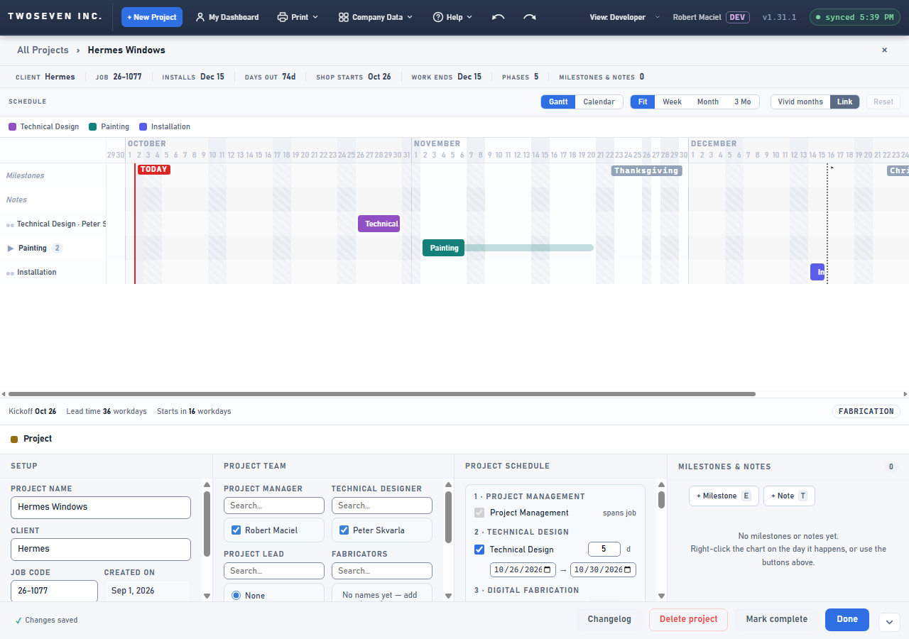
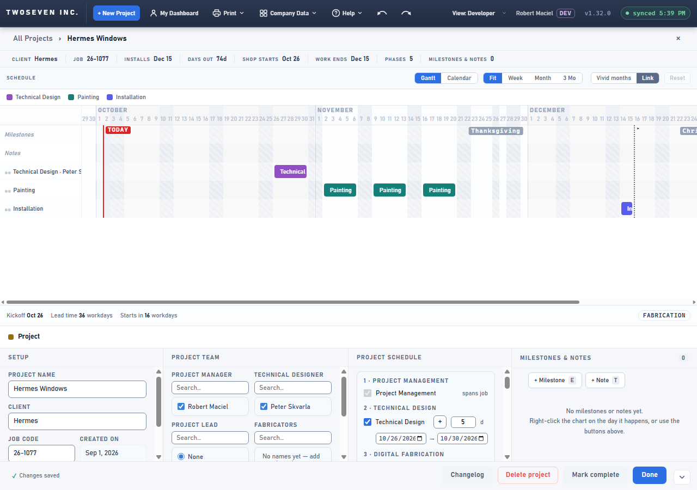
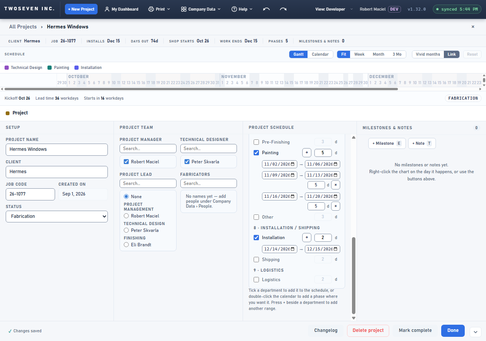
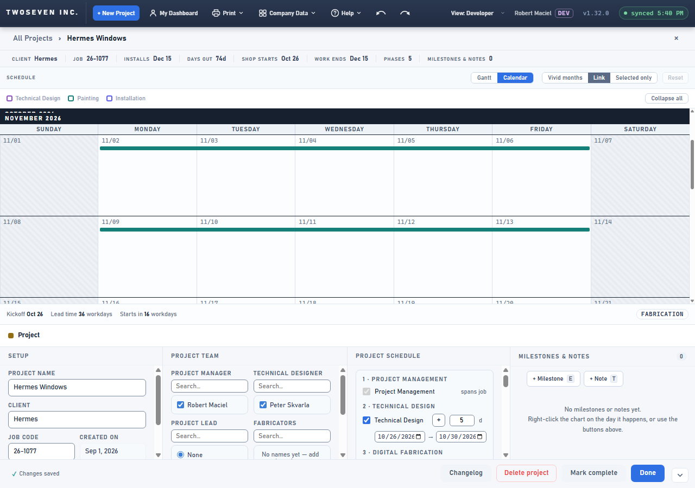

# 2026-10-02 — Separate work periods in every department (v1.32.0)

**Date:** 2026-10-02 · **App version:** v1.32.0 · **Where:** `index.html`,
`design/Design-Language.md`, `docs/Copy-Coach-and-Helpers.md`, `docs/TODO.md` · **PR:** #88 ·
**Tracker:** `221twoseven/Project-Scheduler-issues#16`

## What changed

A department could hold one block of work per project. A second block could only be faked as
a "Subtask", which nests under the first bar, hides until the row is expanded, is clamped to the
first bar's window and is dragged along with it.

1. **Ranges.** Any department can now hold several separate work periods ("ranges") on one
   project. Each range has its own start, end and day count and is listed on the department's
   row under Project Schedule; the first line is the department's primary block, as before.
2. **Adding one.** Press **+** beside the department's name, or right-click the department's
   row on the chart ("Add another range here"; the gutter menu offers it too). A new range
   starts the workday after the department's last range (the calendar day for Installation and
   Shipping) at the row's day count; a right-click day that falls inside an existing range also
   lands after it, so ranges never overlap by placement. The new range is not selected, so +
   twice in a row works.
3. **On the chart.** Each range draws as its own bar on the department's own row, at full
   colour, with the gap left empty — no envelope track, no ▸, no subtask count. Ranges are
   independent: never clamped to the primary's window, never carried by Link. Subtasks behave
   exactly as before.
4. **Removing one.** × on a range's line removes it (saved project: the usual undo toast;
   draft: the line and its placement go, with an undo of their own). The primary block has no ×.
5. **Calendar.** Each range is its own band in the department's colour, following the
   department's detail level like the primary.
6. **Totals** (Shop starts, Work ends, Phases, the footer) count every range, as they count every
   row today.

### Column (owner applies — not a gate)

| List | Column | Internal name | Type | Default |
|---|---|---|---|---|
| `ShopTimeline_Tasks` | Range | `range` | Yes/No | No |

The app writes `range` only on rows that are ranges (tristate), so ordinary saves never touch the
column and a site without it keeps working; the first **+** on a saved project posts a row with
`range: true`, which fails to sync until the column exists. Apply it before this PR merges to
development. Existing rows are untouched (no `range` → the primary block or a subtask, as today).

## Design decisions

- A range is a task row with an explicit `range` flag — not "any unlabeled sibling" (that would
  demote the named repeat blocks tracker #3 asks for) and not "any bar outside the primary's
  window" (that would re-read the multi-site subtask layouts Design-Language §6 protects).
- The department's **primary** is the first bar that is not a range, whatever the sort puts
  first; a range dragged ahead of the primary does not take over the row.
- Draft ranges are lines keyed by their line id (`dept::#lineId`), so two unlabeled ranges with
  the same crew never share a placement.
- Design-Language §6 three-path rule: a range has a pointer path (+) and a context-menu path;
  no keyboard path, the same two-path exception REV61 recorded for subtasks.

## Known ceilings

- Overlap is prevented by placement only; two ranges can still be dragged onto each other and
  then draw on top of one another on the one row (the dashboard lanes them). Laning the project
  row waits for a real complaint.
- A range dragged earlier than the primary stays a range (it is not re-parented); the row's
  day count, a new subtask's nesting and the draft's selection fallback all keep following
  the primary (the first bar that is not a range), wherever the range sorts.
- A right-click day that falls inside a range hops past every range it lands in, so
  back-to-back ranges never take a hidden duplicate.
- Duplicate copies a range at the same dates (on top of the source) — the user drags it apart,
  as with any Duplicate.
- Unticking a department deletes every row of the department, ranges included (the confirm
  counts them as phases, as today).
- Existing "Subtask N" workaround rows are not promoted to ranges; a "Range" checkbox in the
  phase panel is a follow-up if asked. Phases counts ranges as phases.

## Rollback

Revert the PR. Rows with `range: true` stay in the list and read as subtasks under the old code
(they nest under the first bar); nothing else changes. The column may stay.

## Screenshots

Project page, Painting with three work periods. Before (v1.31.1): the only way was two subtasks
— one bar, a faint track bridging the gaps and "▸ 2". After: three Painting bars on one row with
empty gaps. Then the Project Schedule row: + beside Painting, the primary's date line and one
line per range with its day count and ×. Then the calendar with a Painting strip per range.

