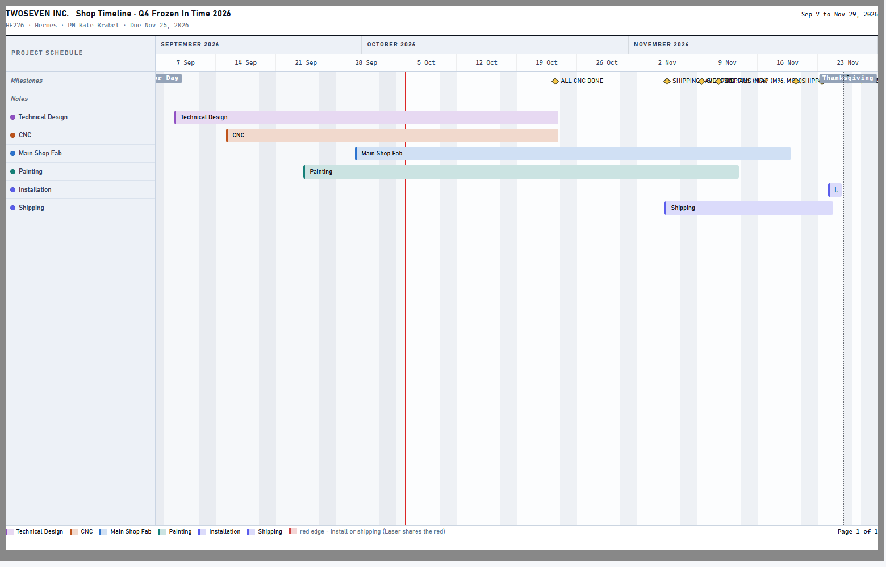
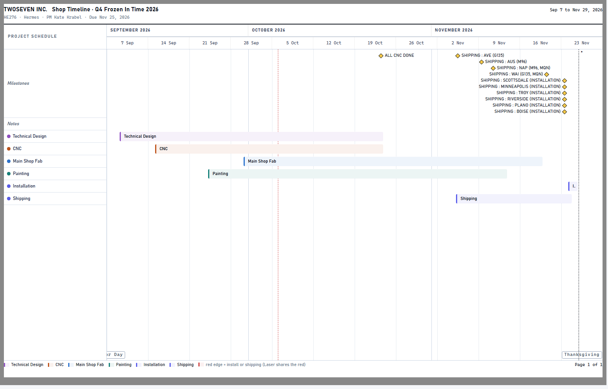
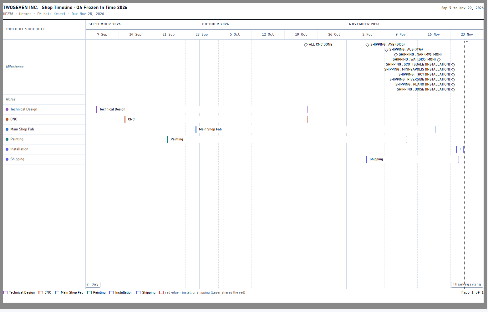
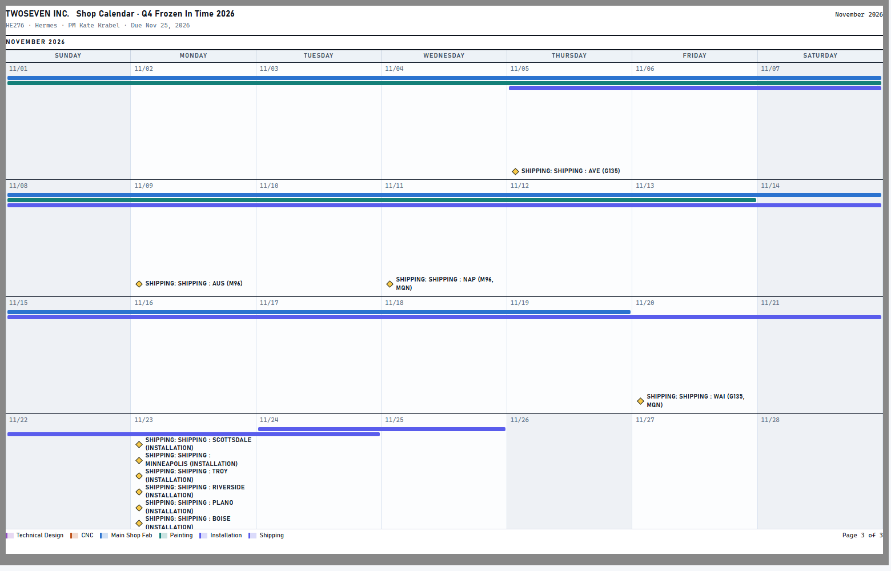
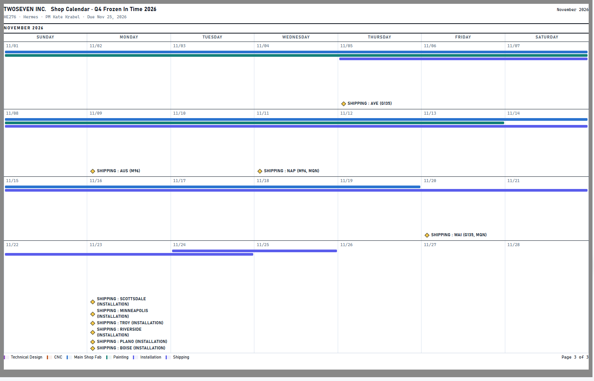
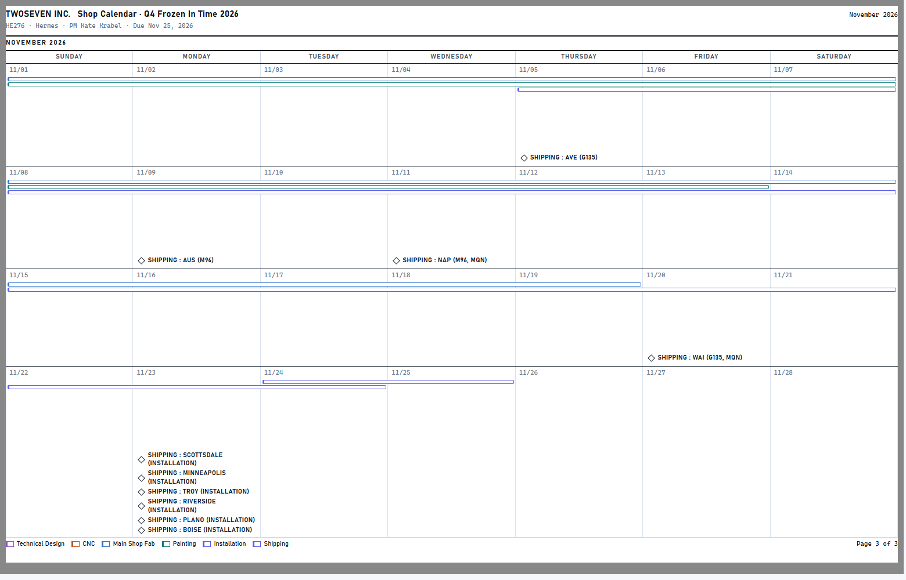
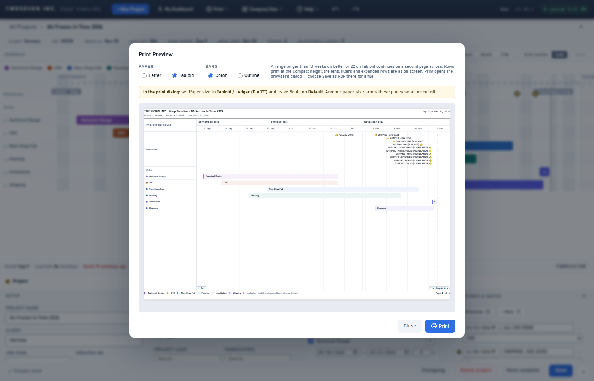
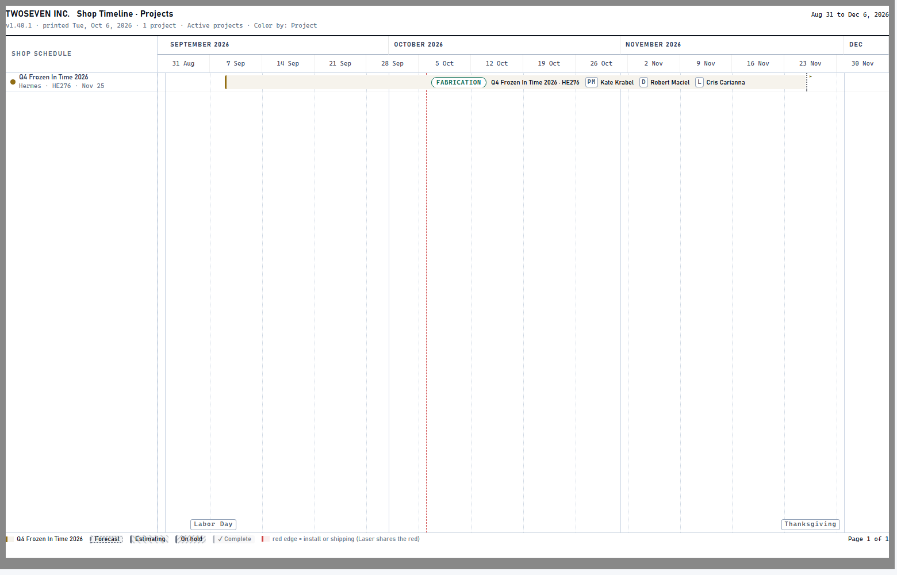

# Print formatting: paper, bars, ink and milestones (v1.41.0)

**Date:** Oct 6, 2026 · **Version:** v1.41.0 · **Branch:** `feat/print-ink-modes`

## Why

The owner printed Q4 Frozen In Time and found four problems:

- Milestone labels printed on top of each other, on both the project Gantt and the Calendar.
- It wasn't clear how to set the paper size. The paper was picked in the Print menu. Picking
  Ledger in Chrome's own dialog instead left a Letter-sized page printed small on 11×17.
- The print copied the screen's gray weekend columns, holiday blocks and header fills, which
  wastes ink.

The owner approved a mockup on Oct 6 and ruled:

1. Bars are either **Color** or **Outline**. Color is the default and suits the shop wall. It
   has an 8% tint, the 3px colour edge and yellow milestones. Outline suits the desk, the
   clipboard and notes. It has white bars in a 1px colour outline, the 3px edge kept, and
   hollow milestones.
2. Every other ink saving always applies: plain white paper.
3. Calendar weeks grow to fit their content.

## What changed

- **Print Preview** has Paper (Letter / Tabloid) and Bars (Color / Outline). The Meeting
  Sheet has Paper too. A yellow note names the setting to match in the browser's dialog,
  where Tabloid is called "Ledger", and says to leave Scale on Default. Both choices are
  remembered per browser. The Print menu's paper radios stay and show the same value.
- **White paper:** no weekend, holiday, past-days, month-header, sidebar or department-band
  fills. A dotted hairline starts each week. Holidays print as outlined tags at the foot of
  the chart. Today prints as a thin dashed red line. PM/D/L chips print outlined.
- **Project Gantt milestones** stack in lanes and the Milestones row grows a lane at a time.
  A label that would run off its page reads leftward from its diamond.
- **Calendar:** each week is measured at the page width and grows to fit its content. A
  month that outgrows the page continues on the next page, marked "(continued)". A milestone
  whose name already starts with its block's name ("SHIPPING : AVE" on Shipping) is no
  longer prefixed twice. This also applies on screen.

## Evidence

| | Before | After |
|---|---|---|
| Project Gantt |  |  |
| Gantt, Outline | |  |
| Calendar (Nov) |  |  |
| Calendar, Outline | |  |
| Print Preview dialog | |  |
| Shop timeline | |  |

Tests: `tests/test-v1410.js` (R1–R5). `test-v1400` and `test-quiet` were updated to the new
white-paper and 8% rules.

## Known limits

- Label widths on the Gantt are estimated at about 7px a letter, because the test runner
  can't measure text. A run of very narrow letters gets a little more room than it needs.
- A single Calendar week taller than a whole page is still cut at the page foot.
- Holiday tags sit at the foot of the chart. On a full shop-timeline page, a tag can touch
  the last row's bar.
