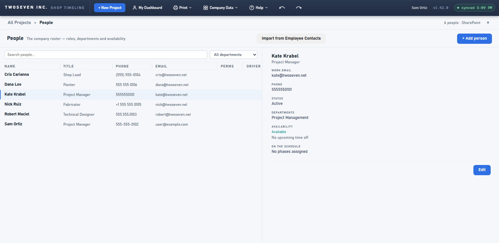
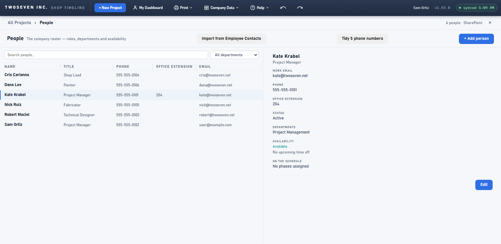

# 2026-10-08 — The HR import asks only for what it uses; one phone format; Office Extension (v1.43.0)

**Version:** v1.43.0 · **PR:** #112 · **TODO:** item 9 (a, c, the Office Extension column; b deferred). The
owner's rulings: 2026-09-24 ("browser cache but invisible is still browser cache") and
2026-10-08.

## What changed and why

- **9a — the Employee Contacts import asks for six fields, not all of them.**
  - *Before:* it requested every column of HR's list, so Pay Type and PersonalEmail reached
    the importing admin's browser, though the app never stored or showed them.
  - *Now:* it reads the list's column definitions first and requests only the internal names
    of the fields it maps: name, status, email, phone, title, department. If it can't read
    the definitions, it imports nothing instead of falling back to "everything".
  - The real protection is still SharePoint permissions on HR's list (item 26, D3). This is
    the app behaving well.
- **9b — deferred.** The owner: contact numbers are posted in the breakroom, and personal
  numbers are used. The Mobile Phone fallback stays (§7.4 ledger).
- **9c — one phone format, 555-555-5555.** It is applied on load, on import and on save.
  - A number stored as 5555555555, 555.555.5555, (555) 555-5555, 555 555 5555 or
    +1 555 555 5555 reads the same.
  - **A one-time tidy for the list itself** (owner, 2026-10-08). While any row on
    `ShopTimeline_Staff` still holds another format, an admin sees **Tidy N phone numbers**
    beside the import. One confirm rewrites the phone column, and only that column, on just
    those rows; then the button disappears. A row saved by the app is written in the new
    format anyway.
  - Foreign numbers and text with the number stay as typed.
  - Searching the bare digits finds the person.
- **Office Extension**, typed on the People page (Employee Contacts has none). It is
  dialled office to office from office phones, so it's its own column after Phone, never
  part of the number (a mobile has no extension). Saved People column widths start
  afresh once, because the columns shifted. It uses the `ext` column on
  `ShopTimeline_Staff` (single line of text), which the owner created on 2026-10-08.

| Before (v1.42.0): six numbers, five formats | After: one format, and the Office Extension column |
|---|---|
|  |  |

## Limits and follow-ups

- **Item 9 (e)**, what non-admins see on the People page, still waits on item 26.
- **Tests:** `tests/test-v1430.js` (39 checks). They include the one-time tidy, and a column
  renamed on the HR list: SharePoint keeps the old internal name, so columns are matched by
  display name. `test-v1100`'s HR-list stub now answers the column request with column
  definitions, as SharePoint does.
