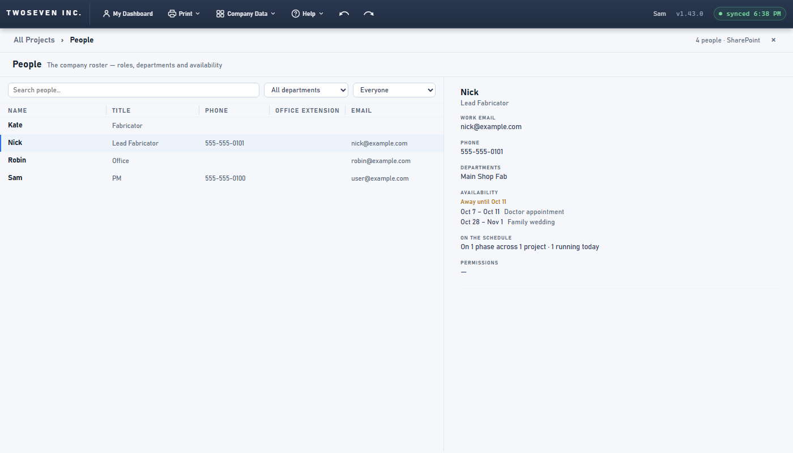
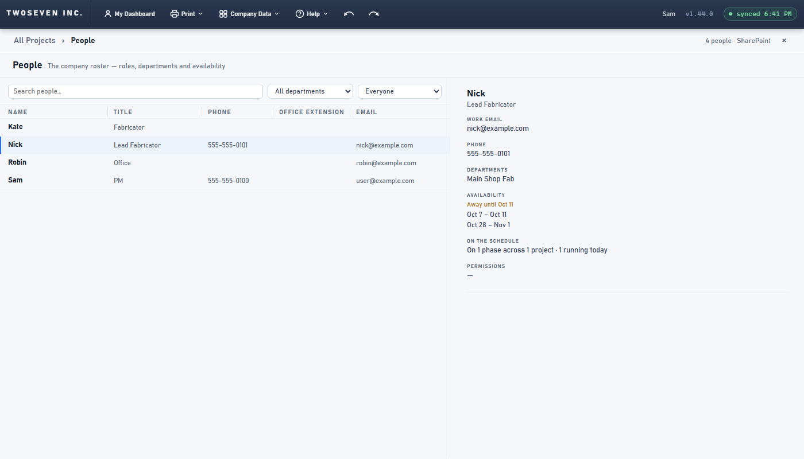
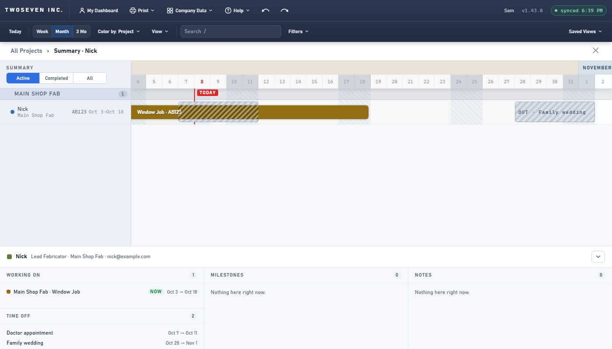

# 2026-10-08 — Time-off notes are private (v1.44.0)

**Version:** v1.44.0 · **PR:** #116 · **TODO:** item 4 (the brief's suggested P0 addition,
brief §7.2).

## What was wrong

An admin can type a note on someone's time off ("Doctor appointment"). Every signed-in user
saw that note, in four places:

- the People record, under Availability;
- the people lanes on the dashboard ("OUT · Doctor appointment", and the bar's hover text);
- a phase's hover tip ("Nick is out Oct 7 → Oct 11 (Doctor appointment)");
- the person panel's Time off list.

## What changed

- Only admins see the note. Everyone else sees the dates: the lane bar reads "OUT", the
  hover tip still warns that the person is out, and the person panel reads "Out of office".
- A developer previewing the app as a viewer sees what a viewer sees.
- Nothing is stored differently. Editing time off was already admin-only, and the note is
  kept on save.

## Evidence

Signed in as a non-admin, before and after:

| | Before | After |
|---|---|---|
| People record |  |  |
| Lanes and person panel |  |  |

Suite `tests/test-v1440.js` checks all four places as an admin and as a non-admin.

## Known limit

This hides the note on screen only. The note still sits in the Staff list's `ooo` column,
so it loads in every signed-in browser and anyone who opens the list on SharePoint can read
it. Real privacy comes with item 27, which moves time-off notes into a restricted record.
Recorded in TODO §7.5.
