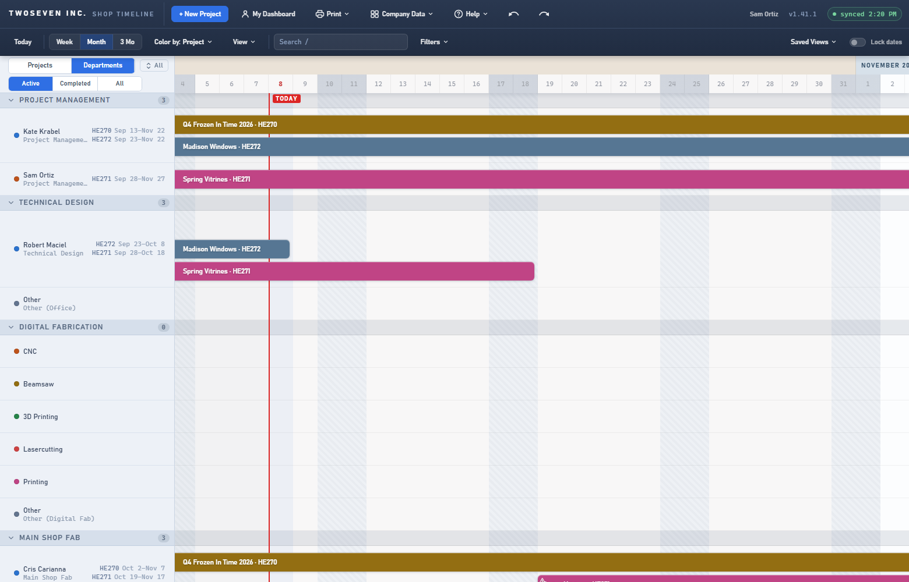
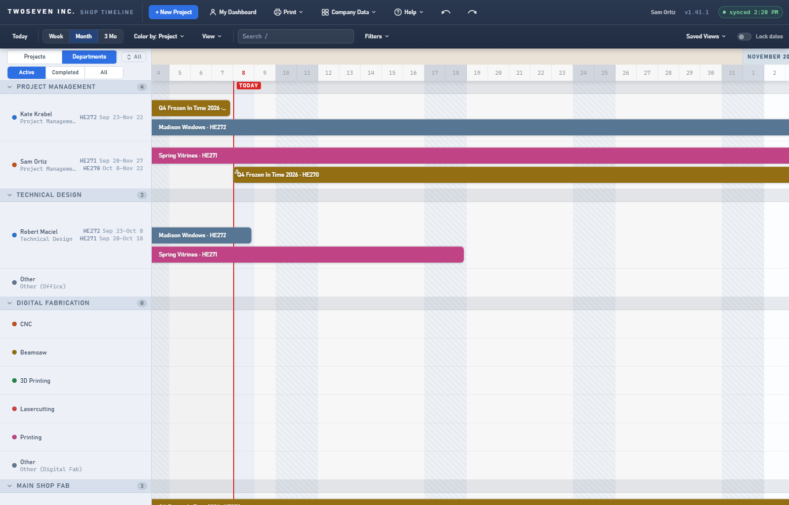
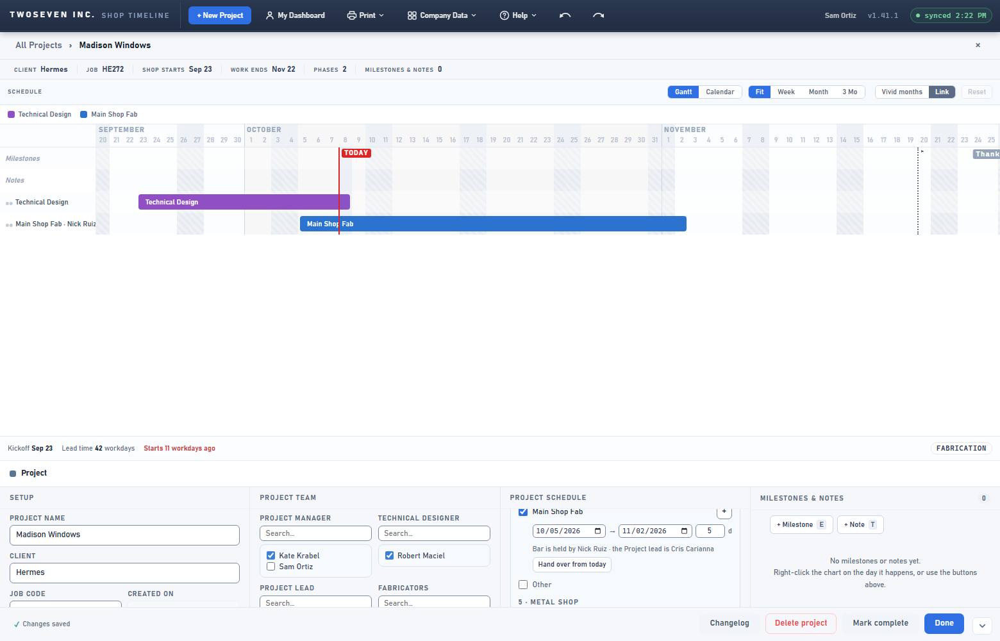

# 2026-10-08 — A role change moves the project to the new holder (v1.42.0)

**Version:** v1.42.0 · **PR:** #111 · **Tracker:** #34 (Kate Krabel, "When a PM is changed
post project creation it still shows up in originals PM's bucket"), approved "proceed with
fix" 2026-10-06 · **TODO:** item 53.

## What was wrong

A project's roles (PM, Technical Designer, Project lead) live on the project. The lanes, My
Dashboard, the person filter and overbooking warnings read the *bars* instead. A bar that
carries its own crew ignores the project team from then on. A bar gets its own crew from:

- a lane drag on the Departments view;
- the Who field;
- older rows that baked the PM's name in.

So after a PM change, the project stayed in the old PM's lane and dashboard, and the new PM
never got it.

## What changed

- **Changing a role hands its bars over from today.** This covers PM → Project Management,
  Technical Designer → Technical Design, and Project lead → Main Shop Fab. Fabricators owns
  no bar, so changing it touches none. The owner's rule: what's current shows the new holder,
  and the Gantt keeps the old holder on the days already worked.
  - A bar running across today splits. The part up to yesterday keeps the old person, by
    name. The part from today goes to the new person.
  - A bar that starts later just changes hands.
  - A bar that already ended is history and keeps the old person.
  - Milestones stay on the part that covers their date. Notes stay with the original bar.
  - It is one save and one undo, and the Changelog records each bar.
- **A note for bars the change never reached.** Old projects were changed before this fix:
  the reporter's case. When a role-owned bar is still held by someone outside the role,
  Project Schedule now says "Bar is held by Nick Ruiz · the Project lead is Cris Carianna",
  with a **Hand over from today** button. Nothing is rewritten without that click.

| Before: after a PM change from Kate to Sam, the job stays in Kate's lane | After: Kate keeps the days already worked; Sam has it from today |
|---|---|
|  |  |

## Limits and follow-ups

- **The hand-over always takes effect today.** There is no way to back-date it yet (§7.4
  ledger, spec Q1).
- **One reading beyond the spec's letter.** The spec said a bar that already ended is left
  untouched. For an *umbrella* bar (one with no crew of its own), untouched would mean it
  silently follows the new holder and rewrites the days already worked. So it's pinned to
  the old holder by name, which is what R4 asks for.
- **Tests:** `tests/test-v1420.js` (38 checks). It covers the saved page for all three roles,
  umbrella and named bars, subtasks, ranges, milestones, the Fabricators no-op, the note and
  its button, a fabricator subtask that must never be flagged, and the draft page.
