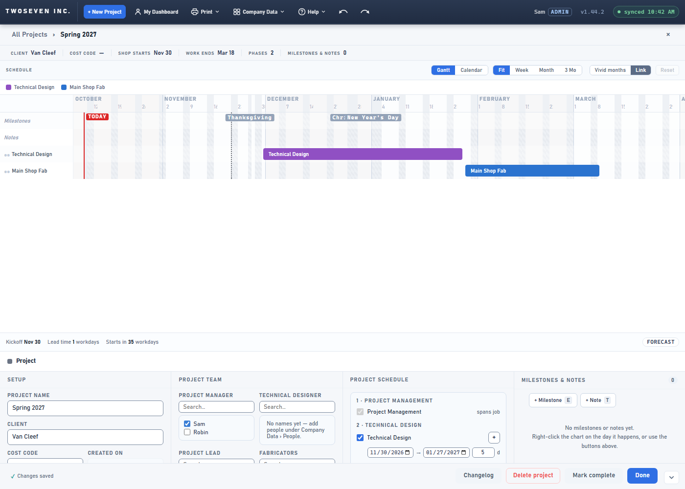
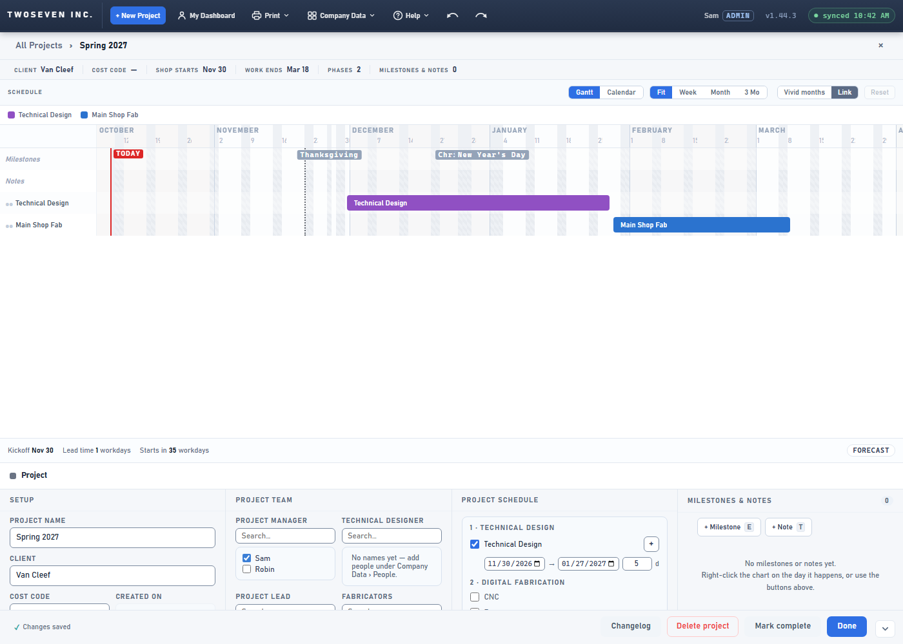

# 2026-10-09 — Project Schedule hides the automatic PM row (v1.44.3)

**Version:** v1.44.3 · **PR:** #120 · **Tracker:** #37, approved "Proceed with fix"
2026-10-09 · **TODO:** item 55. The companion fix for the project start date is #36 (v1.44.2).

## What changed

- Project Schedule no longer shows "1 · Project Management — spans job". That row could not
  be edited, and the PM is already chosen under Project Team.
- The phases now number from 1: Technical Design is "1", Digital Fabrication "2", and so on.
- The row comes back, without a number, only when the project's PM bar is still held by a
  former PM. Its "Hand over from today" button (v1.42.0) is the way to fix that.

## Why it is hidden, not removed

The page saves the department list by reading the checkboxes in this panel. Taking the
Project Management checkbox out of the page would drop Project Management, and its bar,
on the next save. So the row stays in the page, invisible. A test proves a save keeps it.

## Evidence

| Before | After |
|---|---|
|  |  |

Suite `tests/test-v1443.js` covers the saved page and the draft, the numbering, a save, and
the hand-over case.
