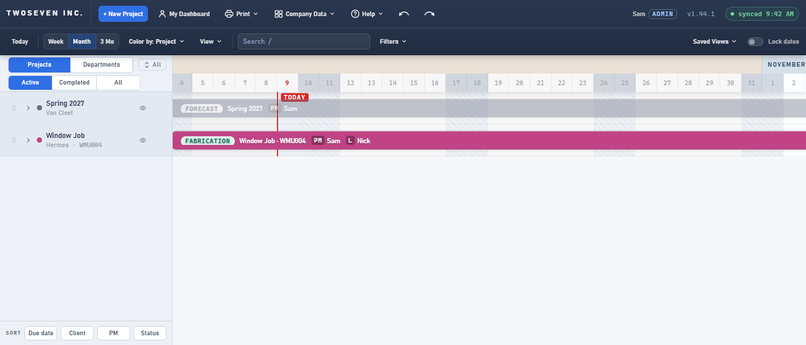
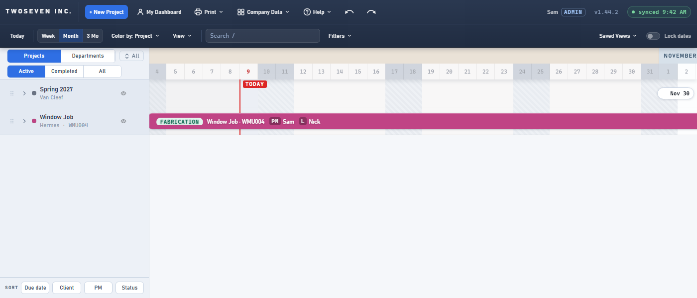

# 2026-10-09 — A project starts at its first phase (v1.44.2)

**Version:** v1.44.2 · **PR:** #119 · **Tracker:** #36, approved "Proceed with fix"
2026-10-09 · **TODO:** item 54.

## What was wrong

A Forecast project, Spring 2027, had Technical Design as its first phase, starting Nov 30.
The project page said "Kickoff Nov 30", but the dashboard bar and the header's SHOP STARTS
began on Aug 12.

Every project saves a hidden Project Management bar ("spans job"). It gets its start once,
when the schedule is first generated, counted back from the install date. Moving a phase by
hand on the new-project page didn't move it. The dashboard bar, the printed Gantt and Shop
starts took the earliest of *all* bars, so the stale PM start won. Kickoff already skipped
the PM bar, which is why the two disagreed.

## What changed

- One rule for a project's start: its earliest real phase. The PM bar counts only when it is
  the only bar; a project with no bars still starts two weeks before its install date. The
  dashboard bar, the printed Gantt and Shop starts all use it, so they agree with Kickoff.
- On a new project, the PM bar now starts with the first phase as it stands when you
  create the project, hand moves included. The PM's own lane shows the right span.
- Saved PM bars are not rewritten (the owner's default). Their dates are history once a role
  hand-over (v1.42.0) has split them. Existing projects such as Spring 2027 are still fixed
  on screen, because the start rule no longer reads that bar.

## Evidence

The report's case, before and after: Spring 2027's bar no longer runs from early October.
It starts off-screen, and the edge chip points to its first phase on Nov 30.

| Before | After |
|---|---|
|  |  |

Suite `tests/test-v1442.js` checks the rule, the dashboard bar, the print, Shop starts against
Kickoff, and a draft whose Technical Design is moved later.

## Follow-up

On an existing project, expanding its row on the dashboard still shows the stored Project
Management bar from its old start, to the left of the project's bar. Dragging that row fixes
it. A one-time refit of saved PM bars would need the owner's go (the spec's Q2).

Tracker #37 (TODO item 55) asks to hide the Project Management row from Project Schedule.
Its spec is posted and waits on the owner's Proceed.
