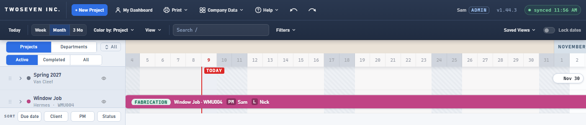

# 2026-10-09 — Protect dates: one meaning everywhere (v1.45.0)

**Version:** v1.45.0 · **PR:** #123 · **TODO:** item 2, (a), (b) and (d). The owner chose
option 1 on 2026-10-09.

## What was wrong

The toolbar's **Lock dates** meant two things. On the timeline, a drag never changed dates:
a resize became a move, and a move could only change lanes. On a project page it blocked
resizing only, so moving a bar still shifted its dates.

## What changed

- One meaning, on the timeline and on a project page (Gantt and calendar): **dragging a bar
  never changes its dates.** On a project page, a move is now refused too, with a note that
  says why. A Shift+Arrow nudge there is a keyboard move, so it is refused too.
- Still allowed: dragging a bar to another person's or department's lane on the timeline,
  and typing dates in Project Schedule or the phase panel.
- Renamed **Protect dates**. The tooltip says exactly what it stops, and that it is always on
  for view-only users (unchanged: the toggle stays hidden for them unless they have the
  phase-edits grant).
- Left for later: remembering the setting per person (item 2 (c), with item 25).

## Evidence

| Before | After |
|---|---|
|  |  |

Suite `tests/test-v1450.js` drags on the timeline, the saved project page and a draft, with
the toggle on and off, and types a date with it on.
