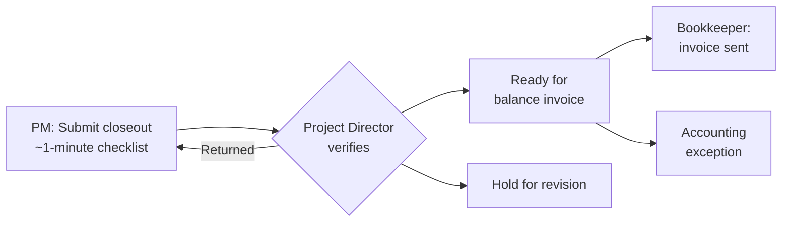

# Shop Timeline App — Brief, Condensed (2026-09-22)

> **Provenance.** The Project Director's 21-page brief, *Shop Timeline App: Current Processes and
> Development Priorities* (September 2026), condensed by Robert on 2026-09-22 with a **Response**
> annotation after each section stating what the app does today. Section numbers match the original.
> Added to the repository 2026-09-24 as the source document for Phase 7 (`docs/TODO.md`); a few
> internal details (a mailbox name, headcount, a location) are generalized because the repository
> is public. The Response claims were fact-checked against the code on 2026-09-24 — corrections
> live in `docs/TODO.md`, not here; this text is frozen.

---

## 1. Purpose and recommendation

Run a limited pilot focused on project visibility, department scheduling, staffing and a dependable closeout signal. Do not try to replace Accounting, timekeeping, Outlook, estimating, file storage or every PM workflow at once.

Start the pilot once the launch blockers are fixed, or scope it deliberately around them. Keep existing systems running for a short, defined parallel period.

After the pilot, remove duplicate entry before adding new features.

Three business controls are foundational. None needs an accounting integration:

- Move the one-user cost code workbook to a shared SharePoint registry without losing its guardrails.

- Add a closeout queue so finished jobs reliably reach the Bookkeeper for the balance invoice.

- Set one source-of-truth rule for 27 Events versus Outlook.

Remaining app asks: let PMs add repeat department work during project creation, make the New Project divider discoverable, and verify the data behind the changelog and People availability.

**1.1** The first release should answer: which jobs are active or forecast; when each department touches each job, including repeat work and real gaps; who is assigned; which dates drive production, shipping, install and strike; which events have a sync conflict; who is absent during scheduled work, without private detail; which jobs are stale, late, tentative, on hold or complete; and which need closeout or a balance invoice.

**1.2** Out of scope for the first release: estimates and tax, writing to QuickBooks or TimeClock Plus, auto-creating server folders or Teams, replacing the shared Outlook calendars, rebuilding PTO around ADP, a general company app hub, and replacing the two shop TV displays.

> **Response**
>
> Agreed on the pilot scope, the short parallel period and removing duplicate entry first. The repo's plan says the same: nothing is retired until its replacement is proven, and v2.0.0 is reserved for the single-source-of-truth cutover.
>
> The app does not connect to Current Projects, 27 Events, Outlook, the PTO list or the cost code workbook. It keeps its own ShopTimeline lists and reads Employee Contacts read-only. The three foundational controls are SharePoint and Power Automate work beside the app, not app features today.
>
> Repeat department work can already be added during creation: on New Project, select a phase and click Duplicate, or right-click and choose New subtask. The fix is making that visible.
>
> The divider already has a resize cursor, a "Drag to resize the panel" tooltip, a remembered height and a collapse toggle. Only a grip visible before hovering is missing.
>
> **1.1**: the app answers the job, department, gap, assignment and key-date questions today. It partly answers absences and status (no stale flag, no tentative dates). It cannot answer sync conflicts or closeout.
>
> **1.2**: agreed. The app does none of these.

## 2. Shop context

The app only works if PMs keep it current, and it cannot become the only record until exports, recovery and fallback procedures are tested.

TwoSeven is a mid-sized custom fabrication shop, larger with seasonal staff and freelancers. Jobs often go from intake to install in two to four weeks, and departments overlap or return to a job in waves.

PMs are both account managers and production leads, so project data depends on their update routine.

Many shop employees have no company email, the Bookkeeper works remotely, and internet service is inconsistent.

PMs, department heads, leadership and the shop TVs each need a different screen. Plan saved views and permissions for that now; do not expand the pilot into a TV redesign.

> **Response**
>
> Agreed. People without company email can be added and assigned on the People page. They can't sign in themselves, because sign-in needs a Microsoft 365 account.
>
> Fallback today: the app's data sits in plain SharePoint lists, so SharePoint's own Export to Excel and version history work. The app itself has no export beyond printing, and no offline mode.
>
> Audiences: named saved views and three roles (Admin, Viewer, Developer) already exist. A shared shop-terminal account for the TVs is logged for later.

## 3. Current project workflow

A job moves through ten steps, and the weak points are the cost code request, repeated project setup, one-way event sync and closeout.

New inquiry: the Project Director and owner qualify the job and assign a PM.

1. Decision to estimate: a cost code is required; dates may still be tentative.

2. Cost code request: the PM edits the one-user server workbook, then emails the cost-code request mailbox from a template.

3. Accounting setup: the remote Bookkeeper creates the code in QuickBooks and TCP. A duplicate forces rework everywhere.

4. Project setup: server folder, sometimes a Team, then the same details retyped into the Master Project Tracker, Current Projects, calendars and the timeline app.

5. Estimating and preproduction: scope, site work, estimate, drawings, client schedule.

6. Production scheduling: department work, leads and contributors, date changes.

7. Events and logistics: entered in 27 Events, which feeds Outlook. Outlook edits and deletions never flow back.

8. AMPM reporting: the Project Director maintains and prints the Master Project Tracker by hand.

9. Closeout: PMs often don't mark jobs complete, so the Project Director watches client email and tells the Bookkeeper when to send the balance invoice.

> **Response**
>
> Step 5 is where the app adds to the problem today: it's one more place a project gets typed in.
>
> Step 9: the app already prints a Meeting Sheet grouped by PM, with status, current phase, dates, install date and workdays left. It could stand in for retyping the AMPM handout.
>
> Step 10: see §8. The app's Mark complete and daily late-project prompt for PMs exist, but nothing hands off to Accounting.

## 4. Current systems

Each system exists for a real reason. Keep most of them, and stop retyping the same fields between them.

| System | Recommended treatment |
|---|---|
| Employee Directory (SharePoint) | Keep as the people source; expose only the fields the timeline needs |
| Entra and Graph | Keep for login and roles; not the full shop roster |
| Master Cost Code List (Excel) | Reproduce its guardrails in a web form, reconcile with QuickBooks and TCP, then freeze it read-only |
| Cost-code request mailbox | Keep the approval gate; later generate it from a form |
| QuickBooks Online | Keep outside the first release |
| TimeClock Plus | Keep; a code isn't ready until it exists here |
| Server project folders | Keep; folder automation later |
| Project Teams | Keep optional; standardize templates later |
| Master Project Tracker | Keep the restricted financial layer; pull shared fields from the project registry |
| Current Projects (SharePoint) | Check whether it can become the core project registry; add a closeout queue |
| 27 Events (SharePoint) | Keep as the event record; store Outlook IDs and sync state |
| Shared Outlook calendars | Keep; define where edits happen now, then pilot limited two-way sync |
| PTO PowerApp and list | Verify it's the availability source and test edge cases before trusting it |
| Shop Timeline app | Pilot as the schedule and staffing interface; verify existing features |
| Email closeout handoff | Keep email for context; move the status into a shared closeout queue |

> **Response**
>
> What the app uses: its own nine ShopTimeline lists (projects, phases, staff, to-dos, events, clients, changelog, feedback, settings); Employee Contacts, read-only, matched on work email, with pay type and personal email never read; Entra for sign-in; and Teams membership for name suggestions.
>
> What it doesn't touch: Current Projects, 27 Events, the PTO list, Outlook, the cost code workbook, QuickBooks, TCP, and 27 Employees (left alone because of an unidentified nightly automation).
>
> The client list was imported from the Excel client master: name plus the 2–3 letter code alias.
>
> The ShopTimeline lists are shared with a separately maintained colleague app, so any schema change must stay additive.
>
> Open question: is the "Employee Directory" the HR team's Employee Contacts list, 27 Employees, or a new consolidated list?

## 5. Redundancy and employee feedback

The problem isn't that several systems need project data. It's that people retype the same client, project, code, PM, status, leads and dates into places that never sync.

Target: one core project record, with linked records for approvals, department work, assignments, events and financials.

Biggest burdens: the cost code workbook, the overlap between Current Projects and the app, 27 Events drifting from Outlook, and closeout by email.

A short parallel pilot is fine. Permanent parallel entry would make the app part of the problem.

**5.1** What employees report, read as adoption requirements:

Every shared field needs one owner and one record, with freshness and last update visible.

- Some PMs doubt a custom app beats a commercial one. Earn trust with reliability and by removing old work, not novelty.

- The tour has looped and Lock dates isn't self-explanatory. Fix or hide confusing controls before launch.

- The New Project divider needs a visible grip, resize cursor and remembered height.

- Verify the existing availability and changelog features before building replacements.

- Management worries about the app outliving its builder. Require company-owned code, architecture notes, backups, a second maintainer and no new master lists without review.

- An all-project calendar and a shop TV view come later, after the data is trusted.

> **Response**
>
> Agreed: the app is a second project master next to Current 2-7 Projects today. The repo's consolidation plan inventories 14 data stores, but its first deliverable, a data consolidation strategy, was never written. This brief is effectively that draft.
>
> Freshness: the last editor and edit time show only in hover cards. There is no stale-project flag.
>
> Tour: no loop bug is on record. The first-visit tour replays whenever a browser forgets it has been seen (new browser, cleared data, private window). A repro would help.
>
> Lock dates stops drags from changing dates, to prevent accidental moves. It is always on for viewers, off by default for admins, and not remembered between visits. A clearer label or tooltip would cover it.
>
> Continuity mostly exists: a company GitHub repository, architecture, setup and handoff docs, 78 automated test suites, milestone records and release notes. Still missing: a named backup maintainer.

## 6. Cost code process

Move the code archive and official code status to a shared SharePoint registry, but keep the workbook's collision and abbreviation checks until a replacement proves it catches the same errors.

Recommended now, a controlled hybrid: SharePoint holds linked Clients, Projects and Cost Codes. A pilot copy of the workbook reads them through Power Query and keeps its formulas. PMs submit through a list form or small Power Automate flow that validates and reserves the code on the server. The Bookkeeper approves and confirms QuickBooks and TCP separately.

Excel connections are read-only from the list's side, so a workbook check alone can't stop two PMs claiming the same code.

Later: native Microsoft Lists forms once the rules are mapped; a Power Apps or in-app form only after the rules are explicit. An Excel submit button is a tightly controlled bridge at most.

Migration order: map the workbook's rules → reconcile with QuickBooks and TCP → build and shadow-test → connect Current Projects and Teams views → freeze the workbook read-only once the new form passes simultaneous-request tests.

Required guardrails: search clients by name, alias or code; warn on exact and similar abbreviations; suggest the next valid sequence; reserve on submit; never show a proposed code as ready; keep old codes searchable and never reusable.

Edits by status: Draft or Returned is freely editable. Submitted can be withdrawn or corrected with a server recheck. Confirmed needs a change request approved by the Bookkeeper, keeping the old value. Closed allows descriptive fixes only, and the code is never recycled.

Fields: a permanent project ID, client ID with approved abbreviation and aliases, proposed/reserved/confirmed code, status (Draft, Submitted, Rejected, Confirmed, Closed), requester and approver, validation result, and QuickBooks and TCP created flags.

**6.7** Current Projects and Teams: extend Current Projects into the core Projects registry if its schema allows, with Current, Needs Closeout, Completed, Cancelled and All views. Keep operational, closeout and billing status separate. Never run a permanent two-way sync between two editable project masters.

> **Response**
>
> Nothing in the app touches cost codes today. The Job code field is free text, with no format check, no duplicate check and no link to QuickBooks or TCP.
>
> Agree with option A. The app runs entirely in the browser with no server of its own, so it can't reserve codes safely itself. A SharePoint list plus a flow can. Once confirmed codes live in a list, the app can pick from it instead of free text.
>
> **6.7** is the biggest architectural decision in the brief. Moving the app onto Current Projects means changing its project store, which a colleague app also uses. It needs a side-by-side schema comparison before anyone commits to it.

## 7. Timeline app role and current gaps

The app is ready for user testing. Verify what it already does before calling anything a finished integration, then close these gaps.

| Area | Direction |
|---|---|
| Employee source | Read the consolidated Employee Directory, include people without company email, expose no personal or pay fields |
| Terminology | Cost Code, not Job Code; Technical Designer, not Drafter; flexible roles instead of fixed buckets |
| Repeat department work | Add, label, duplicate, reorder and remove work blocks before the first save and after |
| Department rollup | Show separate active periods, or label the envelope "Overall span"; never count a gap as work or load |
| New Project layout | Visible grip, resize cursor, Expand/Collapse, remembered height, section progress, links to missing fields |
| Early dates | Support Tentative, Confirmed and TBD without presenting a forecast as a commitment |
| Reliability | Show save errors, retries, last editor and last update |
| Closeout | Show overdue closeouts with an owner and a clear Ready for balance invoice handoff |
| Tour and Lock dates | Fix or disable the tour; explain or hide Lock dates |
| Audience views | Role-based saved views drawn from the same records |
| Later | All-project calendar; read-only shop TV mode |

**7.1** 27 Events and Outlook: declare 27 Events the event record now and put an Edit source link in each Outlook event. Then pilot a limited two-way sync of title, date and time, location, notes and cancellation, using stored SharePoint and Outlook IDs. If both sides changed, mark Needs review instead of guessing. Deletions become a Cancelled state, not a hard delete. Leave recurrence, attendees and cross-calendar moves for later.

**7.2** PTO and changelog: confirm which list feeds People availability. Test multiple, adjacent and overlapping requests, partial days, cancellations and people without company email. Show only the absence window, never the reason. For the changelog, document which records it covers, who can read it, how long it keeps entries, and how to recover from a mistaken delete.

> **Response**
>
> Employee source: the app's own staff list, filled by importing Employee Contacts. The People page shows name, title, phone, email, departments, time off, schedule and driver status to every signed-in user. Check whether the imported "Primary Phone" is ever a personal number.
>
> Terminology: confirmed. "Job code" and "Drafter" are on screen, and team roles are fixed at PM, Drafter and Lead fabricator; each phase has its own free crew. Renaming labels is small.
>
> Repeat work: each block is already its own record, and Duplicate works before the first save. The work is making it obvious.
>
> Rollup: double-booking checks use the actual blocks, and the app does no load or utilization math. The only issue is a faint band behind each department row spanning first start to last finish. Label it or drop it.
>
> New Project layout: cursor, tooltip, remembered height and collapse exist; Create already flags and focuses a missing name, install date or PM. Missing: a visible grip and section progress.
>
> Early dates: an install date is required to create a project, because the schedule is built backward from it. Forecast status exists; a Tentative/TBD flag does not.
>
> Reliability: covered. A sync pill, one automatic retry, failed saves held for retry, undo on every change, and a warning before closing with unsaved edits.
>
> Closeout: none. Worse, a project on Automatic status marks itself Complete once its last install or shipping date passes.
>
> **7.1**: the app has no Outlook connection. Its own events list is separate from 27 Events, so the drift problem sits outside the app.
>
> **7.2** PTO: availability comes from time-off ranges typed on the People page, not the PTO list; that link waits on the operations manager. Whole days only, back-to-back ranges aren't merged for "Away until", and notes typed on time off show to everyone. That last one needs a fix.
>
> **7.2** changelog: admins only. It covers projects, phases, milestones and notes, not people, clients or settings. History starts Sept 2, 2026, there's no export, and pages show the latest 500 entries (300 per project). Recovery is in-session undo or SharePoint version history.

## 8. Recommended data structure

Use linked records keyed by stable internal IDs, not new one-off columns every time a role, department or location appears.

| Record | Purpose |
|---|---|
| Client | Controlled names, approved abbreviation, aliases |
| Project | One master record per job: PM, status, date certainty, closeout and billing state |
| Work block | One period of department work; a department can have several |
| Assignment | A person on a project or work block, with a role |
| Milestone | A zero-duration deadline or approval |
| Event | A dated logistics or field action with its Outlook identity and sync state |
| Person | An assignable worker with stable ID and worker type |
| Department | A configurable shop area, not hard-coded |
| Cost code | The code lifecycle linked to a project |
| Estimate reference | Estimate number, revision and dates only |
| Closeout | The PM → Project Director → Accounting handoff |
| Approved absence | A non-sensitive time-off window |
| Shop closure | Company closures and holidays |

**8.1** Employee directory: keep employment status, worker type (Regular, Seasonal, Freelance, Contractor), schedule basis and title separate. Pay basis stays restricted and never reaches the timeline.

**8.2** Departments: configurable, each with zero or more work blocks carrying their own dates, label, assignments, status and notes. Load views use the blocks, not the envelope. Logistics and Field Operations become groupings later; rename Unit 7 by function eventually.

**8.3** How systems interact: the project registry supplies shared fields to every view; the Master Project Tracker reads them one way and keeps only restricted finance fields; the timeline reads and updates operational fields tied to the same Project ID.

**8.4–8.5** Closeout, the P0 control. Keep project status, closeout status and billing status separate. No budget amounts; QuickBooks stays the financial record.

Reminders start after the last scheduled work date, and overdue items stay visible in AMPM and Accounting views until resolved.

**8.6** Fast estimates: estimates stay in the current tools. The project records only the estimate reference, revision and sent or approval dates. A client revision creates a new revision instead of overwriting, and unbilled scope blocks Ready for balance invoice until resolved.

> **Response**
>
> Already close: projects, work blocks (phases, each with department, dates, crew and label), milestones, notes, events and people all have stable IDs.
>
> Gaps: assignments store names rather than person IDs; departments and the six holidays are fixed in code, with no shop closure list; there are no client IDs, cost code, estimate or closeout records.
>
> **8.1**: staff records already separate employment status (using the HR list's values), a Freelance flag, a weekly schedule and driver approval. Pay basis is never read.
>
> **8.4–8.5**: agreed. Status is one field today, and the retired Invoiced and Called off statuses were folded into Complete, with no Cancelled. Separate closeout and billing fields can be added without breaking anything.

## 9. Development priorities

Use this as the build order: five P0 items before the pilot, then data work, then new views.

| Priority | When | Work | Done when |
|---|---|---|---|
| P0 | Before the pilot | Employee source and fields, permissions, terminology, tentative dates, reliable saves, update metadata, tour fix, Lock dates defined, pilot projects preloaded | Pilot users create and update jobs without missing workers, lost edits or misleading dates |
| P0 | Business control | Closeout and billing states, one-minute PM checklist, Project Director verification, Bookkeeper queue, aging and reminders | A finished job can't fall through before the balance invoice |
| P0 | Calendar drift | Declare the event source of truth, Edit source links, capture Outlook IDs and sync state | A PM knows where to make the official change |
| P0 | Before integrations | Inventory every workbook guardrail; decide whether Current Projects becomes the core registry | The rule set is explicit and nothing is lost by accident |
| P0 | Before shop-wide use | Repeat work blocks in Create and Edit; gaps preserved and never counted as load | A multi-wave job is entered once and every view shows the same work periods |
| P1 | First data milestone | Linked Client, Project and Cost Code lists; workbook reads them; server-side reservation; simultaneous-request test | Shared access without losing guardrails or duplicating codes |
| P1 | After event IDs are stable | Limited Outlook → 27 Events sync with loop prevention, conflict review, retries | Outlook changes return to the right item; failures reach an owner |
| P1 | Verification | Confirm the PTO source and edge cases; document changelog coverage and recovery | Existing features are proven, not rebuilt |
| P1 | Small fix | Obvious resize control on New Project, section progress, missing-field links | A first-time PM finds it without coaching |
| P1 | Right after the pilot | Shared registry behind the Teams page with Current, Needs Closeout, Completed, Cancelled and All views; stale-data warnings; AMPM output | At least one duplicate-entry step is removed |
| P2 | Once data is trusted | 27 Events submitted through the app; all-project calendar; leadership, department and read-only TV views; folder and Teams templates | New views without a third editable record |
| P3 | Long term | ADP or PTO changes, estimating and accounting integrations, a broader app hub | Only after ownership, security and maintenance are settled |

> **Response**
>
> First P0 row: reliable saves and permissions are done. The employee source is done pending verification. Update metadata is partial (hover only). Terminology and Lock dates are small copy changes. Tentative dates and a tour repro are open.
>
> Repeat work blocks: the capability exists; the remaining work is interface only.
>
> Closeout is the one P0 that needs new app features.
>
> Calendar drift and the workbook inventory are outside the app. They need owners in SharePoint and Power Automate, not app releases.
>
> Suggested addition to P0: hide the notes on time-off entries from other users.

## 10. Pilot and rollout plan

Roll out in stages over roughly four to six weeks, and decide which duplicate entry to retire after two AMPM cycles.

| Stage | Duration | Owner | Output |
|---|---|---|---|
| Scope and data mapping | 2–4 days | Project Director, Robert | Field map, workbook rules, who owns which list |
| Launch blocker fixes | 2–3 days | Robert | P0 items fixed or documented as pilot limits |
| Technical test | 2–3 days | Two PMs, a department lead, the Bookkeeper | Code requests, closeout, PTO and repeat-block edge cases tested |
| Event sync pilot | Several days | Selected PMs, Robert | Create, edit, delete and conflict cases tested; no recurrence |
| Controlled pilot | 1 week | Selected PMs | Real projects, old systems still live, daily issue log |
| Operational pilot | 1–2 weeks | All PMs | Jobs preloaded; PMs verify instead of re-entering |
| Consolidation decision | After two AMPM cycles | Leadership, PMs, Robert | At least one duplicate-entry process retired or automated |

**10.1** Success looks like: every pilot project has an owner and a visible last update; a normal project takes about five minutes; repeat work blocks go in during creation; gaps never read as work; people without company email can be assigned; failed saves show a clear error; no personal or pay data shows; two cost code requests at once can't collide; the Bookkeeper sees Ready for balance invoice without an email; overdue closeouts escalate; and the team names the next manual entry to remove.

**10.2** Parallel-period rules: call it a pilot, not the source of truth; set the end date for parallel entry up front; limit the number of pilot projects; don't ask PMs to clean old systems while testing; back up the SharePoint data on a schedule; archive retired records, never delete them.

> **Response**
>
> The app-side stages fit the durations given. The PTO and employee-list items depend on the operations manager's walkthrough of his flows.
>
> The preview and sandbox copies run on the same live SharePoint data as production, so every test is a real edit. Plan test projects accordingly.
>
> No scheduled backup of the app's lists exists yet. A weekly Export to Excel from SharePoint is the quick answer.
>
> Several success criteria can be tested now: repeat blocks during creation, a clear error when a save fails, and assigning people without company email.

## 11. Ownership and maintenance

The Project Director owns the process and Robert owns the app, but the Project Director should stop being the only messenger to Accounting.

| Role | Owns |
|---|---|
| Project Director | Business process, field definitions, priorities, PM adoption, closeout verification, acceptance criteria |
| Robert | Architecture, implementation, testing, documentation, deployment, recovery |
| Project Managers | Accuracy and timeliness of their projects, schedules, assignments and closeout submissions |
| Bookkeeper | Cost code approval, QuickBooks and TCP setup, balance invoice status |
| Production leads | Whether department schedules and workloads are useful |
| Administrative data owner | Employee Directory and Shop Closure list, once assigned |
| Backup maintainer | Access to the repository, deployment, app registration and recovery docs |

**11.1** App guardrails: no new employee, client, project or department master list without justifying it; stable IDs and documented fields; minimum permissions and employee fields; no secrets in browser code or shared docs; source code in a company-controlled repository; development and production data separated enough to test risky changes; every release has an owner, version, change note, rollback path and backup maintainer.

> **Response**
>
> Met: code in the company GitHub repository; no secrets in the browser (Microsoft sign-in, tokens held only for the session); every release has a version, a plain-language change note, automated tests and a revert path.
>
> Partly met: permissions. Admin and Viewer roles gate the app's screens, but anyone with edit rights on the SharePoint site can still change the lists directly. Real enforcement would mean SharePoint permissions.
>
> Not met: separate development and production data, and a named backup maintainer.
>
> Worth knowing: the repository is public (GitHub Pages hosting). That's safe because access depends on Microsoft sign-in, but leadership should know.

## 12. Continuity and fallback

The data cleanup should pay off even if the app doesn't. The Project Director keeps cleaning the Employee Directory, reconciling cost codes and defining fields and list owners; Robert documents architecture, deployment, permissions and recovery. If the pilot stops, the shop returns to its current process without losing data. No second fallback app.

> **Response**
>
> Agreed. The app never writes to the older systems, so stopping the pilot leaves them exactly as they were.
>
> Anything entered only in the app stays in its SharePoint lists and can be exported to Excel from there.

## 13. Reference material to collect

Collect specific schemas, rules and examples, not more screenshots.

Employee Directory: exact list, field names, types, permissions, a sanitized export.

- Master Cost Code List: headers, formulas, validation messages, abbreviation and sequence rules, examples of every warning; compare against QuickBooks and TCP exports.

- Current Projects and 27 Events: schemas, lookups, status fields, Teams and shop-screen dependencies, Outlook ID storage, examples of an Outlook-only edit and deletion.

- Power Automate: every trigger, action, calendar connection, recipient, error owner and retry policy.

- Master Project Tracker and closeout: columns, restricted fields, AMPM fields, closeout email examples, what the Bookkeeper minimally needs.

- PTO, holidays and changelog: the availability source, identity matching, cancellation examples, how holidays are set, changelog coverage and recovery.

- The app: lists used, repository, app registration, Graph permissions, deployment, backups, work-block data model, rollup and duration formulas, and what each shop TV should answer.

> **Response**
>
> The app row is already answered in the repository: the architecture, setup and backlog docs list its SharePoint lists, app registration, Graph permissions, deployment and data model.
>
> The other rows need their owners: HR for the employee list, the Project Director for the workbook and tracker, the operations manager for PTO, and whoever owns the 27 Events flows.

## 14. How to use this brief

Treat the brief as an asynchronous reference for planning milestones, not a request to build everything. Robert's review should:

Confirm what already exists in the current build.

- Separate launch blockers (schedule accuracy, data loss, permissions, trust) from backlog.

- Propose small milestones for closeout, calendar-drift containment, the workbook rule inventory, the SharePoint hybrid and cutover.

- Assess whether Current Projects can become the core registry without breaking 27 Events or Teams.

- Explain how cost code guardrails survive the move, and whether a list form or flow can reserve codes without Power Apps.

- Design the limited calendar reconciliation before the app writes events.

- Document the People availability source and the changelog's limits.

- Propose the smallest PM closeout step; no budget or line-item entry.

- Flag where the current architecture conflicts with this model.

- Confirm how repeat department work is stored and how the rollup and gaps are calculated.

- Ask only for the evidence the next decision needs.

> **Response**
>
> These annotations are that review. The main structural conflict: the app keeps its own project list instead of reading Current Projects, so choosing the core registry comes first.
>
> Repeat department work is stored as separate records. The department band spans first start to last finish, and gaps don't affect any calculation, because the app has no duration or workload formulas.

## 15. Microsoft platform notes

The Microsoft 365 tools can support this design, but the tenant, licenses, flows and schemas still need checking. The Outlook connector can trigger on added, updated and deleted events, with caveats on recurrence, duplicate triggers, delays and fields reset on update, hence the narrow sync. SharePoint flows can create, update and delete list items. Excel can read a SharePoint list through Power Query, but edits in Excel never write back. Microsoft Lists has built-in forms, validation, version history and approvals, enough to pilot the registry without Power Apps.

> **Response**
>
> Agreed. The app talks to SharePoint directly from the browser and uses no Power Automate, so every flow in this brief would be new work with its own owner.
>
